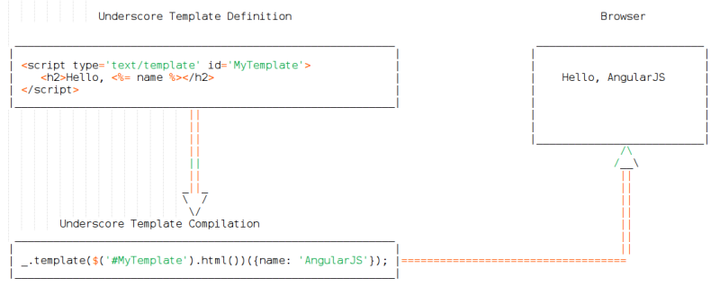
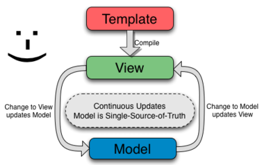
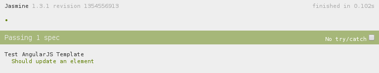
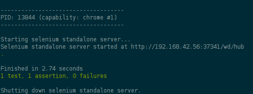
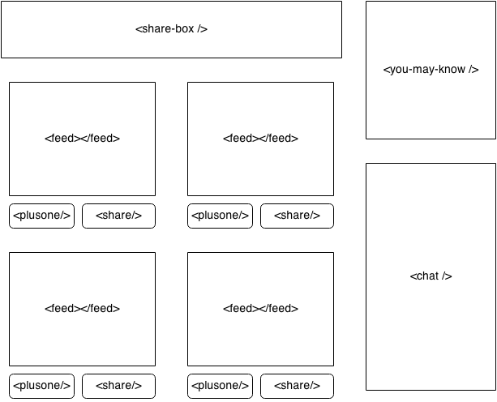

# AngularJS Directives: A forerunner of Web Components

This chapter covers

* The core features and benefits of AngularJS
* What problems AngularJS Directives solve and why they are worth learning
* How AngularJS Directives mimic Web Components – the Future Standard

If you are reading this book then you might be aware of AngularJS and quite curious to know about what it can offer. In case you are a JavaScript developer or jQuery addict and would like to port some of your jQuery plugins to AngularJS, then this book is for you. Pat yourself on the back for making the right choice and choosing to invest your precious time into the precious to make yourself productive to write your next ambitious application or component.

In this chapter, I’ll give you an overview of features and benefits of AngularJS as a whole, as well as describe how AngularJS Directives are helping to shape the future of web applications. We’ll start off with understanding the magic behind AngularJS popularity and then get to know directives straightaway.

## 3Ds of AngularJS – data binding, dependency injection, and directives
AngularJS is built around the belief that declarative programming should be used for building user interfaces and wiring software components. By declarative means that it adapts and extends traditional HTML to better serve dynamic content through two way data binding that allows for the automatic synchronization of data and User Interfaces. With this, AngularJS reduces imperative DOM manipulation (like we do with jQuery) and improves testability by facilitating separation of concerns.

HTML is great for declaring static documents, but it falters when we try to use it for declaring dynamic views in web applications and we often end up with spaghetti code – a mixture of HTML and JavaScript, which is inexpressive, unreadable, and hard to extend further. Other frameworks work around the HTML’s shortcomings by abstracting away HTML, CSS, and JavaScript in terms of UI Widgets or by providing an imperative way for manipulating the DOM. But none of these solutions address the problem developers face while developing dynamic applications. Instead, AngularJS lets you write applications in a declarative manner that not only speeds up the development process but also makes it easy to test, extend, and maintain as applications grow large. AngularJS came into existence to make the web better and browsers smarter, but it did so before it would be supported natively in terms of Web Components. In fact, it truly allows us to write composable and reusable components declaratively to facilitate code abstraction.

Going forward we’ll take a look at what makes AngularJS so special.

### Making HTML dynamic with Data Binding
Who does not like to give commands and have followers to follow them? Data Binding is based on the same notion wherein data models are like commands and are being constantly followed by Views to be updated automatically. Data Binding is a very old concept (new to JS) notably used in Adobe Flex. It is one of the core features of AngularJS that makes the overall framework magical and helps us reduce lines of code (LOC) by doing the heavy lifting itself so we do not have to do DOM manipulation manually and repeatedly.

To understand it better, let us look at a simple but real-world example. Let’s say we have a notification panel in our application to show messages that needs to be updated every time a new message arrives. In JavaScript, we would probably do as follows.

```html
<html>
<head>
  <title>Updating Notification Panel in Pure JS</title>
</head>
<body>
  <div id='notification'>No Message found.</div>
 
  <script type="text/javascript">
    document.getElementById('notification').innerHTML = 'Learning Angular Data Binding';
  </script>
</body>
</html>

```

There could be many places in your application from where you could update the notifier and have to use a long-lasting and painful DOM APIs depending on the complexity of the DOM you are dealing with. You may have to write lot of repetitive code for every HTML element that has to be updated dynamically from several places which is cumbersome and unmanageable as your application grows.

What if there were a simpler and better way to handle this? Well, in AngularJS, any type of data (primitives and objects) is a model and once bound to the DOM will update it automatically whenever the associated model changes. So the same thing can be accomplished using data binding in AngularJS as shown in the following listing.

```html
<html ng-app="App">
<head>
  <title>Updating Notification Panel in AngularJS</title>
  <script src="http://code.angularjs.org/snapshot/angular.js"></script>
</head>
<body>
  <div ng-bind="notification || 'No Message fund.'"></div>
 
  <script type="text/javascript">
    angular.module('App', []).run(function($rootScope) {
      $rootScope.notification = 'Learned Angular Data Binding, Today';
    });
  </script>
</body>
</html>```

With this approach, you are assured that the notification panel will automatically update whenever the notification model changes. Just imagine how easy is it to enable two-way data binding with ngBind directive.

You might be curious to ask, Will it update the model as well if I dynamically change the content of the `<div>`? Nope. That is because it’s a one-way data binding we’ve set up in this case. The two-way data binding can be achieved with Form Controls such as Input, Textarea, Select, Checkbox, Radio, and so on.

```html
<html ng-app="App">
<head>
  <title>Two way Data Binding with Form Controls</title>
  <script src="http://code.angularjs.org/snapshot/angular.js"></script>
</head>
<body>
  <input type='checkbox' ng-model='choose' />
  <div ng-bind="choose"></div>
 
  <button ng-click="choose=!choose">Toggle Checkbox</button>
 
  <script type="text/javascript">
    angular.module('App', []);
  </script>
</body>
</html>
```

We can update `<div>`'s content by either ticking the checkbox or directly updating the model in JavaScript as seen before. So directives let us make HTML dynamic by applying directives so that HTML can interact the way we want it to be.

I’m pretty sure you must be grinning by now considering the possibilities of what you can do with this new learning.

### Managing dependencies with Dependency Injection
Dependency Injection (DI) is a software design pattern that deals with managing dependencies. This allows the removal of hard-coded dependencies and makes it possible to change them, whether at run-time or compile-time. A dependency can be resolved either by creating (using the new operator) or passing a reference of the already created object where it’s needed. The first approach is not optimal because we then need to hard-code the dependency, thereby making it difficult to modify later or even test. The second option is viable, as we do not have to instantiate the dependency ourselves; we can just hand it over. This makes testing easy as we can mock the dependency at will without knowing how it was created. To get more clarity on the subject, let us look at a trivial example given as follows.

In JavaScript, we often define a Class and create an instance of it to access its properties or methods. In this example, `sayHi()` class is dependent on `hello()` class. But, the way we’ve resolved the dependency by creating an instance of `hello()` class manually is not ideal. If, in case, the constructor definition of the `hello()` class changes in future, it will affect our class, `sayHi` as well.

```javascript
function hello(who) { this.name = 'Hello ' + who; }
function sayHi(obj) { return obj.name; }
 
var objHello = new hello('AngularJS');
console.log(sayHi(objHello));
```

What if we could instantiate all the dependencies in one place and just pass the references wherever needed? This will loosely couple all the dependencies, and any modifications later will not affect components that were dependent on it. That’s how AngularJS manages dependencies using the Dependency Injection (DI) system built-in:

```javascript
var App = angular.module('DI', []);
App.service('Hello', function() {
  var self = this;
  self.greet = function(who) { 
    self.name = 'Hello ' + who;
  }
});
 
App.controller('SayHi', function(Hello) {
  Hello.greet('AngularJS');
  console.log(Hello.name);
});
```

In this example, we have a class named `Hello` defined via service method in AngularJS. Then we have injected the same as a dependency in the controller, `SayHi`, which calls greet method with a parameter – whom you wish to greet. Just pay attention to how the dependency has been resolved without creating an instance of `Hello` implicitly. Off-course D.I. internally instantiates the class and stores its instance into the same object passed before.

This approach makes it really easy to mock all dependencies during testing so we can test `SayHi` in a complete isolation by mocking the service `Hello` used with.

FYR, Testing code would look something like:

```javascript
describe('Resolve Dependencies', function() {
  var SayHi, Hello;
   
  beforeEach(module('DI')); 
  beforeEach(inject(function($controller) {
    Hello = {
      greet: function(who) {
        Hello.name = 'Hello ' + who;
      }
    };
 
    SayHi = $controller('SayHi', {Hello: Hello});
  }));
});
```

That's it! AngularJS will automatically resolve dependencies while testing and use the mocked service instead of the original one.

### Scaffolding reusable markups as HTML Template

The purpose of JavaScript Templating is to generate HTML that makes sense based on structured data. Such templating libraries take JSON data and compile it into a function which can then be used to generate the final HTML by passing in values for placeholders. There are two types of templating libraries:

* String-based
* DOM-based


In string-based templating, we wrap an HTML into a pair of `<script>` tags, compile, and interpolate it with JSON data to get the final HTML string – which can be injected in the page later. Underscore.js, Handlebars.js, Mustache.js are some of the well known examples of this category. Here is how templating works in Underscore.js. It introduces a special method `_.template()` to feed in the template that generates a compiled function. The compiled function then takes JSON or JS objects to interpolate the template.

As per the following figure, the moment we update the model, each time the whole template will be recompiled and re-rendered in the browser.



The `<%= name%>` expression is a syntax in Underscore.js to create a placeholder for name. The trade-off of this approach is that as the template becomes larger, the amount of stuff that needs to be re-rendered grows, which is slow and wasteful.

In contrast, AngularJS uses HTML(DOM) as a template where only specific parts of the template updates when the model changes. The benefit of this approach of updating only the fragments of the HTML document is that it does not re-render the whole template every time but just updates those parts of the template that were associated with the models. What this means is that it introduces various directives such as ngBind, ngBindHtml, and so on to achieve this. It supports `{{ }}` as a templating syntax as an alternative to `<%= name%>` in underscore but you could use ngBind built-in directive as well to achieve the same as shown in the following listing. Create *angular-template.html* in *ch01/* directory as:

```html
<html ng-app="App">
<head>
  <title>HTML/DOM Template in AngularJS</title>
  <script src="https://code.angularjs.org/snapshot/angular.min.js"></script>
  <script type="text/javascript" src="../js/ch01/angular-template.js"></script>
</head>
<body>
  <span>Hello, <span ng-bind='name'></span></span>
</body>
</html>
```

Then add following snippet in *js/ch01/angular-template.js* so:

```javascript
var App = angular.module('App', []);
 
App.run(function($rootScope) {
  $rootScope.name = 'AngularJS';
});
```

When AngularJS bootstraps, it compiles the HTML and feeds in the actual data replacing the placeholder, `ng-bind='name'`. All this is done by AngularJS in the background and hence it looks very natural and easy to write or manage.

More specifically, in this example, only `span` tag will be updated if `name` updates to something else later, unlike string-based templates, where the entire template string has to be interpreted in order to replace just the `name` expression. Let’s see how AngularJS does it:



As you can notice that all the pieces such as a template, data model, and view remain the same as in string based templates but the very difference lies in the compilation of the template which only happens once. Furthermore, data binding takes care of updating relevant parts of the view (instead of entire view) upon model mutation.

### Deep Linking AngularJS applications to maintain browser history

Back in the old days, every hyperlink used to refresh the page in order to load it. AJAX (Asynchronous JavaScript and XML) opened the door to load content asynchronously without refreshing a page at all. Developers found a profound way to write applications without a single refresh and hence coined a term, Single Page Applications. With AJAX, web applications can send data to, and retrieve data from, a server asynchronously. Google made a wide deployment of standards-compliant, cross browser AJAX with Gmail and Google Maps. But while doing so, many of the applications were breaking the browser’s back button – there was no longer a way to go back to the previous hyperlink visited.

AngularJS does not break the back button, thanks to Routing. It comes with a routing module named `ngRoute`, which enables you to programmatically generate URLs based on route definition. As given in the following example, we’ve injected `ngRoute` as a dependency (thanks to DI) that provides access to the `$routeProvider` service to define our routes. Let us look at the following route example as:

```javascript
angular.module('ngRouteExample', ['ngRoute'])
.config($routeProvider) {
  $routeProvider.when('/Book/:bookId', {
    templateUrl: 'book.html',
    controller: BookCtrl
  }
});
<div ng-view>Template loads here</div>
```

In this example, I’ve set up a simple route to load book details by its Id. When user opens *http://myapp.com/Book/2 *in the browser, AngularJS’s internals notify the `$routeProvider` service to match the URL format with each of the route definitions and attempts to match the URL format (*/Book/:bookId*) with the URL value (*/Book/2*) in the defined route configuration list (where `:bookId` acts like a parameter). As expected, it will match with the preceding route definition and load book.html partial thereafter into the `div` element.

To make it work, AngularJS provides a special directive named `ngView` which renders a template of the current route into the main layout. Whenever current route changes, the view updates as well according to the route definition. It does not look like a big deal to set up routes, but it is an extremely important and powerful module in AngularJS arsenal, especially in the era of Single Page Applications.


### Testing is !important
AngularJS is written with testability in mind, and there is no reason why one should not write test cases for any snippet. In fact, there is nothing you can write in AngularJS that cannot be testable. If one cannot, then he is doing it wrong. I would recommend every AngularJS developer to write testable code. The same approach we’re going to follow throughout the book.

You as a developer might have gone through a situation (many times) wherein an application stops working or behaves abnormally after fixing a bug or implementing a feature if you’ve not set up an automated testing environment. And it’s very difficult and time consuming to go through all the test cases manually to check if anything is broken every time you do any updates. To solve such problems, the AngularJS team has built many features, libraries, and tools to make testing a **First Class** citizen. There are two ways to do testing in AngularJS: unit testing and end to end testing.

#### UNIT TESTING
Unit Testing, as the name implies, is all about testing individual units of code i.e. functions. To make unit testing fundamentally more accurate, we have to follow Unix Philosophy – write programs/functions that do one thing and do it well. There are many unit testing frameworks, such as Jasmine, Mocha, Chai, Qunit, and so on, but Jasmine has been used at its core so we’re going to use the same for all our examples in this book.

If we were to write a unit test for the example we saw before *ch01/angular-template.html*. We would probably do as follows by creating *tests/specs/ch01/angular-template-unit.js* so:

```javascript
describe('Test AngularJS Template', function() {
    beforeEach(module('App'));  
    var element, scope;
 
    it('Should update an element', inject(function($rootScope, $compile){
        $rootScope.name = 'AngularJS';
        element = angular.element(
         '<span>Hello, <span ng-bind="name"></span></span>'
     );
        element = $compile(element)($rootScope);
        $rootScope.$digest();
 
        expect(element.text()).toBe('Hello, AngularJS');
    }));
});
```
In this simple test snippet, we’ve set up a Jasmine framework to run the test. In Jasmine, `describe()` block allows you to group related tests cases and `it()` block lets you write the actual test to perform. In this case, we’ve injected two dependencies, namely, `$rootScope` and `$compile`. The `$rootScope` is single root `$scope` that every AngularJS application has. Later we create a DOM in memory using `angular.element()` – an alias for the jQuery (`$`) object and compiled it by passing in the `$rootScope` to the `$compile` service – that replaces placeholders with actual values on the scope. Finally, we make sure that the element contains the valid text with `expect()` – an expectation in Jasmine is an assertion which implements comparison between the actual value and the expected value.



At the end, Jasmine will show you above display if the test succeeds.

#### END TO END TESTING
No matter how good programmer you are, you cannot presume that every piece of code you write will work as expected on various browsers; hence, functional testing is extremely important, and there is a need for End to End test frameworks. Protractor is an end to end test framework specifically for AngularJS applications built on top of (a wrapper for) WebDriverJS – Selenium Web Driver which is a standard web applications testing tool used everywhere. The installation of Jasmine with Karma Test Runner and Protractor with Selenium Driver is covered in detail in Chapter 3. Luckily Protractor supports Jasmine like syntax to write test cases so that you can grasp it in no time. Let us quickly check out how to write test cases in Protractor, so create *tests/specs/ch01/angular-template-e2e.js* as:

```javascript
describe('Test AngularJS Template', function() {
  var str;
 
  it('should greet AngularJS', function() {
    browser.get('ch01/angular-template.html');
    str = element(by.binding('name')).getText();
    expect(str).toEqual('AngularJS');
  });
});
```

In the `describe()` block, we are creating an instance of protractor and loading a page to perform tests on. As soon as we run protractor on a command line, `browser.get()` will fetch the specified html page in real browsers and perform a lookup for the binding, `{{name}}` using `by.binding()` syntax. Finally we’re just matching the actual value with the expected one. If everything goes well then this is what you’ll see in the command line.



So AngularJS framework is extremely conscious about testing every bit of AngularJS applications, even directives are no exception!


## Meet AngularJS Directives
By now we have covered AngularJS in a nuthshell and you probably excited to get to know AngularJS directives. So, here we go. HTML is all about elements, but as the web grew bigger, developers started building complex applications so the existing elements fell short to fill the gap and we chose to rely on markups with lots of JavaScript. The basic idea is that the current set of elements we have in HTML always perform the same role and have the same set of properties/options applied to it but the web today has to do lot more work and HTML can’t keep up with the rate of change.

Browsers have engrossed the specification required to analyze the behavior of HTML elements so they understand the language and figure out the layout when a web page loads. But they are not able to interpret the meaning of custom HTML element which is not part of the specification they know. In such condition, the browsers simply consider it as a text content ignoring the element altogether.

AngularJS Directives API teaches the browsers a new trick and helps them to treat custom elements as native ones. Also, it gives developers flexibility and low-level access to create custom elements based on their function. Hence directives are the integral part of the AngularJS framework and the only thing that makes AngularJS stand out from the crowded list of JavaScript frameworks these days. Let us see what are directives made up of.

### What are directives

AngularJS Directive is nothing but the way to expand HTML vocabulary. Having said that you can extend existing HTML element or create a new one by encapsulating custom behaviors atop. That means, we can write custom elements, attributes, and so on in AngularJS that browsers can understand using AngularJS Directives API. Here is a non-intuitive example of Accordion widget in Twitter Bootstrap as:

```html
<html>
<head>
  <title>Accordion in Twitter Bootstrap</title>
  <link rel="stylesheet" href="http://maxcdn.bootstrapcdn.com/bootstrap/3.2.0/css/bootstrap.min.css">
  <script src="http://code.jquery.com/jquery-2.1.1.min.js"></script>
  <script src="http://maxcdn.bootstrapcdn.com/bootstrap/3.2.0/js/bootstrap.min.js"></script>
</head>
<body>
  <div class="panel-group">
    <div class="panel panel-default">
      <div class="panel-heading">
        <h4 class="panel-title">
          <a data-toggle="collapse" href="#accordion1">
            Accordion Header #1
          </a>
        </h4>
      </div>
      <div id="accordion1" class="panel-collapse collapse in">
        <div class="panel-body">Accordion Body #1</div>
      </div>
    </div>
    <div class="panel panel-default">
      <div class="panel-heading">
        <h4 class="panel-title">
          <a data-toggle="collapse" href="#accordion2">
            Accordion Header #2
          </a>
        </h4>
      </div>
      <div id="accordion2" class="panel-collapse collapse">
        <div class="panel-body">Accordion Body #2</div>
      </div>
    </div>
  </div>
</body>
</html>
```

However, it does fulfill the requirement of having a fancy looking accordion widget in the browser but at the expense of imperative markups that you dare to fiddle. The end-users who will end up using this UI widget no longer need to go through the pain of understanding nitty-gritty things in their way just to use the component. What they really want is the minimal, comprehensible, and declarative piece of code that makes sense to them. Up until, it was not possible to have that level of encapsulation in order to hide the complexity behind the curtain and only show things that matter to the end-users. Here is the same example converted into a declarative style using AngularJS directives API for you to get a sense of what AngularJS directives can do:

```html
<html ng-app="App">
<head>
  <title>Accordion in AngularUI Bootstrap</title>
  <link rel="stylesheet" href="http://maxcdn.bootstrapcdn.com/bootstrap/3.2.0/css/bootstrap.min.css">
  <script src="https://code.angularjs.org/snapshot/angular.js"></script>
  <script src="http://cdnjs.cloudflare.com/ajax/libs/angular-ui-bootstrap/0.10.0/ui-bootstrap-tpls.js"></script>
  <script type="text/javascript">
    angular.module('App', ['ui.bootstrap']);
  </script>
</head>
<body>
  <accordion>
    <accordion-group heading="Accordion Header #1">
      Accordion Body #1
    </accordion-group>
    <accordion-group heading="Accordion Header #2">
      Accordion Body #2
    </accordion-group>
  </accordion>
</body>
</html>
```

Now the thing is that you will find this piece of markups much more comprehensible than the one that we saw earlier. Note that, even it looks human readable by now, it still generates the same blob of markup behind the scene but hides it upfront to make it declarative and fun to interact with.

Even though this book is all about directives and we are going to explore all the configurations required to define directives in subsequent chapters, following is the blueprint for your reference.

```javascript
angularmodule('MyModule', []).directive('directiveName', function () {
  return {
    restrict: 'A',
    template: '<div></div>',
    templateUrl: 'directive.html',
    replace: false,
    priority: 0,
    terminal: false,
    scope: false,
    compile: function (tElement, tAttrs, transclude) {
      return {
        pre: function preLink(scope, iElement, iAttrs, controller) { },
        post: function postLink(scope, iElement, iAttrs, controller) { }
      }
    },
    link: {
      pre: function preLink(scope, iElement, iAttrs, controller) { },
      post: function postLink(scope, iElement, iAttrs, controller) { }
    }
    transclude: false,
    controller: function($scope, $element, $attrs) { },
    require: 'otherDirectiveName'
  };
});
```

These are the parameters the directives API supports to compose a directive, so here is a quick tour:

**Restrict:** Restricts the directive to a specific DOM declaration style. Can be an element or attribute by default.

**Template:** Stuffs the element binded to the directive with an extra content to be injected dynamically.

**TemplateUrl:** Same as templateUrl but the template will be loaded asynchronously via AJAX or XHR.

**Replace:** Replaces the element with the template added by template or templateUrl option.

**Priority:** Configures the order in which directives are applied or compiled.

**Terminal:** Freezes the further compilation of directives on the element, if set to true.

**Scope:** Different types of scope strategies depending on the requirement.

**Compile:** Deals with transforming the template or element.

**Link:** Responsible for registering DOM events and bindings variables on the scope to be used within the template.

**Transclude:** Brings the content of the element into the template. Works even if replace set to true.

**Controller:** Allows to share scoped methods or properties with other directives (siblings or child directives).

**Require:** Injects the controller of a sibling or parent directive in order to use shared scoped method or properties.

You will notice that the blueprint is quite huge and complex but trust me its worth learning. So the takeaway is that the directive is:

* The place for Imperative DOM Manipulation
* The home for binding DOM events and unbinding them later
* The technique to facilitate code reuse with semantic and composable widgets
* The ability to write or use code declaratively
* And ultimately the way to extend HTML vocabulary

Now let us see how directives actually work behind the scene in the following section.

### How directives work

In short, AngularJS when bootstrapped, looks for all the directives built-in as well as custom ones, compiles them using built-in compiler, and links with the associated scope by registering listeners or setting up `$watcher`s resulted in 2 way data bindings between the scope and the element.

If this is overwhelming for you, here is the smallest directive that you can possibly ever write. However, it does not do anything but just there to explain how directives get registered in AngularJS. We have defined a custom directive named noop that can be used as an attribute/element as shown:

```html
<html ng-app="App">
<head>
  <title>Basic Directive: noop</title>
  <script src="../bower_components/angular/angular.js"></script>
  <script type="text/javascript">
    var App = angular.module('App', []);
 
    App.directive('noop', function() { return {}; });   #B
  </script>
</head>
<body>
  <div noop></div>
</body>
</html>
```

Few things to note here is that:

* The `ngApp` directive is an important built-in directive you’ll always need per application to bootstrap the same.
* We then register our directive named `noop` that means no operation as it does not alter or modify the associated element or node. However, this will still be registered by AngularJS because of the default properties set internally such as restrict (as an attribute/element by default) in the DOM and priority (0 by default) to set the order of execution. This further added into an injector – built-in service that can be used to retrieve object instances to check if it is a directive or an existing HTML node during DOM compilation that we’ll see next.
* Finally we use it as a custom attribute/element in the DOM and you’ll see just a `div` element in the DevTool. However, you must be nagged by a question that how does AngularJS do it?

That’s quite simple than you think. All it does is the compilation of the HTML tree to find directives to activate them. On a high level, it is quite similar to how browser parses HTML and displays the output. Take an example of an anchor element (`<a>`) that turns a normal text into an underlined one with blue font color by default. As discussed before that the browser has a specification of the anchor element, it just performs the required operations to attach those behaviors. Similarly there is a flow of how AngularJS brings directives to life:


* First it finds where to start the compilation process and that’s why AngularJS needed a unique marker to begin with. The ngApp directive serves that purpose. The element or node (including all of its child nodes) on which it is applied will be owned by AngularJS for further operations such as directives registration, data bindings, and so on. Thus AngularJS does not bootstrap without it. Many beginning AngularJS developers often forget to add the ngApp directive until they realize why their directive did not work.
* Once it knows the root node, it traverses the DOM to find sub nodes (elements, attributes, classes, and comments), and maps each with the injector service to check its definition exists or not. This process helps AngularJS to collect all the directives per node and to return their compile functions.
* The Compile function per directive is executed in order to apply behaviors on the respective node. Prior to this step, directives do not exist at all for the browser. This step creates a new or shared scope per directive (depending on its definition) needed to create watchers and set up data bindings in terms of Link functions.
* Finally the link functions are executed in a reverse order than that of the compile functions to register DOM events or update bindings used on elements or within their templates. There is a reason for the reverse ordering which we’ll cover in Chapter 4. By this step, the directives are fully activated, probably manipulated the DOM, updated the bindings, attached the DOM events, and so on.

By now, we know that AngularJS activates directives but what does it mean? Let us slightly update the noop directive to see it in action as:

```javascript
App.directive('noop', function() {
  var count = 1;
   
  return {
    compile: function(cElement) {
      cElement.html('I am noop {{counter}}');
 
      return function link(scope, element) {
        scope.counter = count;
        count++;
      }
    }
  };
});

```
We have added the compile function which is basically used to manipulate the associated element and update its content. Note that the double curly notations are very common data binding syntax used in AngularJS, you can also use built-in directives replacing the same such as ngBind, ngBindTemplate, and ngBindHtml.

As learned before, the compile function generates a link function that gives access to scope object and you are good to go with binding few scope variables to enable two way data binding in this phase. We have set the `counter` variable that updates the binding `{{counter}}` placed earlier in the DOM. You should see `"I am noop 1"` in the browser now.

You probably think that why there is a need for compile and link functions? Why not combine them? The only reason for the existence of the compile function is performance. To find out, let us update the `noop` directive in HTML as:

```html
<div noop ng-repeat="item in [1, 2, 3, 4, 5]"></div>
```
Here we basically repeat the same div element five times and each time the `noop` directive will be linked to a new instance of the DOM. And you will see `"I am noop 1", "I am noop 2"`, and so on as the counter increments. Imagine there was no compile function, the text will be injected fives times which is unnecessary because we are just repeating the same old element. Also, the linking would have happened at the same time enabling watchers and degrading the performance because the watchers are reevaluated on every digest cycle to make sure views are upto date. Now by separating the two, compiling all directives first and linking them later altogether is not only performant but also cost effective because the compile function of the `noop` directive with ngRepeat will be triggered once whereas the linking function will be called for each iteration.

Now that we know how directives are executed so that browsers could understand their meaning without relying on HTML specification, let us look at why to use directives. Is it the ultimate answer to life, the universe, and everything?

### Why use directives

By now we pretty much realized the problems that AngularJS directives are trying to solve but is it the ultimate remedy? The answer is Yes! Because the HTML language is expressive enough to create complex UI widgets and also extensible so that we, the developers, could fill in the gaps with custom tags. Probably in the near future, it will be possible through a new set of standards called Web Components.

Web Components are a collection of standards which are working their way through the W3C and landing in browsers soon. In fact they allow us to bundle markup and styles into custom HTML elements. It will allow web developers to use their HTML, CSS, and JavaScript skills to build custom elements or widgets that can be reused easily and reliably irrespective of what frameworks you use.

Even Google engineers have tried to replicate web components as Polyfills (plugins that provide technologies that developers expect the browser to provide natively) in terms of [Polymer Project](https://www.polymer-project.org/1.0/) – a Javascript library consisting of several polyfills for various specs of Web Components APIs. Also, Mozilla has been hard at work – making web components a reality through their own JavaScript library named [X-Tag](http://www.x-tags.org/) to bring custom element capabilities to all modern browsers. Similar to Polymer, it also allows us to easily create elements to encapsulate common behavior or use existing custom elements to quickly get the behavior you’re looking for.

In a nutshell, AngularJS Directives is the closest thing to Web Components available at this time and we should ride this wave to get ourselves ready for the future of Web Development.

### When use Directives

Apart from setting the foundation for your next ambitious web application, the AngularJS framework and directives provide lots of benefits to improve the overall development process. With the ability to extend HTML, one could design and build an entire application on top of custom elements that would be more manageable and testable. Other benefits are:

#### Cleaning up the jquery sphaghetti code
jQuery is a great library serving to bridge the gap between different browsers by working around various browser quirks efficiently and helping developers to focus more on building things than fixing browser issues. However, if you do not use jQuery wisely then you will soon end up writing unmanageable spaghetti code. There are many common things we often do in most web applications such as performing an action on every keystroke, adding CSS classes or removing them off an element, dynamically checking/unchecking checkboxes, binding custom events, and so on. All this is not possible without having a unique identifier to the element you are targeting in terms of ID, CSS class, data attributes, and so forth.

Take a look at the following jQuery snippet in which we simply bind a click handler on the button that posts content on Google Plus.

```javascript
$('.post-to-gplus').click(function() {
  share();
  $(this).hide();
  $('#chk_gplus').prop('checked', true);
  $('#message').show();
});
```
The problem with this piece of code is that we have to wait until the page loads completely in the browser before we bind the click event on the button. Also the approach would not scale if we use multiple instances to share various posts. What if we make it declarative and less cluttered to handle multiple instances without modifying a bit. Here is the AngularJS version of the same.

```html
<button ng-click='share(); shared = true;' ng-hide='shared'>
  Post to Google Plus
</button>
 
<input type='checkbox' ng-checked='shared'>Posted
 
<div class='message' ng-show='shared'>
  Your post has been shared successfully!
</div>
```
A few things to note here is that there is no imperative DOM manipulation involved. Post sharing, we just set the variable, shared to true to update the view automatically. We’ve then used AngularJS built-in directives, ngHide, ngChecked, and ngShow to achieve exactly the same thing, although declaratively. Notice we also got rid of the ID and Class associated to make it scalable by encapsulating everything into a custom directive.


#### Assembling an application like lego bricks

Writing a huge application is not a one-man show so we often work with groups of people. While working with teams, maintaining a monolithic application might sabotage the development and probably affect the schedule as well. It even makes it harder to test the whole application that way. The best way is to divide the whole application into modules/components and let each team take care of it by facilitating separation of concerns. They can work on each component independently, test it in isolation, and make it ready to be assembled later.

Suppose you are building the next generation social network named Friendular to beat Google Plus and Facebook. You can break the application into different blocks as shown in the following figure. Each of these blocks could be developed separately and does one thing only.



As you can see the entire application is built on top of tailor-made custom directives just like Lego bricks. This alleviates the pain points and helps to catch potentials bugs/issues at an early stage.

#### Supporting designers to take a plunge into markups

Developers often have to work closely with web designers to knit a well-designed application so it’s the developer’s responsibility not to mess too much with the HTML. But you can end up making a mess because of your choice of framework or library, thereby preventing designers from diving into the markups and avoiding making any further changes. Even template libraries are not much of help sometimes.

Here is a simple example to render a list of to-do items. We just iterate over a collection of to-dos and render them as an ordered list.

```javascript
var html = '<ol class=”todo-list”>';
 
for (var I = 0; I < todos.length; I++) {
  html+= '<li class=”' + todos[I].done ? 'done' : 'undone' + '”>' +todos[I].todo + '</li>';
}
 
html+= '</ol>';
$('body').html(html);
```

This makes it really hard for any designer to modify it if he is not aware of JavaScript or jQuery. Even though it generates a string of HTML, it is not the markup designers care about.

AngularJS’s HTML as a template strategy pays off perfectly for both designers and developers in such scenario. So this will change to:

```html
<body>
  <ol>
    <li ng-repeat='todo in todos' ng-class='{true: “done”, false: “undone”}[todo.done]'>
      {{todo.todo}}
    </li>
  </ol>
</body>
```

The `ngRepeat` directive in AngularJS lets us iterate over an array just like for loop in JavaScript. The ngClass directive allows us to conditionally apply CSS classes so in this case, if the todo’s state is pending then it will remove the done CSS class and add undone instead – and vice versa. This will save the developer time and effort as they do not have to cherry pick the changes done somewhere else by the designer because the designer now can directly modify the same markup without getting into trouble anymore.

#### Gelling up well with jquery plugins

Even though AngularJS has a stripped-down version of jQuery built-in named jQLite, it does not stop you from using the original jQuery library. The jQuery ecosystem has grown rapidly because of jQuery’s ability to extend it with your own function by exposing a public API using `jQuery.prototype` or `$.fn`.

AngularJS does not discourage developers from using jQuery but helps them instead to use it in the angular world in a new way. There are thousands of jQuery plugins available online and new ones coming every day, so porting them all to the AngularJS paradigm is time consuming but would definitely reduce the lines of code which is debatable.

AngularJS enforces declarative than imperative DOM manipulation and to a certain extent the declarative approach solves many problems. But, when you use any jQuery plugin the imperative syntax is inevitable, after all, jQuery is a DOM manipulation library. Still you can encapsulate the jQuery initialization code into its own angular directive to keep it simple. So this trivial jQuery plugin:

```javascript
$(document).ready(function() {
  $('#mytab').fancyTabs();
});
```

Will change to more readable, manageable, and declarative markup ever.

```html
<fancy-tabs id='mytab'></fancy-tabs>
```

There are lots of tidbits to jQuery plugins when it comes to AngularJS so we’ll cover all those throughout the book.

## Summary

We’ve peeked at the AngularJS arsenal and discussed the differences and similarities between AngularJS Directives (present) and Web Components (future). We’ve also realized the purpose of AngularJS existence and benefits it offers to Web Developers/Engineers to build powerful applications with ease. AngularJS really speeds up development and encourages us to reuse the saved time/effort to write tests. Also, learning AngularJS Directives now is a way to be ready for Web Components before they become reality.
    
The next chapter will unpack the AngularJS internals and things you should know about it before writing your first real world directive.

