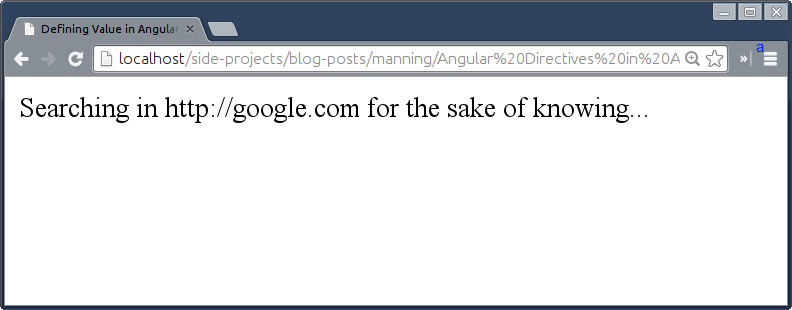
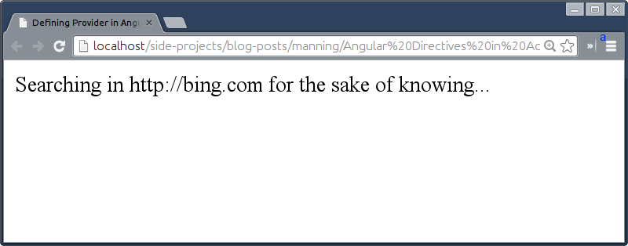
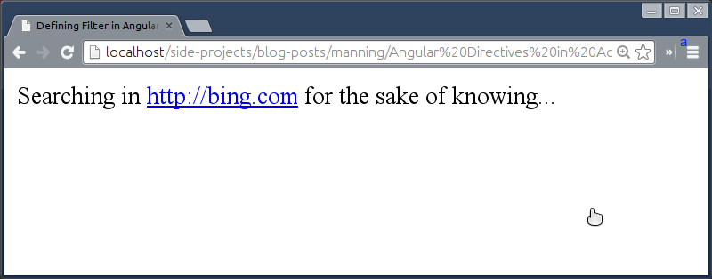
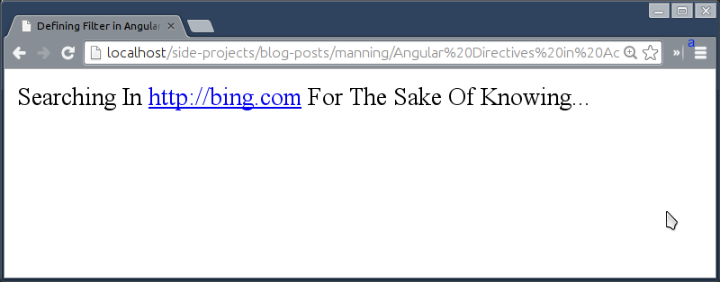
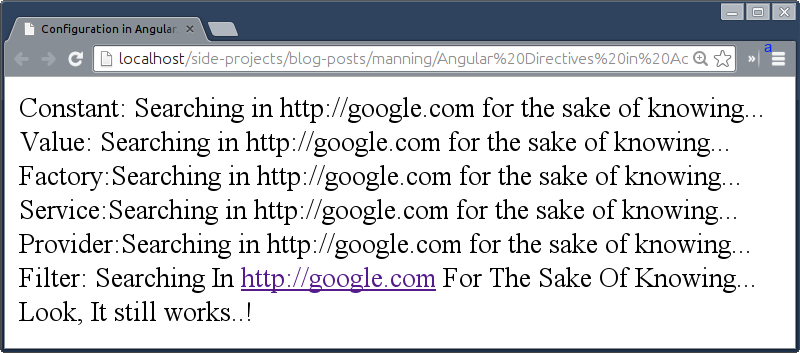
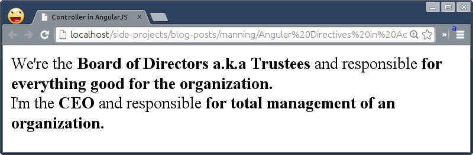
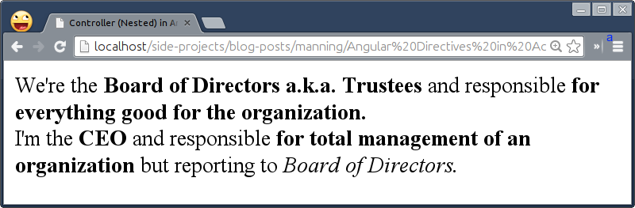
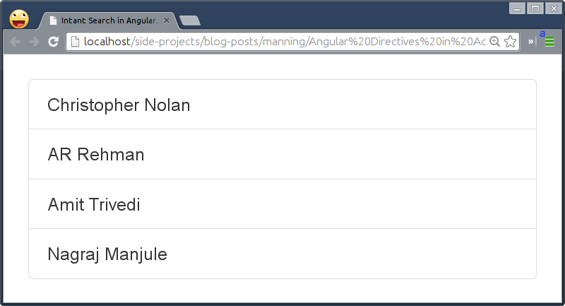
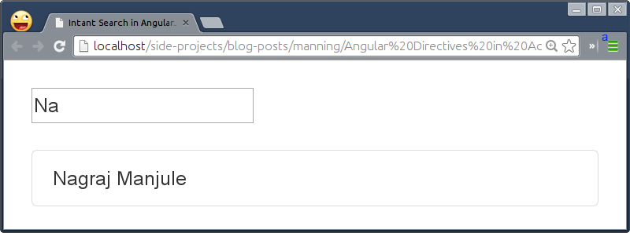

# AngularJS Fundamentals: A Crash Course

This chapter covers
* Usage of Module Design Pattern in Angular ecosystem
* Different ways of bootstrapping angular
* Difference between various services
* How to define, update, and delete models
* Various ways to enable two way data bindings


In the previous chapter, we have discussed the various ways that the angular directives can be helpful and how learning them will actually keep us using the future standards, today.

This chapter provides a quick tour of AngularJS internals – the things you need to know to understand the rest of the book. The purpose of the chapter is to make you aware of angular jargons that will be used through out the book. There are many things about angular that are confusing and new to anyone who comes to angular first time as it's not just another MVC framework you know already. Although, It's difficult to cover the entire framework in a single chapter so this chapter is more inclined to help you focus on important bits only.

## Choosing AngularJS

Every developer has an ability to build amazing web applications but the choice of framework may hinder your dreams and knock you down even before you know it. The Angular Team has gone through these setbacks before while building large applications in-house and hence picked up the best practices to create yet another but extraordinary JavaScript framework to help developers spend time on what to build rather than how to. However, Angular has not invented any of the cool stuffs that it is famous for. So If you have an experience on other programming languages then some of these things may not be new but quite exciting for you to use them in JavaScript. Let's begin.

### Managing complexity with Modules
Over the years we've seen small and large applications were built in a monolithic fashion. The main problem with this approach is that it makes it extremely difficult to debug and manage. The module design pattern overcomes these limitations offering privacy for properties and methods while exposing a public API.

Angular leverages the same pattern to separate the functionality of an application into independent and interchangeable modules such a way that each module holds everything necessary to do one thing and thereby improves maintainability and testability.

#### Understanding Modules
In Angular, every application has a main module acts as a backbone for the entire application and you can create as many sub-modules to serve the main module. In fact, a sub-module is a main module until we tie it up with another module. With modules, we can divide the whole application into pieces, functionality wise or component wise, and plug them later to make up the final application. Let's dive into defining our first module.

```javascript
angular.module('MainModule', []);
```

First thing to note here is that angular allows to name the module that suits us. It can be numbers, alphabets, and special characters. The `[]` as a second parameter allows us to pass in dependent modules i.e. sub-modules. Empty `[]` means no dependencies. 

#### Module loading and dependencies
Remember that sub-module is itself a module so we can defined them the same way as main module. Sub-modules can have other modules as dependencies further. 

```javascript
angular.module('SubModule1', []);
angular.module('SubModule2', []);

angular.module('MainModule', ['SubModule1', 'SubModule2']);
```

When you set up a dependency, all constructors/methods defined on the module come under the same umbrella so that you can invoke them without thinking about sub-module they belong.

### Bootstrapping an Angular application

Defining a main module as seen before is not just enough to call angular for a spin. There is a process to initiate angular in an application. You can bootstrap angular either automatically  or manually.

#### Declarative Initialization
Angular initializes automatically when `DOMContentLoaded` event is triggered or `document` is ready. You can tell angular to bootstrap the application using ngApp directive. We basically have to apply `ng-app` directive on html or any other tag you prefer. At this time, angular starts looking for ngApp directive starting from `<html>` tag all the way down to its last child. As soon as it finds it, it will load the associated module defined, and finally compile the DOM to update all bindings.

```html
<html ng-app="MyApp">
  <head>
    <script src="http://code.angularjs.org/1.2.14/angular.js"></script>
    <script>
      angular.module('MyApp', []);  
    </script>
  </head>
  <body>
    1 + 2 = {{ 1 + 2 }}
  </body>
</html>
```
In this example, we are doing simple arithmetic. The module name used in `angular.module` and in `ng-app` should be same to make it work. This is a widely used approach basically.

#### Imperative Initialization
Sometimes we need to have a control over when angular bootstraps in case of delaying the initialization process, you can use a manual initialization approach instead. If you've come from a jQuery background then the following example might be familiar to you. This approach may be useful while using angular in conjunction with other frameworks during the migration to AngularJS to control when angular kicks in.

```html
<html>
  <head>
    <script src="http://code.angularjs.org/1.2.14/angular.js"></script>
    <script>
      angular.element(document).ready(function() {
        angular.module('MyApp', []);
        angular.bootstrap(
          angular.element(document).find('html'), 
          ['MyApp']
        );
      });
    </script>
  </head>
  <body>
    1 + 2 = {{ 1 + 2 }}
  </body>
</html>
```

Few things to note here:
* angular has a strip-down version of jQuery named **jQLite**. It has a minimal set of methods jQuery supports and sometimes may differ in functionality as well.
* `angular.element` is the new `$` (if you do not include `jquery.js` before `angular.js`). Angular will use `$` internally if its available.
* Note `angular.element()` does not support selectors unlike `$` and thats why we'd to use `angular.element(document).find('html')` instead of `$('html')` in jQuery (Remember, jQLite differs from jQuery).
* Later we call `angular.bootstrap()` to begin the manual initialization.

This approach is extremely useful If you want to use angular in conjunction with some other frameworks in order to port part of your application on AngularJS during migration.

### Configuring  the Module
Once we define an angular module, we have to decorate it in different ways while writing an application. Angular module provides access to various construction functions or interfaces through which we can register new controllers, services, filters, directives, etc. They are:
* Value
* Constant
* Factory
* Service
* Provider
* Filter
* Config Phase
* Run Phase

Let's dive into them in detail.

#### Value
AngularJS provides an easiest way to manage a pre-instantiated Object to register which can be injected later. We can register anything as a value– that can not be decorated. That means     it's not possible to inject it into methods/functions/services during a configuration of application. By doing so ito prevents accidental instantiation of services before they have been fully configured. It can be a string, a number, an array, an object or a function. You can define it as key & value pair and as many. 

Every application has some sort of configurations on top of which an application behaves differently on development or production environments. Imagine you have an application that talks to a server to authenticate users and fetch their details, you might want to hit a staging server during development but a production server when it goes live. So `.value()` function is really handy to store such information. In JavaScript, you may use standard variable to do so such as:

```javascript
var LoginService = 'http://myapp-dev.mydomain.com/loginService';
```

In angular, you can write the same as:

```javascript
angular.module('myApp',  [])
  .value('LoginService', 'http://myapp-dev.mydomain.com/loginService');
```

The real benefit here is that you can prevent polluting global namespaces unlike the JavaScript approach. In addition to it, such values can be injected in other parts of the application as a dependency.


Lets say we have to build a search engine application that uses various search engines APIs available to perform searches. For  now we'll just use Google API to do lookups.

```javascript
angular.module('SEA', [])
  .value('search_engine', 'google.com')
  .config(function() {
    // can not be decorated during the configuration
  })
  .run(function($rootScope, search_engine) {
    $rootScope.message = 'Searching in http://' + search_engine + ' for the sake of knowing...';
  });
```

Now that we've injected the value as a dependency in `run()` method to bind it to a model named `message` to be used in the DOM.

```html
<div>{{message}}</div>
```


#### Constant
Unlike values, Constant lets us register values which can be injected into a module's  configuration function to be decorated. Imagine you want to limit login attempts to 3 (maximum) which is a standard way to stop any kind of suspicious activities (probably by hackers) on the web or you might want to use Pi value for mathematical calculations in your application, the angular constant provides a better interface to do that.  In JavaScript, you would do:

```javascript
var MAX_LOGIN_ATTEMPTS = 3;
var Pi = 3.14159265359;
```
In angular, you would do:

```javascript
angular.module('myApp', [])
  .constant('MAX_LOGIN_ATTEMPTS', 3)
  .constant('Pi', 3.14159265359);
```

The benefit is same as `.value()` but it can be injected during configuration phase that we'll see shortly. You can use Constant the same way as Value in HTML and you'll see exactly what we saw earlier in a browser with the following snippet.

```javascript
angular.module('SEA', [])
  .constant('search_engine', 'google.com')
  .config(function(search_engine) {
    // can be decorated so perform few searches in the background
  })
  .run(function($rootScope, search_engine) {
    $rootScope.message = 'Searching in http://' + search_engine + ' for the sake of knowing...';
  });
```

> NOTE: Both value and constant do not allow you to update its value and have it reflected elsewhere

#### Factory
The Factory is the most widely used service type because of its simplistic nature. You can set it up using **Object Literal Pattern** to avoid polluting the global name-space and return it as an object. Imagine you are building a mobile application and want to figure out whether its an iPhone or iPad or android device to toggle certain features of the application. You could have following in JavaScript:

```javascript
var isIpad = navigator.userAgent.match(/iPad/i) != null;
var isIphone = navigator.userAgent.match(/iPhone/i) != null;
var isAndroid = navigator.userAgent.match(/Android/i) != null;
```

In angular, you can wrap such nifty global variables in a factory service named, Device as:

```javascript
angular.module('myApp', [])
   .factory('Device', function() {
      return {
         isIpad: navigator.userAgent.match(/iPad/i) != null,
         isIphone: navigator.userAgent.match(/iPhone/i) != null,
         isAndroid: navigator.userAgent.match(/Android/i) != null
     }
    });
```
Which you can use easily within angular application as ```Device.isIpad```, ```Device.isIphone```, or ```Device.isAndroid```. Keeping all useful helper methods in one place makes your code modular and easy to scale.

The same way, in the following example, we've abstracted the logic into a factory and injected it to call `find()` method to get the same message. 

```javascript
angular.module('SEA', [])
  .constant('search_engine', 'google.com')
  .config(function(search_engine) {
    // can be decorated so perform few searches in the background
  })
  .factory('LookupFactory', function(search_engine) {
    return {
      find: function() {
        return 'Searching in http://' + search_engine + ' for the sake of knowing...';
      }
    }
  })
  .run(function($rootScope, LookupFactory) {
    $rootScope.message = LookupFactory.find();
  });
```

The example is not hard to understand as we've just replaced the `run()` method with factory. You can even take it further by adding setters/getters methods to `LookupFactory` to override the search engine used.

#### Service
The Service is slightly different than Factory in terms of how it's defined but works much the same way. Factory return an object or instance but Service returns a Class instead which is instantiated internally by Angular after being injected. We can easily convert `Device` factory method into an angular service in case you prefer it as:

```javascript
angular.module('myApp', [])
   .service('Device', function() {
       this.isIpad: navigator.userAgent.match(/iPad/i) != null;
       this.isIphone = navigator.userAgent.match(/iPhone/i) != null;
       this.isAndroid = navigator.userAgent.match(/Android/i) != null;
     }
    });
```
The angular service produces a class unlike factory that gives it an object orientated flavor. Similarly, we can turn `LookupFactory` into `LookupService` so:

```javascript
angular.module('SEA', [])
  .constant('search_engine', 'google.com')
  .config(function(search_engine) {
    // can be decorated so perform few searches in the background
  })
  .service('LookupService', function(search_engine) {
    this.find = function() {
      return 'Searching in http://' + search_engine + ' for the sake of knowing...';
    };
  })
  .run(function($rootScope, LookupService) {
    $rootScope.message = LookupService.find();
  });
```

It gives you an object oriented flavor with `this` keyword so its up to you what you prefer, service or factory. In my understanding, use Factory to combine helper methods in one place and use Service to create a full-fledged function that does one thing only, such as `AuthService`.

#### Provider
Ever wonder what if we could change the default search engine on the fly before performing searches. Of -course we can introduce setters in Factory/Service to do so but its not going to help during the configuration phase. That's where **Provider** shines. Imagine you publish a Service named `AuthService` on the web for other developers to use that authenticates a user using Google Auth API. But you want to make it flexible to support Facebook Auth API or Github Auth API without touching the core, you might expose methods to configure which Auth API to use or  what action to take post login. Angular Providers give you that level of flexibility so that developers who are going to use it can configure it on the fly.

The Provider expects `$get` function that will expose all methods (`find()` in our case) defined into it after its instantiation. We can have setter methods (i.e `setSearchEngine`) also to be available during the configuration phase  to easily change the default search engine to *bing.com*.

```javascript
angular.module('SEA', [])
  .constant('search_engine', 'google.com')
  .provider('LookupService', function(search_engine) {
    var currentSearchEngine = search_engine;

    return {
      $get: function() {
        return {
          find: function() {
            return 'Searching in http://' + currentSearchEngine + ' for the sake of knowing...';
          }
        };
      },

      setSearchEngine: function(se) {
        currentSearchEngine = se;
      },
    };
  })
  .config(function(LookupServiceProvider) {
    LookupServiceProvider.setSearchEngine('bing.com');
  })  
  .run(function($rootScope, LookupService) {
    $rootScope.message = LookupService.find();
  });
```

Please note that the methods returned by `$get` can not be called during configuration unlike those which are outside. Although, It's a bit confusing for you to understand why have we named the provider as `lookupService`? That is because the provider ultimately creates a service. Finally this is what we'll see in the browser. 



Notice that *google.com* has been replaced by *bing.com* on the fly.

#### Filter
Filters are used to format data for display to the user. Imagine you want to support French along with English language in an application and you might store all the translations in a locale file as:

```javascript
var enToFr = {
  'Hello, World': 'Bonjour, monde'
};
function translateIt(key) { return enToFr[key]; };
```

And you would use it in JavaScript as:

```javascript
translateIt('Hello, World');
```
The same thing we can achieve in angular in a better way with filter constructor as:

```javascript
angular.module('myApp', []).filter('translateIt', function() {
   var enToFr = {
      'Hello, World': 'Bonjour, monde'
   };
   return function(key) {
      return enToFr[key];
   };
});
```

Then you can use it in a Controller or Service by injecting a `$filter` built-in service to invoke our filter as:

```javascript
$filter('translateIt')('Hello, World');
```

The real benefit here is that this also works in a DOM out of the box, so you could do:

```html
<div>{{'Hello, World' | translateIt }}</div>
```

Let us see how we can use it in our Search Engine application. The link to *bing.com* is not clickable but we can easily convert it into a hyper-link using a built-in angular filter named, `linky`. The Linky filter comes under `ngSanitize` module which is a security layer to avoid any unsafe HTML rendered into Angular applications.

We'll have to inject `$filter` as a dependency which will give you access to various built-in filters in angular.

```javascript
angular.module('SEA', ['ngSanitize'])
  .run(function($rootScope, LookupService) {
    $rootScope.message = $filter('linky')(LookupService.find());
  });
```
> NOTE: You need to include `angular-sanitize.js` and inject `ngSanitize` module in the main module of your application. Also take a moment to go through other built-in filters (http://docs.angularjs.org/api/ng/filter).

This will turn *bing.com* into a weblink as shown below.



Apart from data formatting, Angular filters also provide high level of code abstraction because sometimes flooding services with utility functions is a bad practice. Let's write a custom filter to make the message Camel Cased. 

In the following example, we are using a regular expression to match a first character from the each word in a message having a blank space before it or the word itself is at the beginning then make it uppercase.

```javascript
angular.module('SEA', ['ngSanitize'])
  .filter('CamelCase', function() {
    return function(message) {
      return message.replace(/(?:^|\s)\w/g, function(match) {
        return match.toUpperCase();
      });
    };
  })
  .run(function($rootScope, LookupService) {
    $rootScope.message = $filter('CamelCase')(
      $filter('linky')(LookupService.find())
    );
  });
```

Using the filter constructor, you can actually expand the range of built-in filters and use them the same way. Then we've passed the output of `linky` to the `CamelCase` filter. The below figure shows how it works.



Angular filters API is a great example of abstracting a huge but crucial implementation into tiny testable pieces.

#### Config Phase
Angular bootstrapping process is divided into two phases. One of them is a configuration phase in which various providers such as `$rootScopeProvider`, `$locationProvider`, `$routeProvider`, and so on can be injected to be configured further. You can even inject custom providers.

Imagine you're using some sort of server side programming language that uses `{{}}` as a templating syntax and you want to use something else for angular data binding to avoid conflicts. The best place to tell angular to use some other interpolation syntax is the configuration phase. Let's see how:

```javascript
angular.module('SEA', [])
  .config($interpolateProvider) {
    $interpolateProvider.startSymbol('[[');
    $interpolateProvider.endSymbol(']]');
  })
  .run(function($rootScope) {
    $rootScope.look = 'Look, It still works..!';
  });
```

The `$interpolateProvider` exposes two methods to change the symbols, namely `startSymbol` and `endSymbol`. In this example, we've changed the symbols to `[[` and `]]` respectively.

```html
<div>[[look]]</div>
```

In addition to this, we can even register all the construction functions we saw earlier inside `config` using `$provide` provider and `$filterProvider` for filters without changing the implementation a bit.

```javascript
angular.module('SEA', ['ngSanitize'])
.config(function($provide, $filterProvider) {
  $provide.value('search_engine_value', 'google.com');

  $provide.constant('search_engine_constant', 'google.com');

  $provide.factory('search_engine_factory', function(search_engine_constant) {
    return {
      find: function() {
        return 'Searching in http://' + search_engine_constant + ' for the sake of knowing...';
      }
    };
  });

  $provide.service('search_engine_service', function(search_engine_constant) {
    this.find = function() {
      return 'Searching in http://' + search_engine_constant + ' for the sake of knowing...';
    };
  });

  $provide.provider('search_engine_provider', function(search_engine_constant) {
    var currentSearchEngine = search_engine_constant;
    return {
      $get: function() {
        return {
          find: function() {
            return 'Searching in http://' + currentSearchEngine + ' for the sake of knowing...';
          }
        };
      },

      setSearchEngine: function(se) {
        currentSearchEngine = se;
      },
    };
  });

  $filterProvider.register('CamelCase', function() {
    return function(message) {
      return message.replace(/(?:^|\s)\w/g, function(match) {
        return match.toUpperCase();
      });
    };
  });
});
```

The following figure demonstrates the usage of all of these instances all together.



The configuration phase is the best place to replace and extend any part of the AngularJS core.

#### Run Phase

The second phase involved in the angular bootstrapping process is Run which is the closest thing to the main method in AngularJS. Because of which it runs after all the services are configured. It also resembles `$(document).ready()` event in jQuery as angular uses the same event internally to bootstrap itself which we saw in the beginning of the chapter. Let us look at the following example wherein we modify the model within controller which was defined in a run block as:

```html
<html ng-app="myApp">
<head>
  <script src="http://code.angularjs.org/snapshot/angular.min.js"></script>
  <script type="text/javascript">
    var App = angular.module('myApp', []);

    App.run(function($rootScope) {
      $rootScope.name = 'AngularJS';
    });

    App.controller('MyCtrl', function($scope) {
      $scope.name = 'AngularJS, My precious!!!';
    });
  </script>
</head>
<body ng-controller="MyCtrl">
  {{name}}
</body>
</html>
```

The run method brings up the `$rootScope` which is a root `$scope` every angular application has. Other scopes become child scopes of it. All methods and properties assigned to `$rootScope` can also be read/write from child scopes and available anywhere within an application because of prototypical inheritance in JavaScript but not the other way around. If you run this example in a browser, you'll be amazed to see *AngularJS, My precious!!!* instead of *AngularJS*. But beware of using `$rootScope` to bind models  unless its really necessary because `$rootScope` is a global object and thereby makes everything bound to it, global. As you may know that global variables do not get Garbage Collected by the browser VMs (Virtual Machine) and free the memory used. This might leak memory unless you manually do the cleanup. However, Child scopes will be destroyed unlike `$rootScope` when it's not required by Angular itself. Last year, I was working on a large application and mistakenly I used `$rootScope` to store all the data which was not consumed by the application all the time but it was still hanging around in memory even though it was not required. Later I figured that  the `$rootScope`'s global nature causing the issue which I fixed later using Controllers.

## Building better Data Model
Being an MVW framework, a model is an essential part of angular applications. Unlike other MVC frameworks where models contain the interactive data as well as a large part of the logic surrounding it in terms of conversions, validations, computed properties, and so on.  Models in angular are just there to hold data without much fuzz and also provide an API to access and manipulate that data.

### Defining a Model
Data models are just plain old JavaScript objects (POJOs) and do not require any getter/setter methods to instantiate. Any type of data, primitives or objects can be used as models in angular and hence makes it easy to set up. Let's learn by example.

```javascript
angular.module('Modeling', [])
  .run(function($rootScope) {
    $rootScope.book = {
      name: 'Angular Directives in Action',
      status: 'reading'
    };
  });
```

In this very simple example, we've defined our first model named `book`, which is a normal JavaScript object – the only difference is that it's bound to `$rootScope` to be used inside angular view later. You can update the model the way you update any variable in JavaScript.

In addition to it, you can also instantiate a model at the DOM level using a special directive named `ng-model` and you can even fill it up using `ng-init` directive. This mainly used with all kinds of form controls such as:

```html
<input type='text' ng-init=”book = {'name': 'Angular Directives in Action', 'status': 'reading'}” ng-model='book.name'/>
```

With this our `book` model will be set with default book data and will show the book's title in the input.

### Listening for models mutation
It's very common to perform some actions when model changes and angular is no different. In many cases, angular by default takes care of model's mutation and updates the associated view automatically. But sometimes you need a control over when that happens, so `$watch` is the answer for that. A `$watch` is an extremely simple API to create a listener for a  model – it takes a model name to watch and a callback to call post update. The callback returns an updated value to perform a check on and churn out a particular action. 

```javascript
angular.module('Modeling', [])
  .run(function($rootScope) {
    $rootScope.book = {
      name: 'Angular Directives in Action',
      status: 'reading'
    };

    $rootScope.$watch('book', function(newVal) {
      if (newVal.status === 'read') {
        console.log('Well Done..!');
      }
    });

    $rootScope.book.status = 'read';
  });
```

As soon as we update the book's `status`, the watch will trigger, and the *“Well Done..!”* message will be logged to the console.

## Using a Controller to segregate models
To understand what a controller is and why we need to pay attention to it while scaffolding an angular application, we'll go through an interesting example. Suppose, you start a small company alone. In early days, you were excited about the progress as everything was well and good - New customers flocking every month, money flowing in, and the business starts to roll. After few months, you realized that you can not handle the load alone and to work effectively you need more people to join in.

You hire 10 people, all reporting back to you. The move of hiring more people was right so you could focus on business side than dealing with customers or marketing. By then the business grows a lot and you soon realize that 10 people are not enough to handle the growing customer base properly. This time the team of 10 people grows to 100 – all communicating directly to you. After few years, the company was  stuck with the last milestone, could not expand anymore, and employees were unmotivated too. You soon figured that hiring more people is not the solution but to manage well in order to improve performance .

Immediately you schedule a meeting with all the employees and decided to split the whole team into sub-teams of having 10 people each. You recognize the great talent from each team and let them lead their respective teams. Then you name all the teams such a way that each name serves some purpose and also keeps team members motivated and focused on their Job. The significant benefit of this scheme is that only 10 team leaders are now reporting you on a daily basis. It's not that you get less information about the progress now but a concise and summarized report on what we are doing and where we are heading. With this, in couple of years, your company became structured and well organized, people were happy and rejuvenated to do their best, and wealth piled up. Awesome..!

Well, the intention behind the story was to tell you the tale of building a large application in AngularJS, and how you can smartly use controllers to manage and scale it. In the story, the company referred to an application itself and you were the `$rootScope`. The ten people you hired initially were the methods/functions used during bootstrapping. Later you saw the miserable condition of the `$rootScope` and the application as the load on the `$rootScope` increased because all methods/properties were global. Finally you split the whole application into different controllers (i.e. teams) to manage various parts of it by naming them descriptively. This leads the application to perform excellently and later scale well.

The take away is that do not rely heavily on the global scope but leverage child scopes with angular controllers.

### How do I use Angular Controllers?
AngularJS controller is nothing but a plain JavaScript constructor function which exposes a `scope`. However, the scope object inherits root scope because of JavaScript prototypical nature. Basically, in JavaScript, when you look up any property or method on the object and if it does not exist there then it goes up the prototype chain until it finds. So, all the methods/properties defined on the `$rootScope` can be accessed via `$scope`.  The angular controller creates some sort of barricade between the root scope and child scopes in a way that you can read from the outside world but can not expose to it. Having said that, you can have a method of  the same name in more than one controller without breaking a thing.

Angular introduces a special directive named `ngController`. While angular bootstraps, it will hook up the scope created by the controller definition with the DOM. This makes sure that all the methods or properties used in the DOM act within the controller's fence. Let's look at an example. As we have already envisiaged of running a successful company, for this example, we'll define two controllers, namely, `BODCtrl` and `CEOCtrl` for board of directors and chief operating officer respectively. And we'll display their job roles and the responsibilities they carry as follows:

```javascript
var App = angular.module('CtrlDemo', []);

App.controller('BODCtrl', function($scope) {
  $scope.person = {
    'role': 'Board of Directors',
    'aka' : 'Trustees',
    'job' : 'for everything good for the organization'
  };
});

App.controller('CEOCtrl', function($scope) {
  $scope.person = {
    'role': 'CEO',
    'job' : 'for total management of an organization'
  };
});
```

Notice, in both the controllers, we have defined the same model named person. Then we'll declaratively specify the controllers in HTML to display the person details as follows:

```html
<body ng-app="CtrlDemo">
    <div ng-controller="BODCtrl">
      We're the 
      <b>{{person.role}} a.k.a. {{person.aka}}</b>
      and responsible 
      <b>{{person.job}}.</b>
    </div>
    
    <div ng-controller="CEOCtrl">
      I'm the 
      <b>{{person.role}}</b>
      and responsible 
      <b>{{person.job}}.</b>
    </div>
</body>
```

The code is pretty straight forward to understand as we've simply specified the controllers and using their respective models to display the details. At the end, this is what you'll see in the browser.



Many few people know that the CEO is not the king of the company and even he has to report to someone i.e. board of directors. So let's try nesting both the controllers and let the CEO tell who he reports to.

```html
<body ng-app="CtrlDemo">
    <div ng-controller="BODCtrl">
      We're the 
      <b>{{person.role}}</b>
      and responsible 
      <b>{{person.job}}.</b>	 
    
      <div ng-controller="CEOCtrl">
        I'm the 
        <b>{{person.role}}</b>
        and responsible 
        <b>{{person.job}}</b>
        but reporting to 
        <i>{{person.role}}</i>
      </div>
    </div>
</body>
```

What we intend to have is the `BODCtrl`'s role in the highlighted section but the controller's confining scope does not allow us to access it inside `CEOCtrl`. To solve such problems and many more because of this restrictive behavior of the controller, AngularJS v1.2 came up with an easy fix to infiltrate with **Controller As** Syntax. This allows us to alias the controller at the directive level (in HTML). So our HTML would look like:

```html
  <body ng-app="CtrlDemo">
    <div ng-controller="BODCtrl as bod">
      We're the 
      <b>{{person.role}} a.k.a. {{person.aka}}</b>
      and responsible 
      <b>{{person.job}}.</b>	 

      <div ng-controller="CEOCtrl">
        I'm the 
        <b>{{person.role}}</b>
        and responsible 
        <b>{{person.job}}</b>
        but reporting to 
        <i>{{bod.person.role}}</i>
      </div>
    </div>
  </body>
```

You can have a unique name-space for the controller at the DOM level and the `$scope` becomes this giving you an object oriented flavor. So you can access person details through `bod` here. Let's update our `BODCtrl` to fix the demo as:

```javascript
App.controller('BODCtrl', function($scope) {
    $scope.person = {
        'role': 'Board of Directors',
        'job' : 'for everything good for the organization'
    };
    
    this.person = $scope.person;
});
```

Alternatively you could bind the person object directly to this instead of `$scope`, but then we would have to replace all the instances of `person.*` with `bod.person.*` in the DOM. Use what you prefer. This will update as: 



We saw how a controller is an essential ingredient in the MVC framework like AngularJS and let's us structure an application nicely. Now let us crack Data Binding.

## Auto updating Views using 2-way data binding
Two way Data Binding is where angular shines a lot and that too without any glue code. It let's you use POJOs (Plain Old JavaScript Objects) to enable the binding as there is no complex setter/getter methods involved. The double curly `{{expression}}` syntax is very basic and widely used in many angular applications but this sometimes leads to **[FOUC](https://en.wikipedia.org/wiki/Flash_of_unstyled_content)**. The FOUC stands for the Flash Of Unstyled Content that means you will see `{{model}}` in the App until angular compiles it to show the actual value. Additionally, you can either use `{{model || '?'}}` to show `?` before the model evaluates or apply `ng-cloak` CSS class on the element containing the expression to avoid FOUC. The `ng-cloak` CSS class normally keeps the element hidden until the expression evaluates and then reveals it by removing the CSS class. But that's extraneous and can be circumvented.

### Eschewing FOUC
There are better ways to handle FOUC issues elegantly. It is preferable to use `ngBind` instead of `{{expression}}` which is almost similar to the `ngCloak` approach but less verbose. So you can use `ngBind` as follows:

```html
<b ng-bind='person.role'></b>
<b>a.k.a</b>
<b ng-bind='person.aka'></b>
```

Please note that you can not use the double curly notation with `ng-bind` as it takes an expression to be evaluated not the already evaluated expression as a string.

Unfortunately, `ngBind` can not even take more than one expressions so we'd to use multiple ngBind helplessly. However, `ngBindTemplate` directive can be useful in such scenarios. Let's see how:

```html
<b ng-bind-template="{{person.role}} a.k.a. {{person.aka}}"></b>
```

As you can see, to support multiple expressions unlike `ngBind`, it has to leverage double curly notations.

To display BOD's details, we'd used many bindings. In order to reduce down these bindings to one, we may store the entire statement into a single model but neither `ngBind` nor `ngBindTemplate` evaluates HTML tags so you will see `<b>Board of Directors</b>` instead of **Board of Directors**. So, `ngBindHtml` directive is here to help.

```javascript
$scope.statement = "We're the <b> Board of Directors a.k.a Trustees</b> and responsible <b>for everything good for the organization.</b>";
```

And use the model, statement by replacing the existing markups as:

```html
<span ng-bind-html="statement"></span>
```

You should look at how many bindings you are using and can they be reduced or even completely avoided as it is one of the optimization techniques to consider while writing slick and fast applications in Angular.

### Handling events in Angular with the ease of native ones

While interacting with an application, we as a user, often perform many actions that present us with desire outputs. We press buttons, insert text into input boxes, drag something and many more but one thing we may not know is common here is that all these actions trigger events. That is, pressing button triggers a Click event, inserting text triggers a Keypress event, dragging something causes a Mousemove event to trigger, and so on. HTML and JavaScript since a very beginning are rich to handle such events and provide built-in handlers such as onClick, onKeypress, onMouseMove, and so forth but these events do not co-operate well with angular because it does not get notified as these events trigger outside the context of angular. Although angular provides public APIs to workaround this but it's not natural to work with.

Hence AngularJS team decided to have its own set of events as wrappers around the native ones. A `click` event is the most common one so let's see how to trigger it in angular as:

```html
<b ng-bind-template="{{person.role}} a.k.a. {{person.aka}}" ng-click="person.role='BODs'"></b>
```

The ngClick handler can take either an angular expression or a function binded to `$scope`. The advantage of using ngClick over onClick is that it triggers a `$digest` loop (being in the angular's context) that updates the person's role. The same with `ng-submit` event to replace the native event, onSubmit to catch the form submission action and add our own behavior.

> TIP: Please take a moment to go through all the events angular supports, http://docs.angularjs.org/api/ng/directive

### Styling elements in angular way
Similar to events in angular, you can conditionally apply CSS classes on any element. Applying `active` or similar CSS class on an element to toggle it's state is an ordinary task in most applications. So following jQuery snippet,

```javascript
$('button').click(function() { $(this).addClass('active'); });
```
can be rewritten in angular as:

```html
<button ng-click=”isPainting=true” ng-class=”{true: 'active'}[isPainting]”>Paint<button>
```

In this example, we are relying on a model named, `isPainting` and using it in a condition to apply active CSS class on the button. If the paint mode is not on then the class will be removed automatically. In case you want to use a different CSS class if `isPainting` is false then you can extend it as:

```html
ng-class=”{true: 'active', false: 'inactive'}[isPainting]”
```

We might want to apply the color to the button which a user is using while painting. In that case, ngClass would not be much helpful because the color would be any random color and creating different CSS classes per color is not the right approach. 

An ngStyle directive comes really handy to tackle this issue. ngStyle let's you apply inline CSS styles conditionally.

```html
<button ng-click="isPainting=true;color='red';" ng-class="{true: 'active'}[isPainting]" ng-style="{'background-color': color}">Paint<button>
```

We again rely on a different model named color to set the background color on the button.  If you change the model to something else later then angular will repaint the background with the new color.

### Listing a List

At some point, every application has to show a list of collection in a tabular format but   angular application is really good at it. Angular has a special directive named ngRepeat that let's you iterate over a collection and it's even well optimized to render a large  collection. Here is my favorite non-techies defined in a controller:

```javascript
App.controller('InstantCtrl', function($scope) {
  $scope.favorites = [
    'Christopher Nolan',
    'AR Rehman',
    'Amit Trivedi',
    'Nagraj Manjule'
  ];
});
```

And we'll use it in HTML as follows:


```html
<div ng-controller="InstantCtrl">
    <ul class="list-group">
      <li class="list-group-item" ng-repeat="favorite in favorites" ng-bind="favorite"></li>
    </ul>
</div>
```

Here favorite refers to each item in the collection. You will see the following output.



Adding an instant search functionality to a collection to quickly filter out the data, always gives me the creeps and so may you. It's horrified and time consuming to implement it in pure jQuery or JavaScript from the scratch. In contrast, angular makes it way simpler than ever using built-in `search` filter. We'll first add an input to type the search criteria:

```html
  <div ng-controller="InstantCtrl">
    <input type='text' ng-model="search" />

    <ul class="list-group">
      <li class="list-group-item" ng-repeat="favorite in favorites" ng-bind="favorite"></li>
    </ul>
  </div>
```
Note that `ng-model` directive binds any form control (input in this case) to a property on the `$scope`. It is same as defining `$scope.search = ''` in the controller.

As we saw in earlier sections that angular let's us define custom filters but it also has built-in filters to simplify developer's life. The search filter named `filter`, yeah funny, is one of them that returns a subset of a collection based on an expression passed. Let's use it and update the HTML as:

```html
<li class="list-group-item" ng-repeat=favorite in favorites | filter: search" ng-bind=favorite"></li>
```

Passing the model, `search` will filter out the collection as:



So iterating over a collection and rendering the data in HTML was never easier than this. Also custom and built-in filters power us to extend its behavior.

## Summary
We made it! We've learned the pretty much all the basic but important stuff about the nuts and bolts of AngularJS. We've understood how angular provides various ways to structure small as well as large applications which make it really easy to scale later. We also found out different ways to enable data bindings through rich set of built-in directives. In short, Angular is not just a framework but a toolkit that can be customized and extended as we wish.

The next chapter will be about testability.
