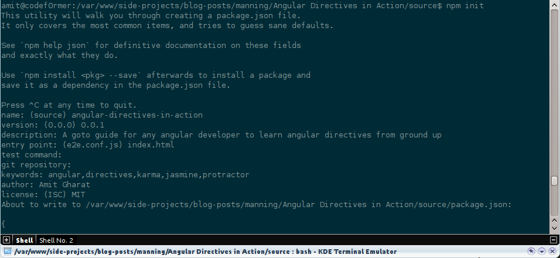
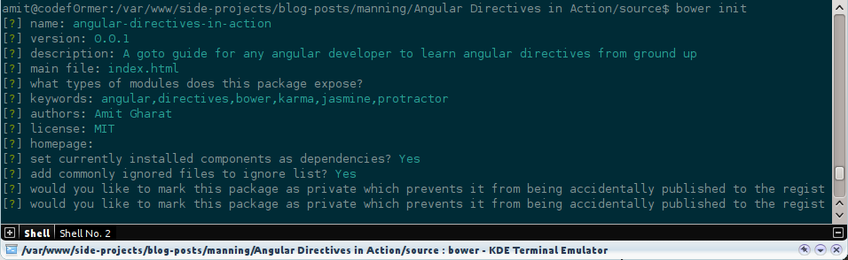
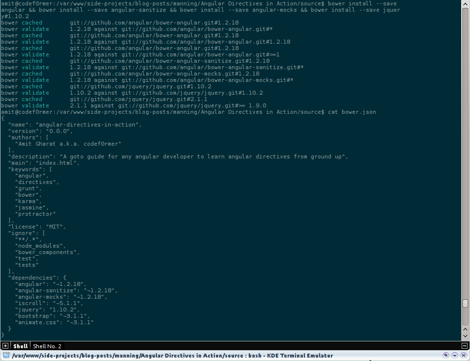
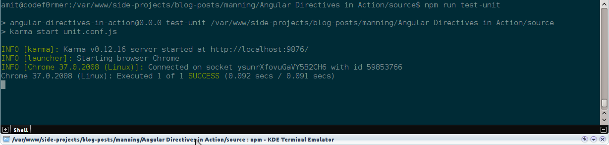
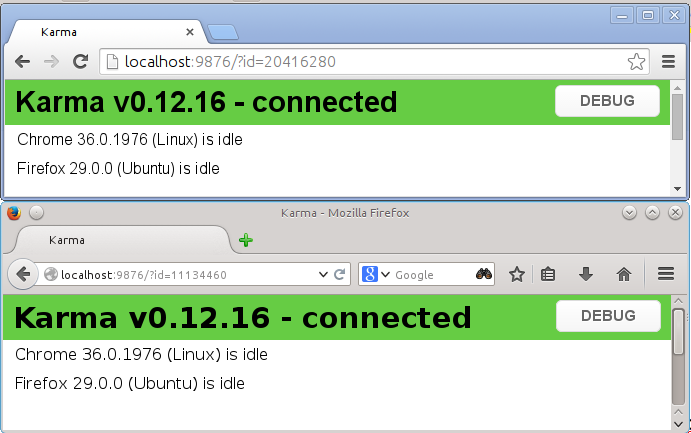

# Testing the Beast: Unit testing and E2E testing

This chapter covers
* The importance of testing to build workable applications
* Seamless Unit Testing with Karma Test Runner
* Benefit of End to End testing with Protractor
* Leveraging all these to help us write testable directives


We have already learned enough about how AngularJS helps developers to keep JavaScript code aside from the DOM to make it easy to test but this chapter will take our learning to the next level and teach us how to write testable AngularJS applications and directives seamlessly. In this chapter, we'll set up an established development environment first. Then we'll get over the intricacies of testing with Karma Test Runner and Protractor. We'll also learn how Protractor facilitates an end to end testing strategy to automate manual testing the user would do instead. At the end of chapter, we'll configure Karma and Protractor to suite our testing needs for all the examples from the book.

> We are going to use Jasmine to write assertions for both Unit and E2E testing. I would recommend to go through the documentation on how to write assertions in Jasmine (http://jasmine.github.io/2.0/introduction.html)  and Protractor (https://github.com/angular/protractor/blob/master/docs/api.md) as we are not going to cover them here in detail.

## Setting up the Testing Environment

We as creators often spend our precious time and put huge efforts to build something amazing. No matter how experienced you are or which company you work with, every application you craft is ambitious for you and your growth. But those ambitions may get crushed if you do not test your application beforehand and may run into last-minute bug on launch day or miss important deadlines too. It's not that people ship stuff without testing; however many of us do manual testing that means fiddling with the application from a user's perspective. Although there is nothing wrong in it but developers are humans and humans are not perfect unlike automatons. Moreover,  manual testing is time consuming for developers to spend their time doing it.

Imagine you are working on some application along with your team and you recently introduce a feature that somehow break the existing functionality; but you are not aware of it until you release the new implementation to Quality Control (QC) and they notify you. The worst case scenario would be that if even QC team did not notice the bug and hit your users badly. So automated  testing flow helps us to focus on shipping than worrying about broken things. Here we could just offload the tasks to a system that does it for us. Many such problems can easily be rectified by automated testing before being deployed on production. According to **Julie Ralph** who is one of the core AngularJS developers and Head of Protractor (E2E testing framework for AngularJS) once said that, *“Testing is about gaining confidence that your code does what you think it should do”.*

In this section, we’ll see how easy is it to set up the testing environment to test AngularJS code. We'll begin with the basic installation of prerequisite softwares for a testing environment to run on. Let's get started.

### Installing Git
I presume you must have used Git before but if not, Git is a free and open source distributed version control system designed to handle everything  from small to large projects. I can not imagine working alone or in a team without using Git at work and home on my personal projects. Although Git is not the requirement for testing AngularJS directives, but we'll going to need it in the last chapter wherein we'll publish all the directives to the world. We'll host them on Github – an online project hosting for Git – for other developers to access them via Bower. If you are not fond of command line, visit [git-scm.com](http://git-scm.com) website to download the installer to install the latest version of Git on your system. Following instruction might be helpful for command line fanatics.

On a Mac, again the easiest way to do this is using Homebrew 
(http://brew.sh). Run the following command in the Terminal 
after installing Homebrew:

```sh
brew install git
```

On Windows, the easiest way to install Git is to run the Windows 
installer from http://git-scm.com/downloads.

On Linux, run the following command in the shell:

```sh
sudo apt-get install git
```

Post installation, make sure Git is properly installed by running `git --version` command which should tell you the installed version.

#### Installing NODE.JS and NPM
Node.js is a platform built on V8 – a JavaScript Engine which powers Google Chrome browser. That means Node.js does not run in a web browser but as a server side JavaScript language. Whereas NPM is a NodeJS package manager written entirely in JavaScript, and runs on the NodeJS platform. Meaning we can use it to install packages/programs written in NodeJS. We do not need to install it separately as it is bundled and installed automatically with the environment. NPM runs through command line and manages dependencies for an application which we'll see shortly. To install NodeJS, visit nodejs.org (http://nodejs.org). 

On a Mac, you could either run the installer from the preceding link or run following command to install it using Homebrew package manager. This will install both Node and NPM.

```sh
brew install npm
```

On Windows, simply download the installer from nodejs.org (http://nodejs.org).

On Linux, you could download the source and compile it manually using following commands. Uncompress the downloaded source first. Then run: 

```sh
./configure
make
sudo make install
```

You could also install through Linux package manager.
```sh
sudo apt-get install npm
```

Assuming you have successfully installed node.js, to make sure just fire up a terminal and run following command to check the version installed as: 
```sh
node --version 
```

We are good to go if it shows the installed version without any error. Also note that any of  these (Apache2, Nginx, WAMP, XAMPP, and so on) web servers is required for Protractor tests to work as it can not handle local files. So install any web server before moving on.

Now let's create a directory for our project somewhere in the root directory of the web server you have installed probably in *C:/Program Files/Apache Group/Apache2/htdocs* or */var/www/* as:

```sh
mkdir angular-directives-in-traction
cd angular-directives-in-traction
```

Then create a `package.json` file by running following command in the terminal as:

```sh
npm init
```

You will be bombarded with few questions by the command such as *name of the package, description, version, entry point, test command, git repository, keywords, author, and license*. These information will be important for us to publish AngularJS directives later. For now, name and author information is enough to move on as shown:



> NOTE: To get more specifics of NPM's package.json handling, please go through https://www.npmjs.org/doc/json.html


### Installing Bower
Like NPM is a package manager for NodeJS, Bower is for the web. It is created by Twitter which offers a generic, unopinionated solution to the problem of front-end package management. Up until, developers used to visit a website to grab an updated version of a jQuery plugin or any library but not now. Just run bower command to install, update, and remove any dependency. For that, first install bower with:

```sh
npm install -g bower 
bower --version
```

This command will install `bower` globally.

As we have bower in place, let's install necessary AngularJS modules for all the examples we have seen so far in previous two chapters. First create `bower.json` as:
```sh
bower init
```

Please enter p*roject name, description*, and so on when asked. At the end, it will create `bower.json` which is really useful to encompass references of external modules or jQuery plugins. You can check out the following figure to fill in the answers.



Now that bower has been set up, let us install following dependencies locally instead of loading them directly via CDN as seen in previous chapters:

```sh
bower install --save angular
bower install --save angular-sanitize
bower install --save angular-mocks
bower install --save jquery#1.10.2
bower install --save bootstrap
```
You may be wondering, what does `--save` do? Well, all these bower packages will be referenced under dependencies section in `bower.json`. This is useful in case you are working in a team and to install  the bower packages required for your application to work on other systems, you can just run following command to resolve dependencies automatically:

```sh
cd angular-directives-in-action
npm install
```

You can take a look at `bower.json` to find records of all the packages that are downloaded under `bower_components/` directory. 



We have successfully installed the prerequisite softwares such as Git, Node, NPM, and Bower on top of which our testing stack will run. Now let us set up Karma and Protractor in following sections.

## Unit Testing with Karma

First thing to note here is that Karma is not a framework to write unit tests. It is essentially a tool which spawns a web server that executes source code against test code for each of the browsers connected i.e. captured. A browser can be captured in two ways:

1. Manually by visiting the URL where the Karma server is listening (typically  http://localhost:9876)
2. Automatically by letting Karma know (via `unit.conf.js`) which browsers to start when Karma is run.

Once specified browsers are captured, the results for each test against each browser are examined and displayed via the command line to the developer such that they can see which browsers and tests passed or failed in real-time. We'll set it up soon but here is how it looks to get you excited:



Karma also watches all the files, specified within the configuration file, and whenever any file changes, it triggers the test run by sending a signal to the testing server to inform all of the captured browsers to run the test code again. Each browser then loads the source files inside an Iframe, executes the tests and reports the results back to the server. The server collects the results from all of the captured browsers and presents them to the developer in the terminal. The main goal of Karma is to bring a productive testing environment to developers.

> TIP: If you are more interested to learn how karma works internally then Vojta Jina's thesis about Karma for unit testing web applications is https://github.com/karma-runner/karma/raw/master/thesis.pdf worth a read.

### Installing Karma
Karma installation is extremely easy with NPM. You just have to run following commands in the terminal:

```sh
npm install karma --save-dev
npm install karma-chrome-launcher --save-dev
npm install karma-jasmine --save-dev
```

Similar to `--save` command line option used with bower, `--save-dev` option records a reference of the installed NPM package under `devDependencies` section in the `package.json` file. Again, this is to make it easy to resolve `devDependencies` on different systems.

In case, you get *EACCESS error* because of missing write permissions on the `node_modules/` directory. Try once again with sudo:

```sh
sudo npm install karma --save-dev --allow-root
sudo npm install karma-chrome-launcher --save-dev --allow-root
sudo npm install karma-jasmine --save-dev --allow-root
```

Notice it must have created karma directory inside `node_modules/`. It has also installed `karma-chrome-launcher` to enable Karma to boot Google Chrome browser by locating the installed location of Chrome on your system to run tests. The `karma-jasmine` package is an adapter for Jasmine so we do not have to load it manually while testing. 

Okay, we can now test karma, just fire following command in a terminal:

```sh 
./node_modules/karma/bin/karma start
```

If you find *Karma v0.12.16 started*, just clap on..! However, typing such lengthy command all the time kinda sucks and so you might find it useful to install `karma-cli` globally. Remember all your NPM packages reside in `node_modules/` directory unless installed globally with `-g` option:

```sh
npm install -g karma-cli
karma start
```

This allows us to run karma from anywhere but will use the local version if exists.

### Configuring Karma
It's time to configure Karma to serve our project well. Karma needs to know about our project structure in order to run tests and this is done via a configuration file. So let us create a Karma configuration file with:

```sh
karma init unit.conf.js
```

Beware that you will again get bombarded with quick questions but keep your chin up and stay with me. Please use exact answers given below to set it up properly.

1. Which testing framework do you want to use? **Jasmine**
2. Do you want to use Require.js? **No**
3. Do you want to capture any browsers automatically? **Chrome**
4. What is the location of your source and test files? **js/*.js**
5. Should any of the files included by the previous patterns be excluded? **Press Enter!**
6. Do you want Karma to watch all the files and run the tests on change? **Yes**

This will create `unit.conf.js`, do check it out. You could see `js/*.js` as mentioned above under files section:

```javascript
    files: [
      'js/*.js'
    ],
```

If you remember we had written Unit as well as End-to-End (E2E) tests in the first chapter to validate AngularJS templating so it is time to test them in real browsers. Replace files option in `unit.conf.js` as:

```javascript
files: [
  'bower_components/angular/angular.js',
  'bower_components/angular-mocks/angular-mocks.js',
  'js/ch01/angular-template.js',
  'tests/specs/ch01/*-unit.js'
]
```

The `angular-mocks` module allows us to inject and mock AngularJS services into unit tests. In addition, it also extends various core AngularJS services so that they can be inspected and controlled in a synchronous manner within test code.

After bower components, we have added the actual JavaScript code and then test files. For the sake of convention, we will use the same file name for the test with the suffix `-unit.js` throughout the book. Now as we have everything in place, we can see if the tests are working or not using following command:

```sh
karma start unit.conf.js
```

The command will fire up Google Chrome and validate our tests by showing the following output in the terminal:


> INFO [karma]: Karma v0.12.16 server started at http://localhost:9876/

> INFO [launcher]: Starting browser Chrome

> INFO [Chrome 36.0.1976 (Linux)]: Connected on socket IrgrQrSoNdT9DqcbCx-j with id 78497101

> Chrome 36.0.1976 (Linux): Executed 1 of 1 SUCCESS (0.081 secs / 0.078 secs)

Keep updating the `unit.conf.js` file for any new examples to test.

### Extending Karma
Karma is fully customizable in a sense that it can be molded to accommodate our application structure. We'll go through some but essential configurable options here. Open `unit.conf.js` in an editor and update it as per the instructions given below.

###### BASEPATH
It is essential to tell Karma where is the configuration file located. This path is prepended to all relative paths defined under files section. In case the karma configuration file is not in the root of the application but the source and test files are, then you may have to change basePath to say, `../../` depending upon directory structure you have followed. We'll keep it empty in our case as:
```javascript
basePath: ''
```

###### FRAMEWORKS
Karma also needs to know about the testing framework used to write unit tests. This option let us use a list of testing frameworks we want to use. As we saw earlier that Karma, by default,   comes with Jasmine adapter so we will stick with Jasmine so:
```javascript
frameworks: ['jasmine']
```

In case you are interested to use qunit then first install karma-qunit node module using npm command in the terminal.

```sh
npm install karma-qunit --save-dev
```

And later update frameworks section from `['jasmine']` to `['qunit']` in the `unit.conf.js` file.

>TIP: There are various testing frameworks karma supports, please visit https://www.npmjs.org/browse/keyword/karma-adapter to install them if needed.

###### FILES
This option takes a list of source files and test files to load in the browser while testing by Karma. You can even target files with patterns or regular expressions. That is:

```javascript
    files: [
      'js/**/*.js',
      'tests/specs/ch01/*-unit.js'
    ]
```
The first entry does a recursive lookup with `/**/` for all JavaScript files inside `js/` and child directories. The second one matches all the file names ending with `-unit.js`.

###### PORT
This refers to the port where karma server runs on. The default port is `9876` but you can change it to anything that not in use. We'll stick to the default one as:

```javascript
port: 9876
```

Nevertheless, handy option to keep port number easy to remember with custom one.

###### BROWSERS
We often do testing on multiple browsers but Karma uses Google Chrome browser, by default, to run all the tests. However, we can easily add a bunch of browsers to run the same tests. For instance, to automate the same for Firefox, we need to install Firefox launcher (similar to Chrome launcher) with following command first:

```sh
npm install karma-firefox-launcher --save-dev
```

And update browsers section in `unit.conf.js` as:

```javascript
browsers: ['Chrome', 'Firefox'],
```

If we restart karma again with `karma start unit.conf.js` command in the terminal then we'll see both browsers running the same tests as shown in the following figure.



> TIP: Please visit https://www.npmjs.org/browse/keyword/karma-launcher to install other kinds of launcher including IE, Safari, Opera, and so on.

Note that the karma server starts at port `9876` and then immediately loads the same URL in Google Chrome and Firefox to capture it in order to run tests atop. In addition, you can even load the same URL in Internet Explorer to run tests against it.

###### SINGLERUN
This is useful for continuous integration mode. We are going to keep captured browsers alive so that tests will be run every time we make changes to our files with:

```javascript
singleRun: false
```

If set to `true` then karma will capture all targeted browsers, run the tests, and exit.

> Definition: Continuous Integration is a software development practice where members of a team integrate their work frequently, usually each person integrates at least daily - leading to multiple integrations per day. Each integration is verified by an automated build (including test) to detect integration errors as quickly as possible. Many teams find that this approach leads to significantly reduced integration problems and allows a team to develop cohesive software more rapidly.

###### AUTOWATCH
This enables/disables watching files listed in files section and executing tests whenever any file changes. Useful only if singleRun option is set to false.

> TIP: There are other options exist to fully customize Karma that we are not covering here because of space constraint, so feel free to go through them at http://karma-runner.github.io/0.10/intro/configuration.html.

In addition to all of these options in `unit.conf.js`, you can override some of them on the fly while starting Karma as shown:

```sh
karma start unit.conf.js --browsers Chrome,Firefox --port 1337 --singleRun true --autoWatch false  
```

That's it..! We are done with Karma installation.

## Integration Testing with Protractor
Like Jamine is to Unit Testing, Protractor is to E2E (End to End) or Integration Testing. When applications grow in size and complexity, it becomes unrealistic to rely on manual testing to verify the correctness of new features, catch bugs and notice regressions. End to end tests are made to find these problems. 

Protractor is an End to End test framework for AngularJS built on top of WebDriverJS a.k.a Selenium. Selenium-Webdriver is a browser automation framework. Tests are written with the WebDriver API, which communicates with a Selenium server to control the browser under test. It runs tests against your application running in real browsers, interacting with it as a user would. Visit http://angular.github.io/protractor/#/infrastructure to know more about how it works under the hood.

### Installing Protractor
Let's quickly install protractor locally. Additionally you could install protractor globally with `-g` flag if you wish as:

```sh
npm install protractor --save-dev
```

Protractor installs `webdriver-manager` by default which is a part of Selenium that controls browsers to run automated tests to mimic the behavior of a real user to test applications. Then we will run the Selenium installation script to download the chromedriver required to run Selenium itself and build a start script:

```sh
./node_modules/protractor/bin/webdriver-manager update
```

Please note that Selenium has a dependency on Java, so you must have Java (http://java.com) installed on your system. Now we are good to start the standalone version of Selenium.

### Configuring Protractor
Similar to Karma, protractor also relies on the configuration file. The configuration file specifies how the runner should start webdriver, where your test files are, and global setup options. Protractor already has a reference configuration file that we can use and update accordingly. Let's copy it in the root directory of our project:

```sh
cp ./node_modules/protractor/docs/referenceConf.js e2e.conf.js
```

It uses Jasmine as a default framework to write assertions.

### Extending Protractor
Protractor is also fully configurable like Karma. So let's check with some of the important configurable options and update them.

###### BASEURL
Use to define an absolute base URL of an application. In our case, it would be:
```javsacript
baseUrl: 'http://localhost/side-projects/blog-posts/manning/Angular Directives in Action/source/'
```

Please change it accordingly. This will be prepended to specs.

###### SPECS
This is similar to files section in Karma configuration consisting of test files to run. Update `e2e.conf.js` with following:

```javascript
specs: [
    'tests/specs/**/*-e2e.js'
]
```

Please note that we are going to use similar convention for protractor tests as well. We'll use the same name as original file with the suffix `-e2e.js`. And `/**/` targets chapter-wise directories i.e. ch1, ch2, ch3, and so on.

###### SUITES
Running all the tests often is time consuming and you might want to just test the current file   being modified. In such scenario, restricting the tests by chapter would be big time saver. With suites options, we can group related tests in order to run them separately. Update `e2e.conf.js` as:

```javascript
suites: {
    ch1: 'tests/specs/ch01/*-e2e.js'
}
```

Here we basically created a chapter-wise suites to run tests independently if needed. With this, we can run all tests for the first chapter only (excluding the rest) as:

```sh
./node_modules/protractor/bin/protractor e2e.conf.js --suite ch1
```

###### CAPABILITIES
This controls a browser on which you want to run tests. By default, it is chrome.
> TIP: You may be interested to go through a specification of DesiredCapabilities and their content at https://code.google.com/p/selenium/wiki/DesiredCapabilities.

###### MULTICAPABILITIES
Although the capabilities section is helpful but you might want to run more than one instance of webdriver on the same tests, use this option instead. This takes an array of capabilities. If this is specified, capabilities section will be ignored. For instance, let's add Firefox as a capability so:

```javascript
multiCapabilities: [{
    'browserName': 'chrome'
}, {
    'browserName': 'firefox'
}]
```

Try running the protractor command to see tests running in both the browsers. It also supports safari, opera, and ie.

###### FRAMEWORK
Protractor for now only supports Jasmine and Cucumber assertion frameworks. We'll stick to Jasmine because even AngularJS uses it for it's own tests.

###### ONPREPARE
This is really useful option to handle more complex operations such as exporting the test report in XML or taking a screenshot of the window to analyze errors. It takes a callback to run when protractor is ready and before the specs are executed. For now, we'll simply resize the browser window as: 

```javascript
onPrepare: function() {
  browser.driver.manage().window().setSize(500, 500);
}
```

> TIP: It is recommended to go through useful docs added by the Protractor Core Team at  https://github.com/angular/protractor/tree/master/docs to know more about other options that we have not covered because of space constraint.

With this modifications in place, our testing environment is ready. In the following section, we'll write a simple but real-world directive and test it with Karma as well as Protractor. Let's get started.

## Learning to test by Real World example
Imagine your application have a profile page for each user to showcase his/her user information along with a nice profile picture. And it is very likely that the profile picture might fail to load because of some technical server issue which would affect the application layout. As different browsers treat missing images differently, it will probably give a bad impression to your users  so its always better to handle errors more gracefully. Let us do that.

Create a `placeholder.html` file in `ch03/` directory as:

```html
<html ng-app="PlaceholderApp">
<head>
  <title>Placeholder Directive</title>
  <script type="text/javascript" src="../bower_components/angular/angular.js"></script>
  <script type="text/javascript" src="../js/ch03/placeholder.js"></script>
  <link rel="stylesheet" type="text/css" href="../bower_components/bootstrap/dist/css/bootstrap.css">
</head>
<body ng-controller="ProfileCtrl">
  
  
</body>
</html>
```

As you can see, we have two profile images, one that works, and another fails to load. Both are  having a special directive applied on them, `onImageLoad` to load the placeholder image if the profile image fails to load. 

Then we'll define the directive in *js/ch03/placeholder.js* as:

```javascript
describe('Chapter 3: ', function() {
  beforeEach(module('PlaceholderApp'));
  
  var element;

  it('Should replace the default image with placeholder If it fails to load', inject(function($rootScope, $compile) {
    // If loads
    element = angular.element('');
    element = $compile(element)($rootScope);
    expect(element[0].getAttribute('src')).toEqual('http://lorempixel.com/100/100/people/1/');

    // If fails, use placeholder image
    element = angular.element('');
    element = $compile(element)($rootScope);
    waitsFor(function() {
      return element[0].getAttribute('src') === 'http://lorempixel.com/100/100/cats/';
    });
    runs(function() {
      expect(element[0].getAttribute('src')).toEqual('http://lorempixel.com/100/100/cats/');
    });
  }));
});
```

The second model named `userImageFail` has a broken url which will definitely fail to load.  That will trigger an error callback on the image to replace it with a placeholder image that will eventually fire up a load event in order to make it visible. This trick is used to avoid FOUC (flash of unstyled content) problem when the original image does not load (especially in IE). Though this directive looks quite simple but very useful in real world applications.

### Testing with Karma
Now that our directive is ready, it's time to unit test the same to make sure it works as expected. Simply create a new Jasmine test file in *tests/specs/ch03/placeholder-unit.js* as:

```javascript
describe('Chapter 3: ', function() {
  beforeEach(module('PlaceholderApp'));
  var element;

  it('Should replace the default image with placeholder If it fails to load', inject(function($rootScope, $compile) {
    element = angular.element('');
    element = $compile(element)($rootScope);
    expect(element[0].getAttribute('src')).toEqual('http://lorempixel.com/100/100/people/1/');

    element = angular.element('');
    element = $compile(element)($rootScope);
    waitsFor(function() {
      return element[0].getAttribute('src') === ' http://placekitten.com/100/100';
    });
    runs(function() {
      expect(element[0].getAttribute('src')).toEqual('http://placekitten.com/100/100 ');
    });
  }));
});
```

Please note that `waitsFor` is a Jasmine's way to track an asynchronous call and perform an action once it is completed. When we load an invalid image URL, it would take some time to trigger the error callback. As this delay is not consistent, we can not randomly wait for 1 or 2 seconds before the placeholder directive takes an action on it. So `waitsFor` provides a better interface for pausing the control flow until the current assertion has been resolved. As soon as it returns true, Jasmine reaches to `runs()` block, where it validates the `src` attribute of the image.

Now, update the file section in `unit.conf.js` to verify the preceding spec as:

```javascript
files: [
      'bower_components/angular/angular.js',
      'bower_components/angular-mocks/angular-mocks.js',
      'js/ch01/angular-template.js',
      'tests/specs/ch01/*-unit.js'
      'js/ch03/placeholder.js',
      'tests/specs/ch03/*-unit.js'
],
```

Then run Karma on the command line with karma start `unit.conf.js` command and you will notice that the test is passing as expected. 

### Testing with Protractor
Writing test cases in Protractor is quite similar to unit testing with one difference is that it will be executed in real browsers and the way your users would perceive it. 

First, create `placeholder-e2e.js` in *tests/specs/ch03/* directory as:

```javascript
describe('Chapter 3:', function() {
  it('should replace the default image with placeholder If it fails to load', function() {
    browser.get('ch03/placeholder.html');

    // If loads
    expect(element.all(by.tagName('img')).first().getAttribute('src')).toEqual('http://lorempixel.com/100/100/people/1/');
    
    // If fails, use placeholder image
    var imgElement = element.all(by.tagName('img')).last();
    browser.wait(function() {
      return imgElement.getAttribute('src').then(function(src) {
        return src === 'http://lorempixel.com/100/100/cats/';
      });
    }, 60 * 1000);
    expect(imgElement.getAttribute('src')).toEqual('http://lorempixel.com/100/100/cats/');
  });
});
```

The `browser.wait()` command is quite similar to `waitsFor()` block in Jasmine. It takes a condition to evaluate, timeout in milliseconds to wait for the condition to be true (60 seconds in our case), and an optional message to show if timed out.

To test the same, update the suite option in `e2e.conf.js` as:

```javascript
 suites: {
    ch1: 'tests/specs/ch01/*-e2e.js',
    ch3: 'tests/specs/ch03/*-e2e.js'
  },
```

And run the following command in the terminal to see it passing.

```sh
./node_modules/protractor/bin/protractor e2e.conf.js --suite ch3
```

We've just scratched the surface here covering Karma and Protractor, so I will recommend to go through the API documentation to learn more.

### Automating tests with “npm run”
So far, we have seen long commands to run unit and End-to-End tests. The `npm run` command is perfectly adequate to trim them down to make it easy to remember and save us few keystrokes every time we run them. You can run following command to see all the available options with npm:

```sh
npm --help

Usage: npm <command>

where <command> is one of:
    add-user, adduser, apihelp, author, bin, bugs, c, cache,
    completion, config, ddp, dedupe, deprecate, docs, edit,
    explore, faq, find, find-dupes, get, help, help-search,
    home, i, info, init, install, isntall, issues, la, link,
    list, ll, ln, login, ls, outdated, owner, pack, prefix,
    prune, publish, r, rb, rebuild, remove, repo, restart, rm,
    root, run-script, s, se, search, set, show, shrinkwrap,
    star, stars, start, stop, submodule, t, tag, test, tst, un,
    uninstall, unlink, unpublish, unstar, up, update, v,
    version, view, whoami
```

For instance, `npm test` command may trigger test scripts if available, but internally it fires `npm run test` where test is some sort of scripts or process we want to invoke. That means we can extend these options to run customized scripts. If we look at `package.json` created at the beginning of the chapter, you may find following in the scripts section:

```javascript
  "scripts": {
    "test": "echo \"Error: no test specified\" && exit 1"
  }
```

So, let's update it to create two new scripts for Karma and Protractor as:

```javascript
  "scripts": {
    "test": "karma start unit.conf.js --singleRun true && npm run test-e2e",
    "test-unit": "karma start unit.conf.js",
    "test-e2e": "protractor e2e.conf.js"
  }
```

First one runs both unit (single run) and End-to-End tests together which is really useful to do a quick test drive. The other two scripts are there to run them separately. You can use them as:

```sh
npm test
npm run test-unit
npm run test-e2e
```

All these commands basically make their respective scripts little handy to use but essentially do the same thing.

## Summary
In this chapter, we have learned about testing units of source code with Jasmine framework and End to End testing of applications in real browsers using Protractor. We have successfully set up a testing environment suitable for this book and to the companion suite but can easily be extended further. We have also automated Unit testing with Karma Test Runner to save our time by running all the tests in the background in no time. 

However, writing tests can be challenging and time consuming but *“Minutes now can save Hours later”*. The next chapter will be hands-on directives to extend HTML vocabulary.
