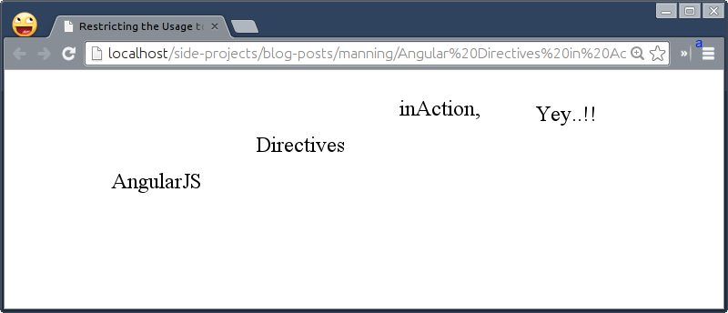
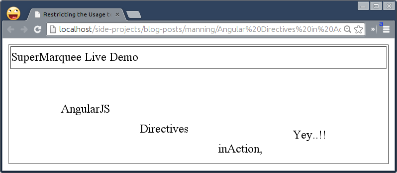
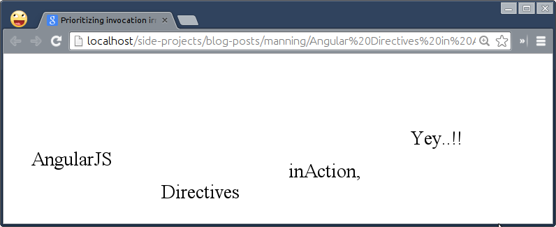
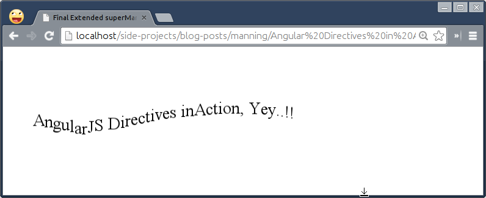
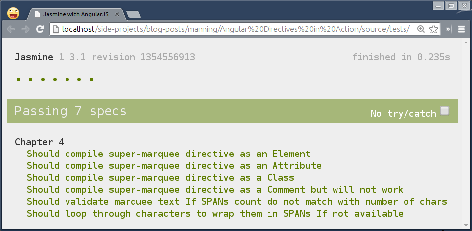

# Learning to extend HTML with the Directive  API
This chapter covers
* Various ways of using directives in HTML
* Difference between template and templateUrl options
* Benefit of prioritizing execution of multiple directives on element
* Purpose of terminating execution of directives
* Unit and E2E testing of sample directive
* Learn to use a jQuery plugin in AngularJS context

Forget about all HTML elements for a moment! The one element that allured me to atleast try out HTML a decade ago was ```<marquee>``` element. The reason behind this is that it was the only HTML element animating stuff on and off the page at that time when developers had to use Flash or other technologies to create animation for the web. However, it can only scroll text horizontally or vertically but things have changed since then; now CSS3 and advanced JavaScript capable to do high quality animations seamlessly without any third party plugins.

In this chapter, we'll resurrect the good old marquee element, give it super powers using CSS3 animations, and learn how AngularJS Directives API helps into all this.

## Gaining an Insight into directives
Through a long but inspiring journey so far, we have come to a moment where we will actually get our hands dirty with directives API. Considering the fact that we can use directives before Web Components come into existence and widely supported, we are now enough prepared to write our first directive.

In simple words, **AngularJS Directives API** is a way to extend HTML vocabulary. By means of Directives API is that AngularJS has it's own reasoning behind how one should write custom element and it does not adhere to the standards of Web Components for now. But It might cohere in future as the standards evolve so hopefully one day you could use directives along with Web Components.

If you take an example of jQuery and realized how it was built out of necessity but after so many years even though all major browsers have implemented complex DOM querying using CSS3 or JavaScript selectors as a part of a Selectors API natively, developers are still happy to use jQuery and they will not go away from it anytime soon. The reason behind the wide adoption over native implementation is that jQuery did not just solve one specific problem, instead it created the ecosystem around it in terms of Plug-ins, UI frameworks, and handling cross-browser quirks without burdening developers. AngularJS is on the same path to make it a rudimentary choice for developers when it comes to build web applications and extend HTML. At the time of writing this chapter, few working examples of AngularJS data bindings with polymer had also emerged that can give us a clear sign where it is heading.

To begin with, we'll leverage ```<marquee>``` tag initially as a scroller to move text to avoid getting overwhelmed with CSS3 animations in the beginning but add them to move words up and down to create a wave-like effect by eliminating the marquee tag altogether at the end of the chapter. 

We'll call it ```<super-marquee>```. Let us first create an HTML file named *restrict.html* in *ch04/* directory.

```html
<html ng-app="MarqueeApp">
  <head>
    <script type="text/javascript" src="../bower_components/angular/angular.js"></script>
    <script type="text/javascript" src="../js/ch04/restrict.js"></script>  
  </head>
  <body>
    <div super-marquee>
  </body>
</html>
```

For the record, the `super-marquee` element will have multiple words wrapped in `span` tags to float around individually using CSS3 keyframe animations that we'll just change `margin-top` from `0px` to `100px` in order to move them up and down, alternatively. To set up the base animation first, add following into the `head` tag: 

```css
<style>
    @-webkit-keyframes animate { to { margin-top: 100px; } }
       @-moz-keyframes animate { to { margin-top: 100px; } }
         @-ms-keyframes animate { to { margin-top: 100px; } }
            @keyframes animate { to { margin-top: 100px; } }

    div.wave > span {
      float: left;
      text-align: center;
      padding-right: 40px;
      -webkit-animation: animate 1.5s ease-in alternate infinite;
         -moz-animation: animate 1.5s ease-in alternate infinite;
           -ms-animation: animate 1.5s ease-in alternate infinite;
              animation: animate 1.5s ease-in alternate infinite;
    }
</style>
```

This will move all the texts vertically but we need an alternate movement to create a wave-like  motion so let's use varying delay as follows. Add following in the above style tag as:

```css
div.wave > span:nth-child(1) { }

div.wave > span:nth-child(2) {
  -webkit-animation-delay: .4s;
     -moz-animation-delay: .4s;
       -ms-animation-delay: .4s;
          animation-delay: .4s;
}

div.wave > span:nth-child(3) {
  -webkit-animation-delay: .8s;
     -moz-animation-delay: .8s;
       -ms-animation-delay: .8s;
          animation-delay: .8s;
}

div.wave > span:nth-child(4) {
  -webkit-animation-delay: 1.2s;
     -moz-animation-delay: 1.2s;
       -ms-animation-delay: 1.2s;
          animation-delay: 1.2s;
}
```

This will move all the words at the same time but with different speed that will create a wave-like effect. Now that we have setup the base for the example to work, let's begin to play with Directives API.

## Restricting the Usage to enforce HTML semantics
The most obvious application of directives API is defining new HTML vocabulary. The directives API is so thorough that it allows us to define specific directive declaration style to suite our need. It enables us to use directives as attributes, elements, CSS classes, and HTML comments in the DOM.

```html
<div angular></div>
<angular></angular>
<div class="angular"></div>
<!-- directive: angular -->
```

For a huge name such as following, you can split the words using hyphens while declaring and camelcase it while defining a directive so:

```html
<div the-quick-brown-fox-jumps-over-the-lazy-dog></div>
```

```javascript
App.directive('theQuickBrownFoxJumpsOverTheLazyDog', function() { ... });
```

Pay attention to **the directive's definition in JavaScript** and **declaration in HTML** as both are different. In order to maintain any directive syntactically valid, we should not declare our directive as `theQuickBrownFoxJumpsOverTheLazyDog` in the DOM. However, it may be correctly rendered by browsers (not by AngularJS) but will not be validated by HTML/XHTML validators. The problem is that different browsers (or even different versions of the same browser) will make different guesses about the same illegal construct; worse, if your HTML is really pathological, the browser could get hopelessly confused and produce a mangled mess, or even crash. In contrast, the directive definition returns a function and one can not use hyphenated function name in JavaScript  which prevents us from using `the-quick-brown-fox-jumps-over-the-lazy-dog` while defining the same.

> NOTE: Always use hyphen while declaring a directive in HTML and camelCase while defining it in JavaScript. This is the biggest point of confusion for beginners and might be time-saver for you. In case you are interested to know how does HTML/XHTML validation work, read the FAQ (http://validator.w3.org/docs/help.html) maintained by W3C.

Moving on we'd applied a custom attribute on a div element earlier so let us write the directive for the same in *js/ch04/restrict.js* as follows:

```javascript
var App = angular.module('MarqueeApp', []);

App.directive('superMarquee', function() {
  return {
    compile: function(element) {
      var scrollingText = '<marquee>\
        <div class="wave">\
          <span>AngularJS </span>\
          <span>Directives </span>\
          <span>inAction, </span>\
          <span>Yey..!!</span>\
        </div>\
      </marquee>';

      element.html(scrollingText);
    }
  };
});
```

Do not worry about compile function for now as it will be covered in detail in later chapters. For now, consider it as a wrapper to put up a logic for the directive. Here we've just a string with each word wrapped in `span` tags which ultimately go within a ```<marquee>``` tag. Later we insert the markup in the element itself using a jQuery ```.html()``` method. With this, our directive must start to roll text in the browser as shown:



That's just an HTML attribute but let us look at other ways of using the `restrict` option and their pros and cons.

###### HTML ELEMENT
Showing off an element of your own name is more exciting than anything else. With restrict as an element option in directives, you can actually extend the existing HTML tags offering by making the markups more meaningful. You can add following option in order to use `superMarquee` directive as an element:

```javascript
App.directive('superMarquee', function() {
  return {
    restrict: 'E',
    link: function() { ... }
  }
});
```

And then use it in the DOM so:

```html
<super-marquee></super-marquee>
```

Note that the Internet Explorer versions prior to 9 do not go well with custom elements so you need to take care of that with additional prescriptions.

> TIP: Please visit http://docs.angularjs.org/guide/ie to take necessary majors in order to run your application smoothly on older IE.

> NOTE: Please note that AngularJS 1.2 will continue to support IE8, but the 
core team will not address any pending issues specific to IE8 or earlier. Also, AngularJS 1.3 is dropping support for IE8.

Here are the pros and cons to decide when to use the option.

**Pros:**
* Beneficial for main directive (I prefer to call it a King Directive) that can encompass other directives to make up the whole functionality. For example, an accordion widget that we saw in the first chapter which had a main directive, `accordion`, as follows:
```html
<accordion>
    <accordion-group heading="Accordion Header #1">Accordion Body </accordion-group>
    <accordion-group heading="Accordion Header #2">Accordion Body </accordion-group>
</accordion>```
* More expressive.
For example,  ```<tabs><tab>Tab 1</tab><tab>Tab 2</tab></tabs>``` is more readable than ```<div tabs><div>Tab 1</div><div>Tab 2</div></div>``` from developer's perspective.

**Cons:**
* Can not use multiple element level directives together and hence need to rely on Class or Attribute level directives to extend behavior. 
For example, we need use `enable` attribute to toggle the tab's state as:
```<tabs><tab enable='false'></tab></tabs>```.
* Require extra efforts to handle older versions of Internet Explorer.
* Can not be validated against HTML/XHTML validators.

AngularJS supports this declaration style for many built-in directives such as form, input, ngInclude, ngSwitch, and so on.

###### HTML ATTRIBUTE
To avoid adding unnecessary complexity to support IE8 or older, you can restrict the directive as an attribute which is a default option and hence if you had noticed that we did not specify it for `superMarquee` directive earlier. This is the most common option used in many open source AngularJS applications, libraries, and widgets. You can specify it as `restrict:'A'` in the directive definition. Similar to Element level directives, this also has few advantages without any disadvantages.

**Pros:**
* Do not have to rely on other directives to pass in configurations to alter the behavior. 
For example, ```<div tab>Tab 1</div>``` can be easily extended as ```<div tab='{enable: false}'>Tab 1</div>```.
* Can be used with Element and Class level directives.
* Works in all the browsers (even older I.E.) with ease.
* Can be validated against HTML/XHTML validators with data- prefix.

AngularJS uses this declaration style as well for many built-in directives like form, ngIf, ngClass,  ngInclude, and ngSwitch.

###### CSS CLASS
You can also defined the directive as a CSS Class using `restrict:'C'` option. There is no added advantage over element and attribute levels, instead, it is recommended to use E or A option over C.

**Pros:**
* Can be used with element and attribute level directives to attach behaviors.
* Sometimes it's possible to utilize CSS classes than applying extraneous attributes if they justify the purpose of the directive. The best example is the dropdown menu functionality of AngularUI Bootstrap where simply adding a class (`.dropdown-toggle`) activates the menu (`.dropdown-menu`) as shown: 
```html
<span class="dropdown">
     <a class="dropdown-toggle">My Dropdown Menu</a>
     <ul class="dropdown-menu">
         <li>One</li>
        <li>Two</li>
    </ul>
</span>
```

**Cons:**
* Class level directives may be hard to differentiate from the actual CSS classes in the DOM so use sparingly.

###### HTML COMMENT
Directives as HTML comments do not make sense in the first place but they are really handy in places where the DOM APIs limit the ability to create directives that spanned multiple elements such as ```<table>, <ul>, <ol>```, and so on. If you try to use any of the restrict options that we learned so far within ```<table>``` element then browser will automatically take it out while rendering, so the following approach would fail.

```html
  <table>
    <tr><td>SuperMarquee Live Demo</td></tr>
    <div super-marquee></div>
  </table>
```

But if you define the directive as an HTML comment and replace it with scrollingText as:

```javascript
App.directive('superMarquee', function() {
  return {
    restrict: 'M',
    compile: function(element) {
      var scrollingText = '<marquee>\
        <div class="wave">\
          <span>AngularJS </span>\
          <span>Directives </span>\
          <span>inAction, </span>\
          <span>Yey..!!</span>\
        </div>\
      </marquee>';

      // If element is a comment
      if (element[0].nodeType === 8) {
        element.replaceWith('<tr><td>' + scrollingText + '</td></tr>');
      } else {
        element.html(scrollingText);
      }
    }
  }
});
```

And update the table so:

```html
<table>
  <tr><td>SuperMarquee Live Demo</td></tr>
  <!-- directive: super-marquee -->
</table>
```

Then this will load `super-marquee` within the table itself as shown in the following figure.



Now comment level directives do not have pros except the one we just saw with ```<table>``` but has many cons as given below: 
* Can not be used with element, attribute, and class level directives.
* Can not use multiple comment level directives together to extend behavior.
* Extra precaution to be taken to avoid removing HTML comments during a `build` process via grunt, gulp, and so on.

So the important things to note that:
* We can use all the options together in any order while defining a directive with `restrict:'EACM'` option and free to use any declaration style in HTML.
* Use element or attribute level options often. As AngularJS 1.3 has dropped IE8 support so `restrict:'EA'` is the default restrict option now.
* Restrict to attribute or class in case of adding just a behavior without any configuration. For example, the `ngIf` directive that can only be used as an attribute because it takes an expression to add or remove the corresponding element when the expression evaluated to `true` or `false` respectively.
* Avoid using comment level directive as AngularJS 1.2 introduces directive-start and directive-end as a better solution to the problem that could be solved earlier by the comment level directive. So that we can use `super-marquee-start` and `super-marquee-end` directives as an alternative to the comment level `superMarquee` directive.

Now that we know how to define directives, let us find out how to add content into the directive in the next section.

## Feeding the minimal Template inline
We saw earlier that the marquee text was stored in a variable named `scrollingText` which we were injecting into the DOM conditionally. That's what exactly `template` option is for. The template option can consist of HTML markups that will be produced when the directive is executed by AngularJS compiler. It can also hold other directives or AngularJS data binding expressions. Let's update our directive in *restrict.js* as:

```javascript
App.directive('superMarquee', function() {
  return {
    restrict: 'EACM',
    template: '<marquee>\
      <div class="wave">\
        <span>AngularJS </span>\
        <span>Directives </span>\
        <span>inAction, </span>\
        <span>Yey..!!</span>\
      </div>\
    </marquee>'
  };
});
```

As you can see, we've just moved the content from `compile` to `template` so all types of directives will still work except the comment one. That is because when the directive is processed, the template is inserted into the element on which the directive was declared and DOM APIs do not allow to inject the markups inside the HTML comment.

Is it a bug in AngularJS directives API or DOM API? Nope, It's not a bug at all from either side because that's how DOM APIs work but AngularJS let's you fix this problem with replace option which we'll see later.

You can even pass a function in the template option that should return a string as a template. Note that you get access to `element` and `attrs` to do some activities or perform actions on the element or the template. So here we are just grabbing the text from the data attribute and injecting it inside the `div` as shown. 

```javascript
template: function(element, attrs) {
  return '<marquee><div class="wave">' + attrs.text + '</div></marquee>';
}
```

And then we can update the declaration to change the default text in the DOM itself as:

```html
<super-marquee data-text="<span>AngularJS </span><span>Directives </span><span>inAction, </span><span>Yey..!!</span>"></super-marquee>
```

Although it looks weird to add span tags in a string as an attribute that could be added as the element's content and will be fixed with `transclusion` in Chapter 6. For now, we'll live with it.

Note that the template is:
* Useful to replace the directive's content or the directive itself.
* Expecting a single root element in the template. For example 
'```<div>one</div><div>two</div>```' is an invalid template which should be used as '```<div>one <div>two</div></div>```'.
* Compiled after getting injected so that bindings are evaluated and child directives are applied with the correct scope.
* Convenient to use if the markup is short and readable.

But what if the template is too complex? Let us find out in the next section.

## Feeding an external template using templateUrl
It's daunting to update the template in JavaScript and will also be difficult to scale later, so it would be great if we put it inside a separate HTML file and read it via XHR/AJAX. The `templateUrl` option is our savior for the same.

Here we basically move the entire markup into a separate HTML file named *templateUrl-partial.html* and AngularJS internally initiates an XHR request to read the file content asynchronously, stores it in `$templateCache` for later use, and finally injects it into the element.

Additionally, if you do wish to avoid XHR request altogether (preventing latency) to quickly load the template, you can wrap the template in pair of ```<script>``` tags somewhere in the body tag in *restrict.html* as follows:

```javascript
  <script type="text/ng-template" id="templateUrl-partial.html">
    <marquee>
      <div class="wave">
        <span>AngularJS </span>
        <span>Directives </span>
        <span>inAction, </span>
        <span>Yey..!!</span>
      </div>
    </marquee>
  </script>
```

Please note that the `type` attribute should have `text/ng-template` specified and the `id` attribute is a must as it will be used as a `templateUrl` instead. The template will be cached by the `$templateCache` service (but not compiled) when AngularJS bootstraps. The `$templateCache` service is a very simple service similar to HTML5 localStorage that takes key and value as a template to cache but only persisted during the life-cycle of the application. That means reloading a page will result in clearing the `$templateCache` container.

Now replace the directive definition in *restrict.js* with:

```javascript
App.directive('superMarquee', function() {
  return {
    restrict: 'EACM',
    templateUrl: 'templateUrl-partial.html'
  };
});
```

When the directive is compiled, the `templateUrl` will be used as a key to look up in the `$templateCache` store to find the respective template to load from the cache. Otherwise it will trigger an XHR request to load the same physically.

In case you want to avoid the template in a ```<script>``` tag or in an external file and even do not want to bloat the directive definition with the template option, you may use `$templateCache` store to cache the template manually as shown:

```javascript
App.run(function($templateCache) {
  $templateCache.put('templateUrl-partial.html', 'Isolated but Cached');
});
```

This approach has been used by AngularJS UI library to keep all the templates used by various widgets at one place. Other benefits are:

* Allows us to override the existing template of any widget with an external template (using above approach) in order to extend it without touching the directive. Although, this is not possible with the template option.
* Enables lazy loading of the template so that the child directives/expressions will be evaluated only when the directive gets compiled. This keeps the template inert reducing active `$watchers` (that may cause performance issues and will be discussed in Chapter 7) if the directive is not activated yet.

Now that the superMarquee directive is rising and shining but still can not be used as a comment with HTML table because of the `template` and `templateUrl` options. Let us fix that in the next section.

## Replacing the associated element
By default the template is injected into the directive but sometimes the base element on which the directive is applied needs to replaced by the template itself. This option specifies where the template should be inserted. The default option value is `false`. Otherwise, it will replace itself with the template.

In earlier section, we noticed that after using `template and `templateUrl` options, the comment level directive stopped working because of the DOM limitation to update the HTML comment with the template. You can now use `replace:true` option to obviate that glitch. Let's update our directive definition to specify the option as:

```javascript
App.directive('superMarquee', function() {
  return {
    restrict: 'EACM',
    replace: true,
    templateUrl: 'templateUrl-partial.html'
  };
});
```

Things to note that:

* Can only be used with `template` or `templateUrl` option.
* All the attributes exist on the directive element are copied and applied on the root element of the template before replacing, so all DOM events or sibling directives will work as expected.
* It is very rarely used option and will be removed (currently deprecated in AngularJS 1.3) in the major release of AngularJS 2.0  because this has difficult semantics (e.g. how attributes are merged with the root element of the template) and leads to more problems compared to what it solves. Also, with Web Components, it is normal to have custom elements in the DOM.
 
What happens when we use multiple interdependent directives and how their order of execution affects the functionality?  Well, lets see that in the next section.


## Prioritizing invocation irrespective of placements
When there are multiple directives defined on an element and especially one directive is dependent on other, sometimes it is necessary to specify the order in which the directives are compiled. We, developers, are smart enough to mess up with the placement of the directives and break a thing or two. Would not it be great to automate this by making directives smarter to invoke in a specific order without worrying about how they were declared in HTML? The answer to that is a `priority` option. AngularJS compiler sorts directives by priority before applying them on elements.

With reference to the priority option, each directive can have one of the two phases i.e. Compile or Link (will be covered in Chapter 6 in more detail). The compile phase (`compileFn`) is useful if you want an element to be processed (or perform any operation on it) before being injected into the document. Whereas a link phase (`linkFn`) is there to link the element with a scope associated. You can override either of it. In fact, the `compileFn` returns the `linkFn`. So it's the compile phase not the link phase that gets prioritized with the priority option so directives with higher numerical priority are compiled first but linked or processed last.

Some of the built-in directives use priorities to dictate the order of execution when used in conjunction with others and override either `compileFn` or `linkFn` depending on their purposes. For example, the ngRepeat directive holds a higher priority (that is 1000) than other directives such as ngInclude(400), ngInit(450), ngController(500), ngIf(600), ngSwitch(800) and so on. Suppose we use ngInclude directive along with ngIf on the same element as shown:

```html
<div ng-include="'do-not-load-me.html'" ng-if="false"></div>
```

For those who are not familiar with ngInclude directive, it is basically used to fetch, compile, and include an external HTML fragment via XHR/AJAX request whereas ngIf directive removes or recreates a portion of the DOM tree based on an expression. So because of the higher priority the XHR call to fetch `do-not-load-me.html` will be prevented by ngIf that removes the respective element before the call is made. This makes more sense instead of loading the fragment first by ngInclude and then removing it later with ngIf. Same is applicable to ngController that has less priority than ngIf.

Similarly the ngInit directive allows us to evaluate an expression in a current scope from within the DOM itself which needs to be processed after ngController directive(if used on the same element) which creates a new scope, so that the values will be initialized (by ngInit) on the controller's scope not the parent scope or rootScope.

Going forward with superMarquee, we've hard-coded the text in `span` tags in the template, so let's add them dynamically that will make it easy to change the scrolling text later. The template may have text with or without span tags. We'll write a new directive named `looper` that will wrap each word in a `span` tag as follows. Add following in *restrict.js* as:

```javascript
App.directive('superMarquee', function() {
  return {
    restrict: 'EACM',
    replace: true,
    template: '<marquee><div class="wave">AngularJS Directives inAction, Yey..!!</div></marquee>', 
    compile: function() {

    }
  };
});

App.directive('looper', function() {
  return {
    restrict: 'AC',
    compile: function(element) {
      if (element.find('span').length) return;

      var DOM = '';

      element
        .text()
        .split(' ')
        .forEach(function(word) {
          if (word !== '') {
            DOM+= '<span>' + word + '</span>';
          }
        });

      element.children().html(DOM);
    }
  };
});
```

It's time to try both directives in the DOM, let's update *restrict.html* so:

```html
<div super-marquee looper></div>
```

Unfortunately, this will not work as intended as `super-marquee` will execute after `looper`. But, Why?? Because the default priority for any directive is 0, if not specified. When multiple directives on the same element have the same priority, they will be sorted by `name` in ascending order i.e. a directive named `apple` will be processed before `google`. So if you rename the directive's name from `looper` to `wrap`, our example will work as expected. Give it a try by changing it in both *restrict.js* and *restrict.html*. However, this approach is not reliable so we'll set a proper priority without renaming any of them. 

Now set a `priority: 1` to `looper` and `priority: 2` to `superMarquee` and try re-ordering the directives in the DOM so: 

```javascript
App.directive('superMarquee', function() {
  return {
    restrict: 'EACM',
    replace: true,
    priority: 2,
    template: '<marquee><div class="wave">AngularJS Directives inAction, Yey..!!</div></marquee>', 
    compile: function() {

    }
  };
});
App.directive('looper', function() {
  return {
    restrict: 'AC',
    priority: 1,
    compile: function(element) {
      if (element.find('span').length) return;

      var DOM = '';

      element
        .text()
        .split(' ')
        .forEach(function(word) {
          if (word !== '') {
            DOM+= '<span>' + word + '</span>';
          }
        });

      element.children().html(DOM);
    }
  };
});
```

As both directives have compile methods, the `superMarquee` directive will be compiled before `looper`.

> NOTE: If you replace the compile methods with link (empty) methods (and log their ordering in console) for both the directives then you'll notice that looper's link method will be called after superMarquee's link method. The reason for reversing the priority order of Link methods will be covered in Chapter 6 as it is a bit overwhelming to be discussed in here.

Now, you will see it working irrespective of directives' placements as shown in the following figure:



So the takeaways are:

* The default priority is always 0 for any directive, if not set .
* The priority can be negative as well.
* The priority is used to sort the directives before their compile functions are called.
* The directives with higher numerical priority are compiled first but linked last. However, it is reversed for element transcluded directives (which enable inclusion of the element on which the directives were applied that will be covered in Chapter 6)  such as ngIf, ngRepeat, and so on wherein the directives with lower numerical priority are compiled first but linked last because the compiler only transcludes directives with low priority (those are not yet linked or processed) than the current directive. So the processing of element transcluded directives happen from high (600 - ngIf) to low (400 – ngInclude), whereas for normal directives, it goes from low(1 - looper) to high (2 - superMarquee).
* Multiple directives on the same element with the same priority will be sorted by name in ascending order.
* Multiple directives on the same element with the same name as well as priority will be sorted by their placements in the DOM.
* Always consider Compile and Link phases before setting the priority on any directive.
* Finally, It is very rarely used but can be helpful only if a directive is manipulating the DOM  or creating a new scope and thereby affecting other directives such as ngIf/ngInclude or ngInit/ngController example that we saw earlier.

As the priority option is pretty important to dictate the order in which directives are compiled, sometimes it's essential to stop the compilation of directives further to avoid any clash but how?

## Terminating invocation to stop further compilation
A `terminal` option is often used along with the `priority` option to prevent further compilation of the directives on an element. If `terminal: true` is set then the current priority will be the last set of directives which will execute, others are ignored without getting compiled. 

The `looper` directive does not continue wrapping words into span tags if they exist. But we do not validate if total number of span tags equal total number of words to allow continuation. So let's create a new directive named `validate` to remove existing `span` tags if not matched and pave the way for `looper`. Although we could have this logic in the `looper` directive itself but we'll have a separate directive to do that for the sake of separation of concerns. Add following in *restrict.js*:

```javascript
App.directive('validate', function() {
  return {
    restrict: 'AC',
    priority: 2,
    compile: function(element) {
      var $span = element.find('span'),
          totalSpans = $span.length,
          totalWords = element.text().split(' ').length;

      if (totalSpans !== totalWords) {
        for (var i = 0; i < totalSpans; i++) {
          angular.element($span[i]).replaceWith($span[i].textContent + '&nbsp;');
        }
      }
    }
  };
});
```
Note that we're using `priority: 2` here because we want it to be compiled before `looper` but after `superMarquee` and hence update the priority of `superMarquee` to 3 as: 

```javascript
App.directive('superMarquee', function() {
  return {
    restrict: 'EACM',
    replace: true,
    priority: 3,
    template: '<marquee><div class="wave">AngularJS Directives inAction, Yey..!!</div></marquee>', 
    compile: function() {

    }
  };
});
```

With this change, the `looper` directive will always run last and any new directive has to have either 1 or higher priority. Update the `looper` directive definition in *restrict.js* as:


```javascript
App.directive('looper', function() {
  return {
    restrict: 'AC',
    priority: 1,
    terminal: true,
    compile: function(element) {
      if (element.find('span').length) return;

      var DOM = '';

      element
        .text()
        .split(' ')
        .forEach(function(word) {
          if (word !== '') {
            DOM+= '<span>' + word + '</span>';
          }
        });

      element.children().html(DOM);
    }
  };
});
```

Please note that the terminal option is always used along with priority and compile functions. That is because if we use linking functions for `superMarquee`, `validate`, and `looper` with priority 1, 2, and 3 respectively then they will run top to bottom unlike compile functions and the order of compilation will be like `superMarquee`, `validate`, and then `looper`. So if we use terminal option on `looper` then both `superMarquee` and `validate` directives will not be compiled because of low priorities, and setting `terminal` option on `superMarquee` does not make sense because it's `looper` not `superMarquee` should be executed at the end stopping further compilation.

The reason why the terminal option exists is:
* To work with directives that use element transclusion such as ngIf, ngRepeat, and ngInclude where all directives with low priority should be compiled before  transclusion happens.
* To restrict using it (with some priority) in conjunction with specific directives only. For instance, `ngNonBindable` directive is used to ignore AngularJS bindings and does not expect to be used with other built-in directives except ngRepeat and thus has the same priority as that of ngRepeat which is 1000. Custom directives need to have higher priority to work well with it.
* To prevent using it with other directives at all by setting `priority: 0` and `terminal: true`. This approach has been used with built-in `script`, `style`, and `ngOptions` directives that prevent us from applying other directives.

Note that if multiple directives with terminal option are placed on the same element, the higher priority will be used to terminate the execution further. Now that we got the hang of the directive definition object as well as few options of it, its time to upgrade the superMarquee directive in the next section.

## Making of Super Marquee
As of now our directive relies on the built-in ```<marquee>``` tag to roll the text which is quite uneasy (even looks poor marquee) so let's throw it away to leverage CSS3 keyframe animations to make it really superb. Look at the new way to use superMarquee in the DOM. Create *super-marquee.html* in *ch04/* directory as:

```html
<html ng-app="MarqueeApp">
<head>
  <title>Final Extended superMarquee</title>
  <script type="text/javascript" src="../bower_components/jquery/jquery.js"></script>
  <script type="text/javascript" src="../bower_components/angular/angular.js"></script>
  <script type="text/javascript" src="../js/ch04/super-marquee.js"></script>
</head>
<body>
  <super-marquee looper validate data-text="AngularJS Directives inAction, Yey..!!" data-scrolldelay="10" data-direction="right" data-wavedelay="0.015"></super-marquee>
</body>
</html>
```

Please note that we have used `data-*` attributes to distinguish them from custom directives such as `validate` and `looper`. The `data-text` attribute holds the actual text to be rolled, `data-scrolldelay` lets you control the speed of the rolling text in seconds, `data-direction` allows you to set the direction of the rolling text i.e. left/right/up/down, and finally `data-wavedelay` controls the wave movement in milliseconds.

To adjust with the DOM level changes, we need to give our directives an overhaul. Add following in *super-marquee.js* in *js/ch04/ *directory as:

```javascript
App.directive('superMarquee', function() {
  return {
    restrict: 'EACM',
    replace: true,
    priority: 3,
    template: function(element, attrs) {
      return '<div class="wave-wrapper"><div class="wave">' + attrs.text + '</div></div>'
    },
    compile: function(element, attrs) {
      if (!attrs.direction || attrs.direction === 'up' || attrs.direction === 'down') {
        element.css('text-align', 'center');
      }

      element.children().css({
       '-webkit-animation': attrs.direction + ' ' + attrs.scrolldelay + 's linear infinite',
           '-moz-animation': attrs.direction + ' ' + attrs.scrolldelay + 's linear infinite',
             '-ms-animation': attrs.direction + ' ' + attrs.scrolldelay + 's linear infinite',
                    'animation': attrs.direction + ' ' + attrs.scrolldelay + 's linear infinite'
      });
    }
  };
});
```

Now that we have replaced ```<marquee>``` tag with `div.wave-wrapper` which is a container to roll the text within, let us set the animation direction, and speed of the rolling text.

Update `looper` directive in *super-marquee.js *as:

```javascript
App.directive('looper', function() {
  return {
    restrict: 'AC',
    priority: 1,
    terminal: true,
    compile: function(element, attrs) {
      var $target = element.children(),
          $span = element.find('span'),
          chars = element.text().split(''),
          totalSpans = $span.length,
          totalChars = chars.length,
          wavedelay = 0,
          DOM = '';

      if (totalSpans === totalChars) {
        angular.forEach($span, function(span) {
          wavedelay+= parseInt(attrs.wavedelay, false) || 0.015;
          angular.element(span).css({
            'display'           : 'inline-block',
           '-webkit-animation' : 'bump 0.3s ease-in ' + wavedelay + 's alternate infinite',
               '-moz-animation' : 'bump 0.3s ease-in ' + wavedelay + 's alternate infinite',
                 '-ms-animation' : 'bump 0.3s ease-in ' + wavedelay + 's alternate infinite',
                        'animation' : 'bump 0.3s ease-in ' + wavedelay + 's alternate infinite'
          });
        });
      } else {
        $target.html('');
        chars.forEach(function(char, index) {
          if (char === ' ') {
            $target.append(' ');
          } else {
            wavedelay+= parseInt(attrs.wavedelay, false) || 0.015;
            $target.append(
              angular.element('<span/>').html(char).css({
                'display'           : 'inline-block',
                '-webkit-animation' : 'bump 0.3s ease-in ' + wavedelay + 's alternate infinite',
                    '-moz-animation' : 'bump 0.3s ease-in ' + wavedelay + 's alternate infinite',
                      '-ms-animation' : 'bump 0.3s ease-in ' + wavedelay + 's alternate infinite',
                             'animation' : 'bump 0.3s ease-in ' + wavedelay + 's alternate infinite'
              })
            );
          }
        });  
      }
    }
  };
});
```

This code looks a bit scary but it is not. Instead of wrapping words in `span` tags, we just wrap each character to improve the wave movement. Then we are applying some CSS animations to bump each character by 20px but with varying delay using `wavedelay`.

Next, update the `validate` directive with minor change in *super-marquee.js* as:

```javascript
App.directive('validate', function() {
  return {
    restrict: 'AC',
    priority: 2,
    compile: function(element) {
      var $span = element.find('span'),
          totalSpans = $span.length,
          totalChars = element.text().replace(/\s/g, '').split('').length;

      if (totalSpans !== totalChars) {
        for (var i = 0; i < totalSpans; i++) {
          angular.element($span[i]).replaceWith($span[i].textContent + '&nbsp;');
        }
      }
    }
  };
});
```

Here, we are just comparing total number of `span` tags with total number of characters to remove them if not matched and let `looper` directive to take action. That's All.

Finally add some CSS in *super-marquee.html* so:

```css
div.wave-wrapper {
  width: 500px;
  height: 100px;
  line-height: 100px;
  overflow: hidden;
}
div.wave {      
  white-space: nowrap;
}
@-webkit-keyframes right {
  0%   { -webkit-transform: translateX(500px);  }
  100% { -webkit-transform: translateX(-250px); }
}
@-ms-keyframes right {
  0%   { -ms-transform: translateX(500px);  }
  100% { -ms-transform: translateX(-250px); }
}
@keyframes right {
  0%   { transform: translateX(500px);  }
  100% { transform: translateX(-250px); }
}
@-webkit-keyframes left {
  0%   { -webkit-transform: translateX(-250px); }
  100% { -webkit-transform: translateX(500px);  }
}
@-ms-keyframes left {
  0%   { -ms-transform: translateX(-250px); }
  100% { -ms-transform: translateX(500px);  }
}
@keyframes left {
  0%   { transform: translateX(-250px); }
  100% { transform: translateX(500px);  }
}
@-webkit-keyframes down {
  0%   { -webkit-transform: translateY(-50px); }
  100% { -webkit-transform: translateY(100px); }
}
@-ms-keyframes down {
  0%   { -ms-transform: translateY(-50px); }
  100% { -ms-transform: translateY(100px); }
}
@keyframes down {
  0%   { transform: translateY(-50px); }
  100% { transform: translateY(100px); }
}
@-webkit-keyframes up {
  0%   { -webkit-transform: translateY(100px); }
  100% { -webkit-transform: translateY(-50px); }
}
@-moz-keyframes up {
  0%   { -moz-transform: translateY(100px); }
  100% { -moz-transform: translateY(-50px); }
}
@-ms-keyframes up {
  0%   { -ms-transform: translateY(100px); }
  100% { -ms-transform: translateY(-50px); }
}
@-webkit-keyframes bump {
  from { -webkit-transform: translateY(-10px); }
  to   { -webkit-transform: translateY(10px);  }
}
@-ms-keyframes bump {
  from { -ms-transform: translateY(-10px); }
  to   { -ms-transform: translateY(10px);  }
}
@keyframes bump {
  from { transform: translateY(-10px); }
  to   { transform: translateY(10px);  }
}
```

You can customize the CSS to adjust the superMarquee's container size, wave movement, and character bump to suit your needs. Here is your little bumpy `superMarquee` is ready.




Go customize the CSS keyframes to make it even wave-er.


## Testing of Super Marquee
As decided in the first chapter, we'll stick to the promise to write test cases to make sure things work fine in various browsers. First setup a base for Jasmine in *tests/spec/ch04/super-marquee-unit.js* as:

```javascript
describe('Chapter 4: ', function() {
  beforeEach(module('MarqueeApp'));  

  var element;

  // your tests go here
});
```
We already saw the purpose of describe block in the first chapter, so I'll skip it here. 

### Unit Testing of superMarquee with Jasmine
Let's check if element level superMarquee works or not – simply replace the comment (above) with following snippet as:

```javascript
it('Should compile super-marquee directive as an Element', inject(function($rootScope, $compile) {
  element = angular.element('<super-marquee looper validate data-text="AngularJS Directives inAction, Yey..!!" data-scrolldelay="2" data-direction="up" data-wavedelay="0.015"></super-marquee>');
  element = $compile(element)($rootScope);    

  expect(element.text()).toBe('AngularJS Directives inAction, Yey..!!');
}));
```
Here we are expecting the value of `data-text` to match with the content of the element. Similarly you can test Attribute, Class, and Comment level directives so I'll leave that to you but will be included in the source code. Then we'll check if the validate directive removes `span` tags conditionally, so let's test that as well so:

```javascript
it('Should validate marquee text If SPANs count do not match with number of chars', inject(function($rootScope, $compile) {
    // If not matched, remove SPANs
    element = angular.element('<div validate><span>A</span> B</div>');
    element = $compile(element)($rootScope);

    expect(element.text()).toBe('A B');
    expect(element.find('span').length).toBe(0);

    // If matched, do not remove SPAN
    element = angular.element('<div validate><span>A  </span><span>B</span></div>');
    element = $compile(element)($rootScope);

    expect(element.text()).toBe('A B');
    expect(element.find('span').length).toBe(2);
}));
```
At the end, test the` looper` directive as:

```javascript
it('Should loop through characters to wrap them in SPANs If not available', inject(function($rootScope, $compile) {
    // If text only
    element = angular.element('<super-marquee looper validate data-text="A B" data-scrolldelay="2" data-direction="up" data-wavedelay="0.015"></super-marquee>');
    element = $compile(element)($rootScope);

    expect(element.text()).toBe('A B');
    expect(element.find('span').length).toBe(2);

    // If empty char is wrapped in SPAN
    element = angular.element('<super-marquee looper validate data-text="<span>A</span><span> </span><span>B</span>" data-scrolldelay="2" data-direction="up" data-wavedelay="0.015"></super-marquee>');
    element = $compile(element)($rootScope);

    expect(element.text()).toBe('A B');
    expect(element.find('span').length).toBe(2);

    // If SPANs count do not match chars count
    element = angular.element('<super-marquee looper validate data-text="<span>A</span> B" data-scrolldelay="2" data-direction="up" data-wavedelay="0.015"></super-marquee>');
    element = $compile(element)($rootScope);

    expect(element.text()).toBe('A B');
    expect(element.find('span').length).toBe(2);  
  }));
```

Once we run these test cases in the browser, you will see the following result.



Having all the unit tests passed, we are now relieved from worries and free to update the directive without hesitating a bit. In fact, even if you break something unknowingly, broken tests will let you know about it immediately.


### Integration testing of superMarquee with Protractor
Similar to unit testing, the integration testing does not require much effort. It only requires two files, the spec file and the configuration file. As we have already configured it in Chapter 2, we'll go ahead with writing test cases. Create `super-marquee-e2e.js` as:

```javascript
describe('Chapter 3:', function() {
  var ptor = protractor.getInstance(), str;

  it('should activate super-marquee directive', function() {
    ptor.get('ch03/super-marquee.html');
    element.all(by.tagName('div')).each(function(element) {
      expect(element.getText()).toEqual('AngularJS Directives inAction, Yey..!!');
    });
  });
});
```

Few things to note here that:
* `by` is a collection of element locator/selector strategies which allow you to find elements by CSS selectors, ID, attribute, and tag Name.
* `element.all` returns all the elements that match the locator.
* Later we loop through each matched element and fetch their innerText using `element.getText()` to compare with what we had set in `data-text` earlier.

This test will ensure that `superMarquee` directive works fine in real browsers too.

## Using jQuery Plugin in the AngularJS Context
With your learning so far, you will now be able to use any jQuery plug-in available on the web in AngularJS. Let's look at `iScroll` jQuery plugin which is a high performance, small footprint, dependency free, and multi-platform JavaScript scroller which mimics iOS native scrollbar.  Let us first install iscroll and twitter bootstrap CSS framework using `bower`, so run following commands in a terminal as:

```sh
cd angular-directives-in-traction
bower install --save iscroll
bower install --save bootstrap
```

Here is a list of movies I recently watched that I want you to scroll through for fun. Let us create *iscroll-directive.html* in *ch04/* directory as follows:

```html
<html ng-app="App">
<head>
  <title>iScroll Angular Directive</title>
  <script src="../bower_components/angular/angular.js"></script>
  <script src="../bower_components/iscroll/build/iscroll.js"></script>
  <link rel="stylesheet" type="text/css" href="../bower_components/bootstrap/dist/css/bootstrap.css">
  <style type="text/css">
    #wrapper {
      width: 280px;
      height: 202px;
      overflow: hidden;
      position: absolute;
    }
  </style>
  <script type="text/javascript">
    var App = angular.module('App', []);

    App.controller('MainCtrl', function($scope) {
      $scope.movies = [
        'Her', 
        'Amazing Spiderman 3D', 
        'Silicon Valley HBO', 
        'Anchorman 2', 
        '300 Rise of an Empire', 
        'The Hobbit The Desolation of Smaug', 
        'Fandry', 
        '12 Years a Slave', 
        'Frozen', 
        'Ender`s Game', 
        'Gravity', 
        'Riddick', 
        'Jobs', 
        'The Hobbit The Unexpected Journey', 
        'Man of Steel', 
        'Turbo', 
        'After Earth', 
        'Europa Report', 
        'Forest Gump', 
        'Now You See Me'
      ];

      window.setTimeout(function() {
        new IScroll('#wrapper', {scrollbars: true, mouseWheel: true});
      }, 0);
    });
  </script>
</head>
<body ng-controller="MainCtrl">
  <div id="wrapper">
    <div>
      <ul class="list-group">
        <li class="list-group-item" ng-repeat="movie in movies" ng-bind="movie"></li>
      </ul>
    </div>
  </div>
</body>
</html>
```

The code is straight forward to understand as we are just listing down movies collection using `ngRepeat` but then invoking iScroll's constructor on the list to get a pretty scrollbar. The only problem here is that the iscroll constructor call is an imperative DOM manipulation in the controller which is an anti-pattern and hence should be avoided at any cost. So we'll remove the following block added earlier from the controller:

```javascript
window.setTimeout(function() {
    new IScroll('#wrapper', {scrollbars: true, mouseWheel: true});
}, 0);
```

Encapsulate the same into its own directive named `iscroll`:

```javascript
App.directive('iscroll', function() {
  return {
    restrict: 'EAC',
    link: function(scope, element) {
      window.setTimeout(function() {
        new IScroll(element[0], {scrollbars: true, mouseWheel: true});
      }, 0);
    }
  }
});
```

As the directive gives access to the original element, we do not have to depend on its id and hence we can reuse the same directive in many places within an application. Next apply the directive on `div#wrapper` as:

```html
<div id="wrapper" iscroll>
```

Because of JavaScript single threaded nature, adding a `0ms` delay would actually invoke `Iscroll` after a list is rendered by ngRepeat. Although it's not safe as you may have to increase the delay depending upon how lengthy your list is. Also the iscroll will not update if the content grows/shrinks but do not worry about that for now. We'll learn how to auto update it by watching over a collection of movies in later chapters. However, this technique is good enough for you to use any jQuery plugin or imperative DOM manipulation in AngularJS that does not rely on scopes.

## Summary
In this chapter, we have learned about different ways to define directives and their advantages and disadvantages while using them in HTML. Use comment level directives to be used along with other elements that span multiple elements such as `ul, li, table`, and so on. We saw how template option comes handy to consume a readable chunk of markups but let us load it from an external file when it grows. You can also keep all your templates cached at once place using `$templateCache` service. Many open source AngularJS UI libraries use the same approach. We also realized that the priority option automates the order of execution of multiple directives applied on the same element irrespective of their placement (in HTML) that really saves developers effort to remember the ordering and also prevents potential bugs. Directives are the means to prevent imperative DOM manipulation with built-in directives (wherever possible) or use it safely (whenever required) with custom directives. Now you'll be able to understand most of the directives available on the web to improve your knowledge further.

In the next chapter we'll explore scope and what role it plays to make directives configurable.