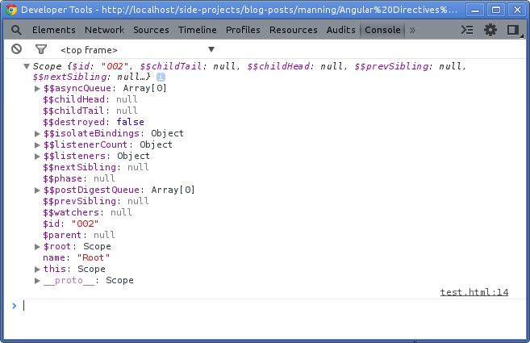
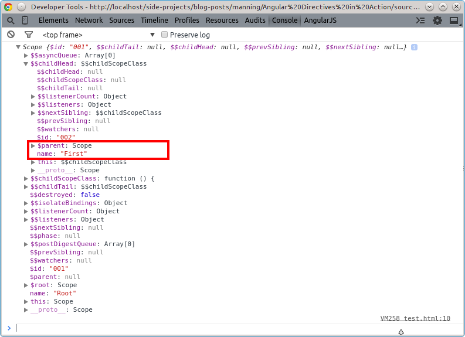
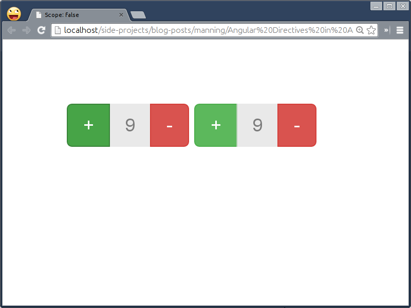
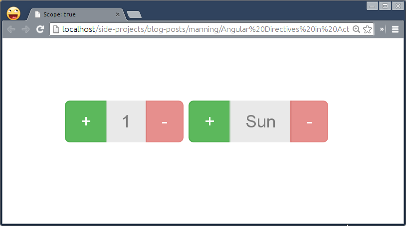
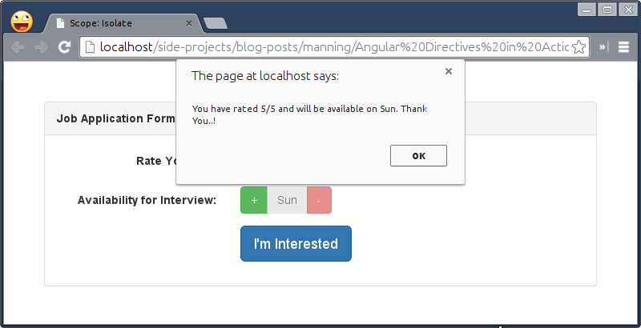
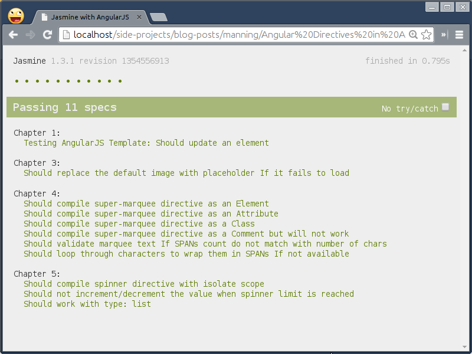
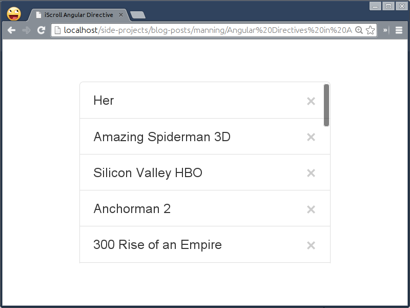

# Understanding Scope in Directives for better context

This chapter covers
* How scope brings newness to the framework like AngularJS
* Learn to write a simple directive that shares the global scope
* Benefit of inheriting the global scope for inbound context
* Sand boxing an isolated but reusable components
* Unit and E2E testing for sample directive
* Extending jQuery plugin with scopes

In the previous chapter, we almost made our hands dirty by playing with easy but crucial options to shape directives. In this chapter, we'll expand our understanding by learning about why and how scopes play an important role in directives and the framework itself. We'll begin with a simple **Spinner** component to choose from a range of values using up/down buttons. We'll then extend it to have a pre-populated list of items to flip through. At the end, we'll create a reusable component and write test cases to make it bulletproof in ever-green browsers. Finally, we'll learn by example how to use angular scopes with jQuery Plugins.

## Keeping directives clean with Scope
Being an MVW framework, AngularJS does have a way to define Data Model that consists of application data and business logic. Unlike other frameworks, Model in AngularJS is a plain old JavaScript object and does not require any getter or setter. The getter/setter methods provide a bridge between what is your data and how the framework understands it in order to bind external behavior on it. However, AngularJS does that with Scope. The scope acts as a glue between your data and view resulted in a bi-directional data binding. It also gives access to different methods such as `$watch, $apply, $digest`, and so on to cater to various needs to build scalable webapps in AngularJS which we will cover in Chapter 7. 

Moreover, **Scope** is an integral part of AngularJS lifecyle to perform data binding and that is why every application built on top of it always has a `rootScope`. The other scopes become child scopes which will be created either automatically by some of the built-in directives (`ngController, ngInclude, ngSwitch`, and so on) or manually by custom directives. To become proficient in directives, one must understand how scope hierarchy works  to help solve issues often raised while working with scopes. Here is a simple example to help us understand how AngularJS maintains a relation between  scopes. In this example, I've a model named `name` binded on the rootScope.

```html
<html ng-app="App">
<head>
  <title>Understanding Scope</title>
  <script src="http://code.angularjs.org/snapshot/angular.js"></script>
  <script type="text/javascript">
    var App = angular.module('App', []);

    App.run(function($rootScope) {
      $rootScope.name = 'Root';
      console.log($rootScope);
    });

    App.controller('FirstCtrl',function($scope){$scope.name = 'First'; });
    App.controller('SecondCtrl',function($scope){$scope.name = 'Second';});
    App.controller('ThirdCtrl',function($scope){$scope.name = 'Third'; });
  </script>
</head>
<body></body>
</html>
```
The browser console will show you the following as follows. 



There you could see our model `name` assigned with the same value defined earlier in the run block which is Root. Note that public properties in the scope object are prefixed with `$` whereas private ones use ```$```. It is recommended to use only public properties such as `$parent` in the application if needed. You can also notice that the scope object has some weird private properties, ```$child, $childHead, $childTail, and $nextSibling``` which AngularJS uses to traverse through the scope hierarchy during the digest cycle to find respective ```$watchers``` for dirty checking.

The rootScope is the top most scope in the hierarchy so it will never have any next or previous sibling scopes. As we do not have any child scopes both ```$childHead and $childTail``` are empty as well. Let us update the code to see how hierarchy changes by adding following in the body:

```html
<div ng-controller="FirstCtrl"></div>
<div ng-controller="SecondCtrl"></div>
<div ng-controller="ThirdCtrl"></div>
```

The ngController directives in HTML will instantiate all three AngularJS controllers defined before in JavaScript. Now after refreshing the page, you will find the information about child scopes under ```$childHead``` as well as ```$childTail``` as shown in the following figure.



However, the most important thing to note here is that each of the child scopes refer to their parent scope. As you may know that JavaScript uses Prototypical Inheritance to maintain object hierarchy. In a prototypal system, objects inherit from other objects and that is why we can easily find the parent scope for any child scope by looking at `__proto__` or `$parent` object.

So if we update the `FirstCtrl` controller to following, you will see *“Root Root Root”* in the console. That's because when `name` is not defined on the current `$scope`, it goes up the scope chain to find the same. Whereas `$scope.$parent` and `$scope.__proto__` both will return the `name` property defined on the parent scope.

```javascript
App.controller('FirstCtrl', function($scope) {
  console.log($scope.name, $scope.$parent.name, $scope.__proto__.name);
  $scope.name = 'First';
});
```

To read the name from the current scope, simply execute the `console.log` statement after setting the `name` property to see *“First Root Root”* in the console. However, `__proto__` object may not have the correct parent reference information sometimes and may lead to issues while inheriting data models in AngularJS so always remember to use `$parent` object on the scope which handles the parent referencing with ease.

Now that we have understood the scope and prototype gotchas, it is time to dive into AngularJS Directives API again and understand how scope benefits directives. But before moving to that, let us set up the base for Spinner directive and then will write a directive along  the way.

First, create *scope-false.html* under *ch05/ *directory and put following in it:


```html
<html ng-app="SpinnerApp">
<head>
  <title>Scope: false</title>
  <script src="../bower_components/angular/angular.js"></script>
  <script src="../js/ch05/scope-false.js"></script>
  <link rel="stylesheet" href="../bower_components/bootstrap/dist/css/bootstrap.css">
</head>
<body ng-controller="ScopeCtrl">

  <adia-spinner></adia-spinner>

</body>
</html>
```

Now define `ScopeCtrl` in *js/ch05/scope-false.js* which will create a new scope that will be served as a parent scope for the directive as:

```javascript
var App = angular.module('SpinnerApp', []);

App.controller('ScopeCtrl', function($scope) {
  $scope.value = 1;
});
```
As you can see we've used a custom element name `adiaSpinner` to load the spinner widget in HTML, so let us revive it in the following section.

## Sharing parent scope:  Simple
All the directives we wrote in the previous chapters so far, all had used the scope indirectly. That is, we can tell AngularJS not to create a new scope but to share the exact same parent scope with `scope: false` option. This is also the default option so that the parent scope will be used as a directive's scope by default. Let us explore this option by using it with spinner directive and figure out the use-cases for the same. Add following in *js/ch05/scope-false.js* as:

```javascript
App.directive('adiaSpinner', function() {
  return {
    restrict: 'EA',
    replace: true,
    scope: false,
    template: '\
      <div class="btn-group">\
        <button class="btn btn-success" ng-click="inc()">+</button>\
        <button class="btn" disabled>{{spinnerText()}}</button>\
        <button class="btn btn-danger" ng-click="dec()">-</button>\
      </div>',
    link: function(scope) {
      scope.inc = function() {
        scope.value++;
      };

      scope.dec = function() {
        scope.value--;
      };

      scope.spinnerText = function() {
        return scope.value;
      };
    }
  };
});
```

Notice that our directive does not have it's own scope but sharing the parent one instead and hence we could access the value property defined in the controller earlier. The `inc()` method increments the value by 1 whereas `dec()` method decrements it by 1. In addition, the `spinnerText()` method simply displays that value. Now you should see the super simple spinner directive in the browser, click plus/minus buttons to see it in action for yourself.

Over the course of this book, we learned that the real benefit of directives is that they facilitate re-usability of the code by allowing us to re-use the same directive in many places without any side effects. But if you use two instances of `<adia-spinner>` element in HTML, you will be surprised to see that if the first instance increments the value, the other instance also shows the updated value immediately. The following figure focuses on the issue:



However, it is not at all intimidating to see such abnormal behavior because both are sharing the same parent scope which means if you update the value in the controller, both directives will reflect the exact value instantly. On the other hand, if any of the directives modifies the same on its scope, it will be reflected by other directive as well. 

That does not mean you should never use this option for any directive, but its just not right for our widget which we will fix in the next section but before that, let us look at a few important aspects you may want to know about it:

* Being a default option, we do not have to mention scope option as `false` explicitly if any directive does not require it.
* This option allows us to use the exact same parent scope (not inherited one) in the directive.
* Any changes to the parent scope will affect other directives using it and vice versa.
* If we use any directive that uses shared scope such as `adiaSpinner` along with other directive on the same element that has its own inherited child scope, the `adiaSpinner` directive will share the inherited scope (created by other directive) instead of the parent one irrespective of the order in which these directives get compiled with priority option enabled.

Overriding the parent scope is crazy, right? But there are few real-world scenarios where you may want to use the shared scope such as:

* If any directive is not dealing with the scope at all but simply manipulating DOM or binding DOM events.
* If any directive is just reading the parent scope values but not overriding them.
* If any nested directive referring to the scope of the parent directive and if its fine to override values on the shared scope. For example, AngularJS UI Bootstrap's  datepicker widget (http://angular-ui.github.io/bootstrap/#/datepicker) creates its own scope but is shared across its child directives such as `daypicker, monthpicker, and yearpicker`.

Similarly, we had used the shared scope for the `iScroll` directive in the previous chapter as its only dealing with the DOM.

## Inheriting parent scope: Contextual
In order to solve the problem we faced with the shared scope in the spinner directive earlier, we can have a separate scope but prototypically inherited from the parent scope so that we can read the existing scope values globally but write new or update existing ones locally. Since we are creating a new inherited scope here, other instances of the directive do not get affected when scope value changes. The reason for using a new scope which is inherited from its parent scope is that values binded to the parent scope will be accessed out of the box by the directive without relying on helper properties such `$parent` or `__proto__`. 

By changing the scope option from `false` to `true` fixes the issue for us. Try at your end. Now that the problem has been solved and we are allowed to use the same directive in many places without any side effects, let us add few new features to the spinner directive to take it to the next level. First, add few more parameters to customize the directive to enable `range` type. With range type, we can control how the default value should be incremented or decremented. We can also limit the value to grow/shrink with min and max options. Here is how we can use the same directive with extended options in the DOM as:

```html
<adia-spinner data-default="{{value}}" data-min="1" data-max="5" data-interval="2"></adia-spinner>
```

Then update the directive to read them with:

```javascript
App.directive('adiaSpinner', function() {
  return {
    restrict: 'EA',
    scope: true,
    template: '\
      <div class="btn-group">\
        <button class="btn btn-success" ng-click="inc()" ng-disabled="opt.default >= opt.max">+</button>\
        <button class="btn" disabled>{{spinnerText()}}</button>\
        <button class="btn btn-danger" ng-click="dec()" ng-disabled="opt.default <= opt.min">-</button>\
      </div>',
    link: function(scope, element, attrs) {
      scope.opt = {
        type    : 'range',
        default : parseInt(attrs.default, false) || 1,
        interval: parseInt(attrs.interval, false) || 1,
        min     : parseInt(attrs.min, false) || 1,
        max     : parseInt(attrs.max, false) || Infinity
      };

      scope.inc = function() {
        scope.opt.default+= scope.opt.interval;
      };

      scope.dec = function() {
        scope.opt.default-= scope.opt.interval;
      };

      scope.spinnerText = function() {
        return scope.opt.default;
      };
    }
  };
});
```

No worries..! We have done slight modifications to accommodate extra spinner options as `scope.opt` replacing `scope.value` used before. As we have a separate scope for each instance now, all options will be in their respective context without affecting parent scope. 

Apart from what the spinner directive does now, if we enable it to walk through a set of predefined values such as weekdays or ratings, it will be very useful in real-world applications than just being used as a spinner. So, let us support one more type named `list` to spin a pre-populated list, update the link method of the directive as:

```javascript
link: function(scope, element, attrs) {
  var isList = attrs.type === 'list';

  scope.opt = {
    type    : attrs.type || 'range',
    default : parseInt(attrs.default, false) || 1,
    interval: parseInt(attrs.interval, false) || 1,
    min     : parseInt(attrs.min, false) || 1,
    max     : parseInt(attrs.max, false) || Infinity,
    list    : scope.$eval(attrs.list) || []
  };

  if (isList) {
    scope.opt.default = attrs.default ? scope.opt.default : 0;
    scope.opt.min = 0;
    scope.opt.max = scope.opt.list.length – 1;
  }

  scope.inc = function() {
    scope.opt.default+= scope.opt.interval;
  };

  scope.dec = function() {
    scope.opt.default-= scope.opt.interval;
  };

  scope.spinnerText = function() {
    return isList ? scope.opt.list[scope.opt.default] : scope.opt.default;
  };
}
```

Let us test it out quickly. Add one more instance of the spinner directive next to the current one in HTML as shown:

```html
<adia-spinner data-type="list" data-list="['Sun', 'Mon', 'Tue', 'Wed', 'Thur', 'Fri', 'Sat']"></adia-spinner>
```

There you go! We can now use the same directive to display different set of data in the form of Spinner:



### $evaluating AngularJS expressions
One thing you might have noticed that we have used `scope.$eval` call to transform a list passed as a string attribute into a JavaScript array. The `$eval` method executes AngularJS expressions but not JavaScript expressions on the current scope and returns the result. So ```$rootScope.$eval('name')``` is same as ```$rootScope.name```. Both will return the same value i.e. *Root*. The `$eval` call takes 2 parameters, an expression to evaluate and local value (as JavaScript object) to replace with. However, the second parameter is optional. In addition to that you can also do a lot more cool stuff with it as follows:

* Initializing a variable on the scope. For instance, `$scope.$eval('PI = 3.14')` will bind a model named `PI` with a value of `3.14` on the current scope.
* Performing arithmetic operations such as `$scope.$eval('3 + 4')` would return 7 as a result. We can even replace numbers used with AngularJS models that is `PI + PI` wherein `PI` is defined on the same scope beforehand.
* Overriding existing values of expressions with locals that is `$scope.$eval('minute * 60 + "s"', {minute: 2})` would bind `minute` model on the current scope first and then will be used within the expression to evaluate further. Offcourse, this would return `120s` as a result.
* Evaluating objects or arrays passed as a string or model similar to `scope.$eval(attrs.list)` seen before.

However, `$eval` is synchronous and hence evaluates the expression right away but sometimes it is useful to execute particular expression at later point in time, to do so use the asynchronous variant of `$eval` called `$evalAsync`. Note if the digest cycle is in progress, the expression will be evaluated during the same. Otherwise, it will trigger a new digest cycle on the `$rootScope` after 0ms using `window.setTimeout`. Since the setTimeout method in JavaScript has its own call stack and therefore the method passed to it will be run as soon as the current stack is cleared. In simple words, the setTimeout call allows browser to finish whatever it has been waiting to finish before executing our method. Having said that our expression will be evaluated atleast once. AngularJS internally uses the same in `$anchorScroll` service to scroll to the related element whenever browser hash/route changes.

### $parsing AngularJS expressions
In contrast to `$eval`, the `$parse` service converts an AngularJS expression into a function which represents the compiled expression that you can evaluate by passing a proper context a.k.a. scope and local variables a.k.a locals in order to override values present in the context/scope. Similar to `$eval`, the `$parse` call takes 2 parameters and returns the result after evaluating the expression on the current scope with locals passed as a second parameter. Like   `$eval`, you can use `$parse` as: 

```javascript
App.run(function($rootScope, $parse) {
  console.log($parse('PI = 3.14')($rootScope));
  console.log($parse('1 + 2')());
  console.log($parse('PI + PI')($rootScope));
  console.log($parse('minute * 60 + "s"')($rootScope, {minute: 2}));
});
```
However, `$parse` is a built-in service/provider in AngularJS that we have to inject as a dependency before using. Here `$rootScope` passed to `$parse` is the context/scope and second parameter is the locals to override the existing value of minute with *“2”*. In fact, `scope.$eval` internally calls the same `$parse` service which means `$parse` is an ideal choice if you want to evaluate same AngularJS expression multiple times. The $parse call compiles the expression into a function awaiting for the context and locals to be passed in. Hence the `scope.$eval` method may call `$parse` multiple times (for multiple `$eval` calls) which can be avoided by calling `$parse` once to convert the expression into a function that ready to serve the right context/scope later. For the spinner directive, it is fine to use `scope.$eval` over `$parse` as we are parsing attrs.list just once.

Now that we realized the benefit of `$parse` service over `$eval`, let us walk through some important details about using a new inherited child scope in a directive:
* We need to explicitly mention to create a new scope for the directive if its required.
* This option creates a new scope but prototypically inherited from its parent.
* Any changes to the new scope created will not affect its parent scope and vice versa but it can be circumvented with a custom `$watch` method.
* This option gets higher priority than shared scope option if multiple directives with different scope strategies are exposed on an element.
* Because of prototypical inheritance, it still allows us to access any model defined on the parent scope seamlessly. Use `scope.$parent` alternatively.

Apart from writing self composed widgets with it, there are few real-world use cases where you might want to use this option:

* If any directive needs a scope to bind few models locally (within the directive's instance)  without any side effects such as ngController directive.
* If any nested directive requires its state to be maintained separately. For example, an accordion widget can keep multiple panels open at a time and hence need a separate child scope to handle the same. That's not the case with a Tab widget wherein only one tab can be opened at a time. Even the ngRepeat native directive uses it over items it repeats for separate context per item.
* The interpolation used in an element such as ```<alert type='{{type}}'></alert>``` will be evaluated in the context of it's own scope. If the `type` model is not found on the current scope, the parent scope will be used for evaluation.

This option is often used than Shared scope as well as Isolate scope which is what we are going to learn about in the next section.

## Isolating parent scope: Private
Even though `scope:true` makes the directive contextual with the separate but prototypically inherited scope which has their own problems. Sometimes to build reusable components, it needs a complete isolation to avoid accidentally reading or modifying data in the parent scope and that is what isolate scope provides. The isolate scope differs from normal scope in that it does not prototypically inherit from the parent scope. For instance, imagine an Alert directive whose purpose is just to show error messages, highlight them with different color codes i.e. success, error, info, etc and hide when closed. This kind of component does not have to depend on a parent scope as it can easily evaluate whatever stuffed into it. Here is how we can set an isolate scope to the spinner directive:

```javascript
scope: {

}
```

With this option, the interpolation used in an element such as ```<alert type='{{type}}'></alert>``` will not be evaluated on the isolate scope but the parent scope. Off-course this does not make sense at all as you may need a controller's scope or `$rootScope` to define the model named `type` to use with the directive. Therefore, the isolate scope allows us to pass an object which defines a set of local scope properties derived from the parent scope. There are three ways to do that:

* @ or @attr
* = or =attr
* & or &attr

Let us look at each and see how to use to benefit the spinner directive.

### @ for One way Data Binding means a String
We all know that an attribute of an element is always a string and that is why we had to use  `parseInt` to parse `default, interval, min, and max` options to integers. As you already guessed the `@` is best suitable for passing string values to the spinner widget, so let us quickly update `scope:true` with:

```javascript
scope: {
  'type': '@'
}
```

In our case, the type will always be a string, either range or list which we can be used as:

```html
<adia-spinner data-type='list'></adia-spinner>
```

Additionally you can pass an evaluated expression such as `data-type=”{{type}}”` wherein the type property needs to be defined on the parent scope which will be evaluated within the parent context and then passed to the directive as a string attribute. But you can avoid doing so with the two-way data binding syntax explained in the next section.


### = for Two way Data Binding means an AngularJS model
Passing other options such as default, interval, and so on in the form of interpolation does not make sense as we then have to parse them into integers later. What if we could send these options as AngularJS models which will be evaluated on the parent context before being passed to the directive. Well, that's exactly what `=` option does. We can pass:

```javascript
scope: {
  'type'      : '@',
  'default'   : '=',
  'interval'  : '=',
  'min'       : '=',
  'max'       : '=',
  'list'      : '='
}
```
With this we can completely get over `$eval` vs `$parse` paradox of choice and pass either AngularJS models or primitives because AngularJS itself evaluates models on the parent scope before being passed ahead as:

```html
<adia-spinner default="1" interval="1" min="1" max="5"></adia-spinner>
<adia-spinner type="list" list="['Sun', 'Mon', 'Tue', 'Wed', 'Thur', 'Fri', 'Sat']"></adia-spinner>
```

Most of the options the spinner directive takes are not mandatory, so we can make some of them optional with the question mark (`?`) as a suffix as shown:

```javascript
scope: {
  'type'      : '@',
  'default'   : '=?',
  'interval'  : '=?',
  'min'       : '=?',
  'max'       : '=?',
  'list'      : '=?'
}
```

In addition to this, the interval option does not look that fancy and may be misleading to our users. We can change that without modifying the underling directive definition as:

```javascript
scope: {
  'type'      : '@',
  'default'   : '=?',
  'interval'  : '=?step',
  'min'       : '=?',
  'max'       : '=?',
  'list'      : '=?'
}
```

Yes, `=step` let us use step instead of interval in the DOM, so update Spinner instances as follows:

```html
<adia-spinner default="1" step="1" min="1" max="5"></adia-spinner>
<adia-spinner type="list" list="['Sun', 'Mon', 'Tue', 'Wed', 'Thur', 'Fri', 'Sat']"></adia-spinner>
```

Notice the usage of `step` replacing `interval` attribute above. Now we'll update the link method to replace `attrs.*` occurrences with `scope.*` as we do not need them now:

```javascript
link: function(scope, element, attrs) {
  var isList = scope.type === 'list';

  scope.opt = {
    type    : scope.type || 'range',
    default : scope.default || 1,
    interval: scope.interval || 1,
    min     : scope.min || 1,
    max     : scope.max || Infinity,
    list    : scope.list || []
  };

  if (isList) {
    scope.opt.default = scope.default ? scope.opt.default : 0;
    scope.opt.min = 0;
    scope.opt.max = scope.opt.list.length - 1;
  }

  scope.inc = function() {
    scope.opt.default+= scope.opt.interval;
  };

  scope.dec = function() {
    scope.opt.default-= scope.opt.interval;
  };

  scope.spinnerText = function() {
    return isList && scope.list ? scope.opt.list[scope.opt.default] : scope.opt.default;
  };
}
```

With little modifications, we are ready to see the directive in action.

### & for Method means an AngularJS method expression
Imagine we want to use the spinner widget in an online Job Application Form and the values filled need to be saved back into the database when submitted. We'll need a provision to pass a method or callback that will be triggered when spinner updates. That's exactly `&` helps us to accomplish. Let us add optional `onChange` callback to the Spinner directive as:

```javascript
scope: {
  'type'      : '@',
  'default'   : '=?',
  'interval'  : '=?step',
  'min'       : '=?',
  'max'       : '=?',
  'list'      : '=?',
  'onChange'  : '&?'
}
```

In HTML, we can either pass a function call with or without parameters or just mention a function name to be called. The difference between the two is that if a function name is passed, it will be evaluated on the parent context returning the actual function definition which we will then be invoked with `scope.onChange()` call. In contrast, a function call is converted into a function which represents the compiled expression that can be invoked by passing parameters if required. So we'll write a new method in the link function in order to notify of the change. Add following inside the link method of the directive as:

```javascript
scope.inc = function() {
  scope.opt.default+= scope.opt.interval;
  scope.notify();
};

scope.dec = function() {
  scope.opt.default-= scope.opt.interval;
  scope.notify();
};

scope.notify = function() {
  if (typeof scope.onChange({param: {value: scope.opt.default, text: scope.spinnerText()}}) === 'function') {
    scope.onChange()({value: scope.opt.default, text: scope.spinnerText()});
  }
};

scope.notify();
```

This will immediately trigger the callback to save the current spinner state when the directive is compiled as well as when the value updates. Here is how we can use it in HTML: 

```html
<adia-spinner data-default="1" data-step="1" data-min="1" data-max="5" on-change="getRating(param)"></adia-spinner>
<adia-spinner data-type="list" data-list="['Sun', 'Mon', 'Tue', 'Wed', 'Thur', 'Fri', 'Sat']" on-change="getWeekday"></adia-spinner>
<button class="btn btn-lg btn-primary" ng-click="submit()">Save</button>
```

Please note that the `param` parameter highlighted above should match with the one used inside the notify method. The updated value will be passed as a parameter to a callback method that is `getRating` and `getWeekday` in our case.

Finally fit the last piece of the puzzle..! Define both the callbacks in `ScopeCtrl` that we defined at the beginning of the chapter as:

```javascript
App.controller('ScopeCtrl', function($scope) {
  $scope.getWeekday = function(objWeekday) {
    $scope.weekday = objWeekday;
  };

  $scope.getRating = function(objRating) {
    $scope.rating = objRating;
  };

  $scope.submit = function() {
    alert('You have rated ' + $scope.rating.value + '/5 and will be available on ' + $scope.weekday.text + '. Thank You..!');
  };
});
```
Go ahead and check it out..! When submit is pressed, you should see the selected weekday and rating as per following figure.



I'm sure you may be wondering about why there is a need of `ScopeCtrl` to have callbacks defined outside of directives as Isolate scope is all about pluggable components that have no intent to use AngularJS expressions inherently. Well, your assumption is damn right and there is a scope of improvement using `ngModel` on the directive which we'll cover in Chapter 6 after getting the hang of `require` option. For now, let us move forward to write test cases for the same in the next section.

## Testing of Spinner
Time for some tests..! Passing tests is a proof that your code actually works and a token of an excellent work done. Let us write Jasmine test cases first by updating *unit.conf.js* and add references *scope-isolate.js* and its test file  as shown:

```javascript
files: [
  'bower_components/jquery/jquery.js',
  'bower_components/angular/angular.js',
  'bower_components/angular-mocks/angular-mocks.js',
  'js/ch01/angular-template.js',
  'js/ch04/super-marquee.js',
  'js/ch05/scope-isolate.js',
  'tests/specs/ch01/*-unit.js',
  'tests/specs/ch04/*-unit.js',
  'tests/specs/ch05/*-unit.js'
]
```

Please note that we'll only test *scope-isolate.js* because of space constraint so writing test cases for *scope-false.js* and *scope-true.js* will be pretty straight forward and hence are left as an exercise for you. We'll start off with if the directive takes `default` options properly or not. So let us add following in *tests/specs/ch05/scope-isolate-unit.js* as:

```javascript
describe('Chapter 5: ', function() {
  beforeEach(module('SpinnerApp')); 

  var element, $plus, $minus;

  it('Should compile spinner directive with isolate scope', inject(function($rootScope, $compile) {
    element = angular.element('<adia-spinner></adia-spinner>');
    element = $compile(element)($rootScope);
    $rootScope.$digest();
    expect(element.find('.btn:eq(1)').text()).toBe('1');

    element = angular.element('<adia-spinner data-default="2"></adia-spinner>');
    element = $compile(element)($rootScope);
    $rootScope.$digest();
    expect(element.find('.btn:eq(1)').text()).toBe('2');

    $rootScope.default = 3;
    element = angular.element('<adia-spinner data-default="default" data-step="2"></adia-spinner>');
    element = $compile(element)($rootScope);
    $rootScope.$digest();
    expect(element.find('.btn:eq(1)').text()).toBe('3');
    element.find('.btn:eq(0)').click();
    expect(element.find('.btn:eq(1)').text()).toBe('5');
  }));
});
```

If you remember, we have not used `rootScope.$digest` while testing superMarquee directive in the previous chapter but the Spinner directive uses data binding to update the spinner value and `$digest` call is required to update the binding with the actual value. The `.btn:eq(0)` and `.btn:eq(1)` jQuery selectors target spinner's plus button and the text respectively. The `toBe` is one of the matchers Jasmine supports to match the actual value with the expected one.

Also the spinner should not increment or decrement the value when it's limit has reached. Let us check if the spinner's plus/minus buttons freeze as expected, so add the following to create one more Jasmine spec as:

```javascript
it('Should not increment/decrement the value when spinner limit is reached', inject(function($rootScope, $compile) {
  element = angular.element('<adia-spinner data-min="1" data-default="2" data-max="3"></adia-spinner>');
  element = $compile(element)($rootScope);
  $rootScope.$digest();

  $plus = element.find('.btn:eq(0)');
  $minus = element.find('.btn:eq(2)');
  expect(element.find('.btn:eq(1)').text()).toBe('2');
  expect($plus.is(':disabled')).toBeFalsy();
  expect($minus.is(':disabled')).toBeFalsy();
  $minus.click();
  expect($minus.is(':disabled')).toBeTruthy();
  $plus.click().click();
  expect($plus.is(':disabled')).toBeTruthy();
}));
```

Note that `toBeFalsy` and `toBeTruthy` are the matchers we can use to replace `toBe(false)` and `toBe(true)` respectively – no added benefits over `toBe` but little handy for matching booleans.

Finally, we'll test if the spinner directive does support `list` type. So update *scope-isolate-unit.js* with:

```javascript
it('Should work with type: list', inject(function($rootScope, $compile) {
  $rootScope.availability = ['Friday', 'Saturday', 'Sunday'];
  element = angular.element('<adia-spinner data-type="list" data-default="2" data-list="availability" on-change="whichDay"></adia-spinner>');
  element = $compile(element)($rootScope);
  $rootScope.whichDay = function(day) {
    $rootScope.day = day;
  };
  spyOn($rootScope, 'whichDay').andCallThrough();
  $rootScope.$digest();

  $plus = element.find('.btn:eq(0)');
  $minus = element.find('.btn:eq(2)');

  expect(element.find('.btn:eq(1)').text()).toBe('Sunday');
  expect($plus.is(':disabled')).toBeTruthy();
  $minus.click().click();
  expect(element.find('.btn:eq(1)').text()).toBe('Friday');
  expect($minus.is(':disabled')).toBeTruthy();

  expect($rootScope.whichDay).toHaveBeenCalled();
  expect($rootScope.day).toEqual({text: 'Friday', value: 0});
}));
```

Now that we have the specs ready, just run ```“npm run test-unit”``` command in the terminal to see all tests passing as:



We are now rest assured that the Spinner directive is bullet proof and works as intended. Let us write E2E tests to do functional testing as well. First update the suites for this chapter in *e2e.conf.js* as:

```javascript
suites: {
  ch1: 'tests/specs/ch01/*-e2e.js',
  ch2: 'tests/specs/ch02/*-e2e.js',
  ch4: 'tests/specs/ch04/*-e2e.js',
  ch5: 'tests/specs/ch05/*-e2e.js'
},
```
And then create *tests/specs/ch05/scope-isolate-e2e.js* as:

```javascript
describe('Chapter 5:', function() {
  it('should activate spinner directive', function() {
    browser.get('ch05/scope-isolate.html');

    element.all(by.tagName('button')).then(function(btn) {
      var $ratingPlus = btn[0];
      var $rating = btn[1];
      var $ratingMinus = btn[2];      
      // increment rating
      expect($rating.getText()).toBe('1');
      $ratingPlus.click();
      $ratingPlus.click();
      $ratingPlus.click();
      expect($ratingPlus.isEnabled()).toBeTruthy();
      $ratingPlus.click();
      expect($rating.getText()).toBe('5');
      expect($ratingPlus.isEnabled()).toBeFalsy();
      // decrement rating
      $ratingMinus.click();
      $ratingMinus.click();
      $ratingMinus.click();
      expect($ratingMinus.isEnabled()).toBeTruthy();
      $ratingMinus.click();
      expect($rating.getText()).toBe('1');
      expect($ratingMinus.isEnabled()).toBeFalsy();

      var $availPlus = btn[3];
      var $avail = btn[4];
      var $availMinus = btn[5];
      expect($avail.getText()).toBe('Sun');
      $availPlus.click();
      $availPlus.click();
      $availPlus.click();
      $availPlus.click();
      $availPlus.click();
      expect($availPlus.isEnabled()).toBeTruthy();
      $availPlus.click();
      expect($avail.getText()).toBe('Sat');
      expect($availPlus.isEnabled()).toBeFalsy();
      $availMinus.click();
      $availMinus.click();
      $availMinus.click();
      $availMinus.click();
      $availMinus.click();
      expect($availMinus.isEnabled()).toBeTruthy();
      $availMinus.click();
      expect($avail.getText()).toBe('Sun');
      expect($availMinus.isEnabled()).toBeFalsy();
    });
  });
});
```

This completes the testing for the Spinner directive, so quickly run ```“npm run test-e2e”``` command to run them in Protractor.  Now let us shift our focus on a jQuery plugin and see how can our newly learned scope related techniques help us to improve the `iScroll` directive which we wrote in the previous chapter.

## Using jQuery Plugin the Angular Way
First of all, create a copy of *iscroll-directive.html* from *ch04/* to *ch05/* directory. Then update `div#wrapper` to make `iScroll` directive customizable. Here we can customize the scrollbars visibility and mousewheel support as:

```html
<div id="wrapper" iscroll data-scrollbars="true" data-mousewheel="true">
```

And update the directive definition so:

```javascript
App.directive('iscroll', function() {
  return {
    restrict: 'EAC',
    scope: {
      scrollbars: '=?',
      mousewheel: '=?'
    },
    link: function(scope, element) {
      window.setTimeout(function() {
        new IScroll(element[0], {
          scrollbars: angular.isDefined(scope.scrollbars) ? scope.scrollbars : true,
          mouseWheel: angular.isDefined(scope.mousewheel) ? scope.mousewheel : true
	      });
      }, 0);
    }
  }
});
```
The `setTimeout` JavaScript method was a little hack we had used earlier to delay the iscroll instantiation but it will not always work. AngularJS let us allow to write a custom `$watch` method to update the view when model changes which we can leverage here to replace `window.setTimeout` call. Update the link method of the `iscroll` directive so:

```javascript
link: function(scope, element) {
  var myScroll = null;

  scope.$watch(function() {
    if (myScroll) {
      myScroll.refresh();
    } else {
      myScroll = new IScroll(element[0], {
        scrollbars: angular.isDefined(scope.scrollbars) ? scope.scrollbars : true,
        mouseWheel: angular.isDefined(scope.mousewheel) ? scope.mousewheel : true
      });
    }
  });
}
```

The `$watch` method in AngularJS takes an expression or a JavaScript method to watch over as a first parameter and a callback to trigger as a second parameter. In this case, we are not watching anything that means the callback will be triggered for every `$digest` cycle. That is why to avoid re-instantiation of iScroll, we have cached the instance to simply update iscroll if its already constructed. To test that out, let us replace the existing ```<li>``` element:

```html
<li class="list-group-item" ng-repeat="movie in movies" ng-bind="movie"></li>
```

with:

```html
<li class="list-group-item" ng-repeat="movie in movies">
  <button type="button" class="close" ng-click="movies.splice($index, 1)">&times;</button>
  <span ng-bind="movie"></span>
</li>
```
Here we have just added a close icon next to each movie so that we can see if the iscroll updates when any movie is removed from the list.



As soon as we remove any movie, the `$digest` cycle will run to update the ```<li>``` list, and the iScroll `$watch` will be triggered to update itself. Try at your end.

> NOTE: There are various ways to use `$watch` method in AngularJS to resolve common UI problems. How complex or heavy $watchers could sabotage your application and what you can do to fix such issues, all that will be covered in detail in Chapter 7. 

## Summary
There we are..! 

This chapter has expanded our understanding on why and how scopes play an important role in AngularJS directives and the framework itself.  Directive is a place to put any sort of imperative DOM manipulation in AngularJS and it's very likely that we are not going to deal with scope in such directives, so always use simple a.k.a. shared scope in such scenarios. Sometimes we need an easy access to methods or properties assigned on the parent scope but still require own space for a directive to work efficiently without affecting the rest of the application by accidentally overriding models on the parent scope.  Use inherited child scope in such cases. Isolated a.k.a. Private scope is simply useful to make reusable components. We also learned that `$parse` over `$scope.$eval` can be used for performance gain while evaluating same expression multiple times. We then used 3 ways to pass data to an isolated directive as attributes, bi-directional AngularJS models, and AngularJS method expressions. 

All in all we learned everything about scope in directives to master different scope strategies to improve a simple yet useful Spinner widget. Later we tested the Spinner directive using Karma and Protractor to verify if it works well. Finally we leveraged the newly learned skill to fix the iscroll directive to auto update itself when a list changes.