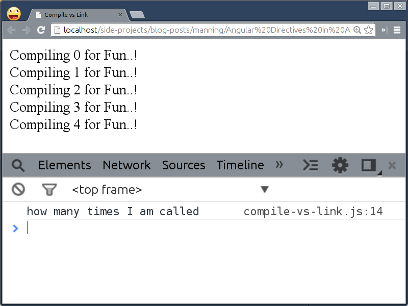
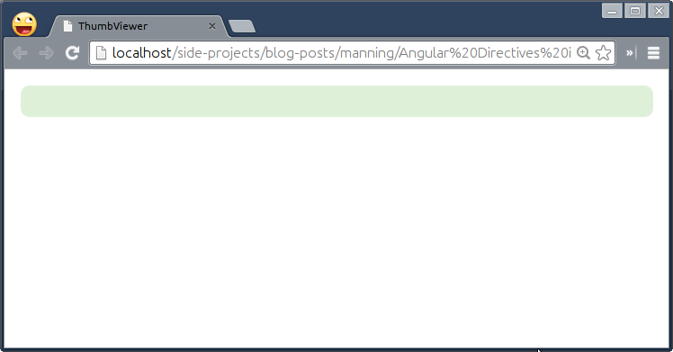
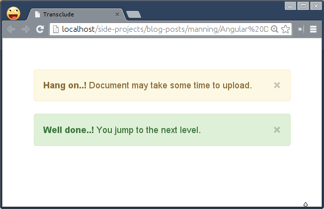
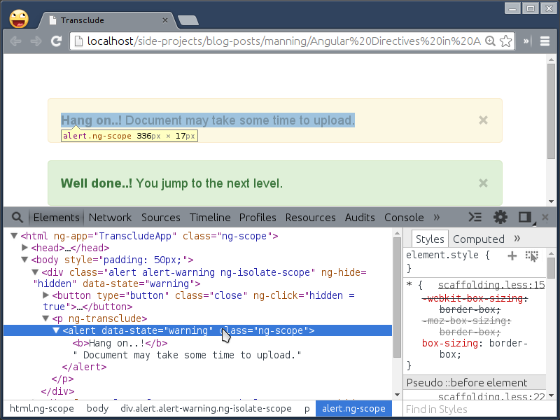
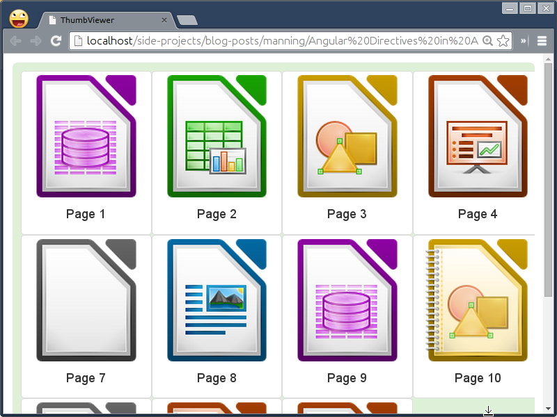
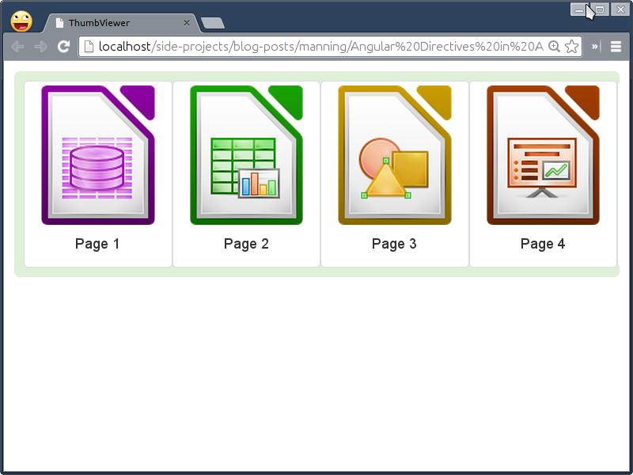
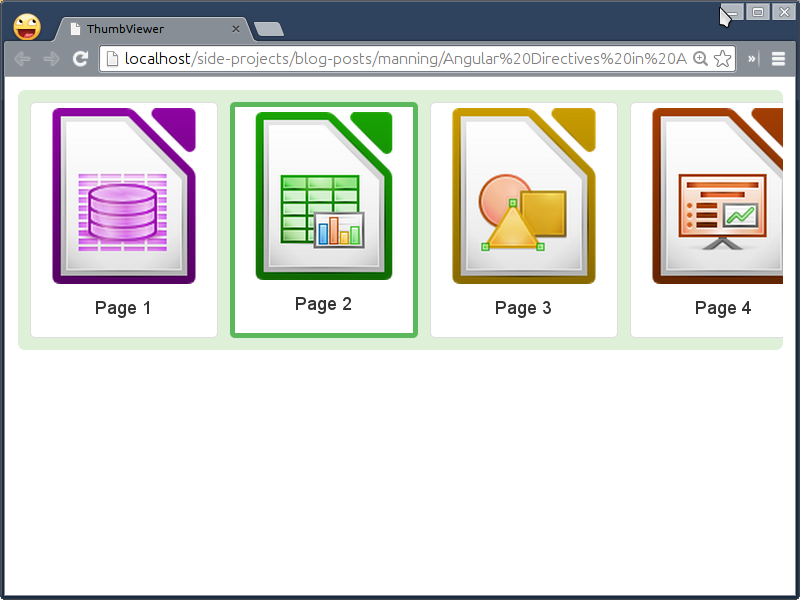
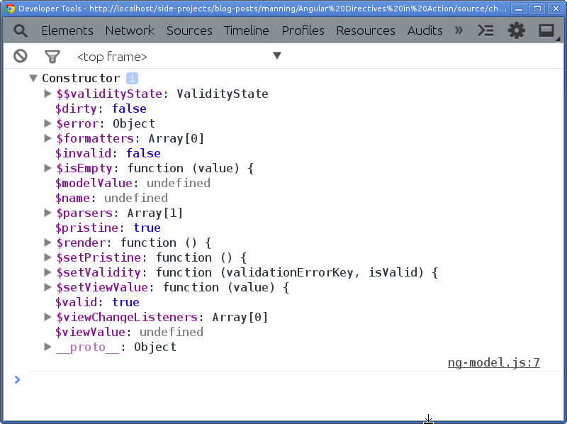

# Crafting directives to handle Complex Scenarios
This chapter covers
* The difference between Compile and Link
* Transcluding an external markup to customize template used by directives
* Use of directive controller to wire up nested directives and how it differs from normal controller
* How directives can be independent but still communicate with each other by requiring a directive controller of parent or sibling directives
* Enabling data binding, validation, DOM updates, and data formatting and parsing to custom controls using ngModelController
* Unit and E2E testing for sample directives

In the previous chapter, we saw how different scope strategies are useful to build simple to complex reusable components or widgets in AngularJS. 

In this chapter, we'll learn all the useful things (mentioned above) that will help us build component/widget from the scratch in AngularJS. We'll create a complex *Page Thumbnail Pane* (used in Adobe Acrobat) as an exercise to quickly navigate to particular page. We'll also improve the *Spinner* directive as promised in order to get the current state without relying on external scoped callbacks. Then we'll combine Spinner directive with Thumbnail Pane directive to make it easy to navigate to specific thumb. 
	

## Next level Up!
All the things that we learned over the course of this book so far are good enough for us to port any existing component or plugin in the AngularJS world with an extra layer on top of it in terms of AngularJS Directives. Take an example of an iscroll directive that we wrote in the previous chapter that really helped us to use *iScroll* jQuery plugin as is in AngularJS context. But sometimes adding this extra layer is unnecessary and bloating the widget which can be avoided by restructuring it entirely using AngularJS Directives API. 

Imagine Twitter Bootstrap's Tab component built on top of jQuery which can be completely restructured and written in a short time with two-way data binding and become modular with dependency injection in AngularJS. AngularUI Bootstrap is the perfect example of this wherein it has  native AngularJS directives for the same with small footprint and no 3rd party JavaScript dependencies at all. That does not mean, you should always rewrite any existing jQuery plugin or so. But in many cases, you should because AngularJS two way data binding surely reduces the effort you require to make something in other than AngularJS which makes it declarative as well. We'll learn everything that required to make rewriting jQuery plugins in AngularJS possible for you.

Let us create a base template for our Page ThumbViewer example that we'll enhance step by step as we conquer each option in directive definition object. Along the way we'll also build sample directives to strengthen our understanding about each of those options. First of all scaffold Page Thumbviewer component by creating *thumbnail-viewer.html* in *ch06/* directory as:

```html
<html ng-app="ThumbApp">
<head>
  <title>ThumbViewer</title>
  <script src="../bower_components/angular/angular.js"></script>
  <script src="../js/ch06/thumbviewer.js"></script>
  <link rel="stylesheet" type="text/css" href="../bower_components/bootstrap/dist/css/bootstrap.css">
  <style type="text/css">
    .thumbnail-container {
      display: inline-block;
      width: 100%;
      overflow: hidden;
      padding: 10px;
    }
    img { width: 100%; }
  </style>
  <script type="text/ng-template" id="thumbviewer.html">
    <div class='thumbnail-container bg-success img-rounded'>
      <div class='thumbnail-wrapper'>
        <!-- Page Thumbs go here -->
      </div>
    </div>
  </script>
  <script type="text/ng-template" id="thumb.html">
    <div class="thumbnail pull-left"></div>
  </script>
</head>

<body style="padding: 10px;" ng-controller="ThumbCtrl">
  <thumbviewer data-size="150" data-gap="0"></thumbviewer>
</body>
</html>
```

Then define a directive in *js/ch06/thumbviewer.js* so:

```javascript
var App = angular.module('ThumbApp', []);

App.controller('ThumbCtrl', function($scope) {
  $scope.thumbnails = [
    { title: 'Page 1',  image: '1.png', active: true },
    { title: 'Page 2',  image: '2.png'  },
    { title: 'Page 3',  image: '3.png'  },
    { title: 'Page 4',  image: '4.png'  },
    { title: 'Page 5',  image: '5.png'  },
    { title: 'Page 6',  image: '6.png'  },
    { title: 'Page 7',  image: '7.png'  },
    { title: 'Page 8',  image: '8.png'  },
    { title: 'Page 9',  image: '9.png'  },
    { title: 'Page 10', image: '10.png' },
    { title: 'Page 11', image: '11.png' },
    { title: 'Page 12', image: '12.png' },
    { title: 'Page 13', image: '13.png' },
    { title: 'Page 14', image: '14.png' },
    { title: 'Page 15', image: '15.png' }
  ];
});

App.directive('thumbviewer', function() {
  return {
    restrict: 'EA',
    replace: true,
    templateUrl: 'thumbviewer.html',
    scope: {
      size: '=?',
      gap : '=?'
    }
  };
});
```

Make sure to have couple of images in *img/ *directory and update the collection `thumbnails` accordingly. Go ahead and see it for yourself in a browser. I'm sure you will see a rounded green block. 

## Compile begot Link
In the first chapter, we learned a little bit about how AngularJS brings custom elements or attributes to life by compiling them to react to user interactions. But what exactly happens when any directive gets compiled? To understand that, we must know that every directive has one of these methods, i.e. Compile or Link. It is very confusing at first to realize that the compile method itself produces a link function and the directive can have either of two.

To understand why these two phases exist in the first place,  we need to take a look at a simple directive called *compileCheck* that will repeat itself over five times using ngRepeat built-in directive. Create *ch06/compile-vs-link.html* as:

```html
<html ng-app="CVLApp">
<head>
  <title>Compile vs Link</title>
  <script src="../bower_components/angular/angular.js"></script>
  <script src="../js/ch06/compile-vs-link.js"></script>
</head>
<body>
  <compile-check ng-repeat="item in [1, 2, 3, 4, 5]"></compile-check>
</body>
</html>
```

Then create *js/ch06/compile-vs-link.js* as:


```javascript
var App = angular.module('CVLApp', []);

App.directive('compileCheck', function() {
  return {
    restrict: 'EA',
    template: '<div>Compiling {{$index}} for Fun..! </div>',
    compile: function(cElement, cAttrs) {
      console.log('how many times I am called');
    }
  };
});
```

Please note that scope has not been created yet so we can not access it in the compile function. The `cElement` refers to the template element where the directive has been declared, in our case ```<compile-check>``` and `cAttrs` consists of all the attributes associated with the element such as `ng-repeat` for this particular example. 

This simple directive basically dumps the template into the directive's body and then ngRepeat just renders it for five times. If you may have thought that the compile method calls for each item in the list then you are surely wrong as shown in the following figure.



As you could see, the compile method calls only once for all but why?


### Compile Phase: manipulate the template and performance benefit
The sole reason for having a separate phase to compile all the directives first and then link them altogether is only a performance benefit. Think for a moment that we do not have a compile phase, just a link phase wherein a directive gets compiled as well as linked with the right scope. Imagine we want to update the template to have an hash tag (`#perfmatters`) at the end of the sentence in that phase. 

Considering the fact that we now have just a link phase, the template will be modified for each instance of the list that it repeats which is redundant. In addition to this, it will interpolate `{{$index}}` binding to `0` for the first item as it is now linked to the respective scope right away and will create a watch for the same. The moment you have a watch method set up for any binding, it will be evaluated for each digest cycle on the scope to update the respective view. So when the second item gets compiled and `{{index}}` binding associated with it will also be interpolated to `1`. Now the digest cycle has run again for the new binding to be evaluated. This will drastically reduce performance when a list grows. That's why we have a compile phase in directives. 

So to update the template at compile time, we'll add following in the compile phase as:

```javascript
var App = angular.module('CVLApp', []);

App.directive('compileCheck', function() {
  return {
    restrict: 'EA',
    template: '<div>Compiling {{$index}} for Fun..! </div>',
    compile: function(cElement, cAttrs) {
      console.log('how many times I am called');
      cElement.find('div').append('#perfmatters');
    }
  };
   });
```

Now the template will be updated first but only once and the transformed template will be used by the repeater later. In short, the compile phase creates a compiled function for each directive waiting for a scope to interpolate bindings similar to the `$parse` service we saw in the previous chapter. Here are some of the checkpoints to consider before using the compile phase in any directive:
* The compile function gives access to two parameters that is the template element and the template attributes. *The parameters can be renamed but the order should not be changed.*
* The template element refers the element on which the directive is applied but the same element will be inserted post compilation is not guaranteed, especially, when used with ngRepeat directive which makes a clone of it to repeat over. Suppose our directive binds a click event on the template element, it will not be existed when rendered because ngRepeat creates a copy of the element and injects back into the template. The cloning of elements does not carry dynamic DOM events forward unless they are inline such as `onClick`. *That means its not recommended to bind DOM events in this phase.*
* The `cElement` is equivalent to a `$(cElement)` so you do not have to wrap AngularJS elements in `jQuery()` or `$()` constructor because AngularJS contains a minimal version of jQuery named jQLite which emulates certain core features of jQuery. *That means you can bind a click event to `cElement` with ```cElement.on('click', fn);``` instead of ```cElement.click(fn);``` which will require jquery to be included.*
* The `cAttrs` is an object containing all the attributes and their values associated with the element. The hyphenated attributes are converted to camelCase so that you can access the value of `compile-check` attribute as `cAttrs['compileCheck']`. However, it will return non-evaluated value if it has a data-binding expression because of the unavailability of the scope to evaluate it against.

So, all the complex things that do not require scope can be accomplished in the compile phase for the performance gain. Other benefits are:

* To use different link functions to be produced conditionally. For example, `ngValue` directive that binds the given expression to the value of a form control if the expression is boolean (true/false). Otherwise set up a watcher to evaluate the expression passed, every time the value of the expression changes.
* To use both compile as well as link functions together. For instance, `$parse` or `$interpolate` AngularJS expressions once in the compile phase and get them evaluated in the link phase later by passing an appropriate scope. The built-in directives such ngClick, ngDblclick, and so on are using the same approach.
* And the most importantly to transform the template element or the template itself.

Moving forward, we'll look at what role the link phase plays and what are best scenarios to use it over compile phase in the following section.

### Link Phase: Registering DOM listeners and Setting up $watch methods
We would start with the question that why can not we bind DOM listeners to an element, `cElement` which is available in the compile function. The reason is that `cElement` and the element available inside a link function are not same. The `cElement` is basically a cloned version of the original element. So when we updated the template with reference to `cElement`, in reality, we modified the cloned element not the actual element that goes into the DOM at the end. For binding DOM events or having a custom `$watch` methods, the link function is the best place.

The link function is further broken down into two phases, preLink and postLink. Suppose we have nested directives then the flow of all these phases would be like: 

```html
<parent><child1></child1><child2></child2></parent>
```
```
1. parent compile phase
2. child1 compile phase
3. child2 compile phase
4.1. parent controller
4.2. parent preLink phase
5.1. child1 controller
5.2. child1 preLink phase
5.3 child1 postLink phase
6.1. child2 controller
6.2 child2 preLink phase
6.3 child2 postLink phase
7. parent postLink phase
```
With this you can imagine, if we bind something to a scope inside the parent preLink (4.2.) method, it will be available to all of it's children (5.1 – 6.3) because of the way data flows as shown. Now, why do we need such a flow? Because sometimes we might want to access the content of the child directives into the parent postLink (7.) method for further manipulation so the order of execution makes more sense because the child directives should be compiled/linked before gets transforms by the parent directive. Let us try that out.

```javascript

var App = angular.module('CVLApp', []);

App.directive('compileCheck', function() {
  return {
    restrict: 'EA',
    template: '<div>Compiling {{$index}} for Fun..! </div>',
    compile: function(cElement, cAttrs) {
      console.log('how many times I am called');
	 cElement.find('div').append('#perfmatters');

      return {
        pre: function(scope, element, attrs) {
          scope.$index = scope.$index + 1;
        },
        post: function(scope, element, attrs) {
          element.find('div').on('click', function(event) {
            alert('You tapped ' + scope.$index);
          });
        }
      }
    }
  };
});
```

In here, we are just updating `$index` used in the template by 1 in the `preLink` method and binding a click handler in the `postLink` method. However, merging both in any of the methods would lead the same output. So it's very rare to use both occasionally but can be useful in case of nested directives. Additionally, you could also do the same with a link function as shown:

```javascript
link: {
  pre: function(scope, element, attrs) {
    scope.$index = scope.$index + 1;
  },
  post: function(scope, element, attrs) {
    element.find('div').on('click', function(event) {
      alert('You tapped ' + scope.$index);
    });
  }
}
```

Now that we understood the difference between link and compile phases, let us quickly walk through some useful bits to keep in mind:
* Unlike compile function, the link function receives 3 parameters, namely, `scope`, `element`, and `attrs`. Feel free to rename them as you wish but the order should be intact.
* If an attribute consists of an AngularJS model that is `data-index='index'`, it can be extracted after the evaluation using `scope.$eval(attrs['index'])` or `$parse(attrs['index'])(scope)` service. If it contains an interpolated string such as `data-index='{{index}}'`, the observer function, `attrs.$observe` should be used instead that will be covered in Chapter 7.

Most importantly, if a scope is the requirement for your directive, always use the link phase over compile. However, there are other benefits as well you may want to consider before using it. They are:

* The element in the link function refers to the same one that goes into the DOM at the end, so it is safe to bind DOM events in this phase.
* As the scope is available in this phase, we can set up custom watches similar to how we have done in case of *iScroll* directive before.
* Even though the link phase is further divided into two more phases, pre and post. The preLink method is very rarely used but the postLink method is the default link method which is what we have used in Spinner as well as iScroll directives before.

Now it's time to use both phases. Let us see how to apply our understanding to Page Thumbviewer directive in the next section.

### Using Link and Compile in Page Thumbviewer directive
We'll first repeat a list of images inside the thumbviewer directive with the help of child directive named  `thumb` which we'll write soon. First update the thumbviewer directive in HTML as:


```html
<thumbviewer data-size="150" data-gap="0">
  <thumb ng-repeat="thumbnail in thumbnails" active="thumbnail.active">
    <div></div>
    <div class="caption text-center" ng-bind="thumbnail.title"></div>
  </thumb>
</thumbviewer>
```

Then update both the templates used for thumbviewer and thumb directives respectively so:


```javascript
<script type="text/ng-template" id="thumbviewer.html">
  <div class='thumbnail-container bg-success img-rounded'>
    <div class='thumbnail-wrapper' ng-style="wrapperStyle()">
      <!-- Page Thumbs go here -->
    </div>
  </div>
</script>

<script type="text/ng-template" id="thumb.html">
  <div class="thumbnail pull-left" ng-style="thumbnailStyle(this)"></div>
</script>
```

Please note that both the methods passed to ngStyle directives return the width to be set on their respective elements. It will be calculated dynamically and may vary based on a total number of thumbnails. For now, we'll hard code the width in the thumbviewer directive as we do not have it but will be available when we maintain a separate collection of all the thumbnails being rendered by the thumb directive. Please note that `$scope.thumbnails` defined in the ThumbCtrl controller will not be helpful in this situation and can not be accessed within the directive as we are using an isolate scope. However, we can pass it as an attribute i.e. `data-thumbnails-count="{{thumbnails.length}}"` on the thumbviewer directive but that will be extraneous because we are already repeating over the same collection using the thumb directive. So we'll utilize what is being passed to ngRepeat later in the chapter.

Pay attention to `this` passed as a parameter to the `thumbnailStyle()` method which will carry a separate scope created for each `<thumb>` directive by the repeater. The scope will be required to figure out the currently selected thumb and animate it back and forth like carousel that we'll see in later sections. For now, add `wrapperStyle()` method in thumbviewer directive:


```javascript
App.directive('thumbviewer', function() {
  return {
    restrict: 'EA',
    replace: true,
    templateUrl: 'thumbviewer.html',
    scope: {
      size: '=?',
      gap : '=?'
    },
    link: function(scope, element, attrs) {
      scope.wrapperStyle = function() {
        return {
          width   : '1000px',
          display : 'inline-block'
        };
      };
    }
  };
});
```

Then we'll write a new directive named `thumb` that is being repeated by ngRepeat to create multiple thumbnails. Add following in the same JS file.

```javascript
App.directive('thumb', function() {
  return {
    restrict: 'EA',
    replace: true,
    templateUrl: 'thumb.html',
    scope: {
      active  : '=?'
    },
    compile: function(tElement, tAttrs) {
      return function postLink(scope, element, attrs) {
        scope.thumbnailStyle = function(thumb) {
          return {
            width       : 150,
            marginBottom: 0
          };
        };
      };
    }
  };
});
```

As of now, there is no benefit of using compile method in this specific directive but it may be helpful in case we want to manipulate the template for the thumb directive later. Remember we were passing the thumb width and gap via attributes to the thumbviewer directive that will replace the hard coded value `150px` later to auto scale itself in order to accommodate all the thumbnails. Here is what you will see in the browser.



I'm sure you must be disappointed not to see all the thumbails here that we added into thumbviewer directive in the DOM earlier. But if you recall what we have learned about `templateUrl` and `replace` options in Chapter 4 that the base element gets replaced by the template. So is there any way to include an external content into the template? Let us read on the following section to find out.

## Transcluding Away
The template or templateUrl options are great to encapsulate markups that shape any directive but with a predefined template, the component may not be reusable. There are many real world scenarios wherein an external markup needs to be injected into the template to decorate the directive further. For instance, take an example of an accordion widget that let's you set up a heading for each accordion header but a content to be shown inside the accordion panel may vary depending upon the requirement. So it requires a provision to include varying content in the directive to fulfill the need, `transclude` option is the best deal for that. It allows us to include outside markup into the template smartly. There are two ways to transclude the content:

### transclude: true
The easiest way is to just allow a directive to inject an arbitrary markup into the template with  `transclude: true` option. This option simply informs a directive to get ready for transclusion. This follows whether an external markup needs to be injected as is or manipulated before getting injected. 

Imagine your webapp requires a robust system to provide contextual feedback for typical user actions with flexible alert messages. Basically you need a container to put up error messages and the container itself should take care of it's style appropriately. Let us write an alert directive to explore it further. Create *transclude.html* in *ch06/ *directory as:

```html
<html ng-app="TranscludeApp">
<head>
  <title>Transclude</title>
  <script src="../bower_components/angular/angular.js"></script>
  <script src="../js/ch06/transclude.js"></script>
  <link rel="stylesheet" type="text/css" href="../bower_components/bootstrap/dist/css/bootstrap.css">
</head>
<body style="padding: 50px;">
  <alert data-state="warning"><b>Hang on..!</b> Document may take some time to upload.</alert>  

  <alert data-state="success"><b>Well done..!</b> You jump to the next level.</alert>
</body>
</html>
```

Notice we had created a custom element `alert` to hold an error message that will be transcluded into the template used. We can also set the state of an alert message to have different styles based on the context of the error. Add the following in *js/ch06/transclude.js*:

```javascript
var App = angular.module('TranscludeApp', []);

App.directive('alert', function() {
  return {
    restrict: 'EA',
    replace: true,
    transclude: true,
    scope: {},
    template: function(element, attrs) {
      return '<div class="alert alert-' + ( attrs.state || 'info' ) + '" ng-hide="hidden">\
                <button type="button" class="close" ng-click="hidden = true">\
                  <span aria-hidden="true">&times;</span>\
                </button>\
                <p ng-transclude></p>\
              </div>';
    }
  }
});
```

As expected we had set transclude option to true to enable transclusion. AngularJS comes with a special kind of directive named `ng-transclude` to let us control the placement of the transcluded content inside the template. Here we wanted to place an error message into the `<p>` element. At the end of the alert message, we have shown a close icon to hide it manually using ngClick and ngHide directives. 

When the alert directive gets compiled, it's content/body will be transcluded inside the template where ngTransclude directive is defined and finally the directive declaration will be replaced by the template. Go ahead and give it a shot.




In case you want to manipulate the content before the transclusion, you can completely get rid of the ngTransclude directive used in the template and introduce a transcludeFn method as a 5th argument in a link function. This method gives access to a cloned transcluded element which you can manipulate before injecting it into the template manually unlike ngTransclude directive (that does it automatically). Let's update the directive to see it in action so:


```javascript
App.directive('alert', function() {
  return {
    restrict: 'EA',
    replace: true,
    transclude: true,
    scope: {},
    template: function(element, attrs) {
      return '<div class="alert alert-' + ( attrs.state || 'info' ) + '" ng-hide="hidden">\
                <button type="button" class="close" ng-click="hidden = true">\
                  <span aria-hidden="true">&times;</span>\
                </button>\
              </div>';
    },

    link: function(scope, element, attrs, NullController, transcludeFn) {
      transcludeFn(scope, function(tContent) {
        element.append(tContent);
      });
    }
  }
});
```


The `NullController` is just a placeholder required to be the 4th argument for transclusion to work. However, there is no controller that we want to use here so just passing `NullController` to avoid syntax errors. We'll learn about controllers more in later sections. 

Notice we removed ngTransclude directive from the template and have `transcludeFn` method to which we can pass a scope, the content will be evaluated against (to update all bindings if used). However, the scope parameter is optional if no bindings available. This function returns a cloned transcluded element but manipulated which we can then be appended inside the element i.e.`div.alert`. However, we are not manipulating the cloned transcluded content in this example but you got the point – you can add, remove, or manipulate it however you want. You could try (as an exercise) to make the directive smart enough to understand the meaning of the transcluded content to automagically style the alert irrespective of data-state attribute passed. For instance, if an alert message consists of words such as 'sorry', 'failed', 'error', and so on then the alert should apply `alert-danger` class to highlight something has gone wrong.

So the takeaway here is that use this option only if you want to transclude the content of the element on which the directive was binded. The AngularJS internally does not use it but there are many open source widgets built on top of AngularJS find it really useful. Some of the AngularUI Bootstrap's components such as accordion, carousel, datepicker, modal, tab, and so on are using it extensively along with templateUrl because this gives flexibility to extend the respective component with external markups. Sometimes transcluding the entire element is the requirement, let us find out how to achieve that in the next section.

### transclude: 'element'
This option allows to transclude the whole element along with its content on which the directive was binded. If you change `transclude: true` option to `transclude: 'element'` in the previous example and reload the browser, you will not see any visual change but the underlining template has been modified as shown in the following figure:


You could see that the alert directive itself goes into the template (under `<p>` element) but does not get recompiled further to avoid never ending recursive compilation process – luckily  AngularJS takes care of that..! This option is mainly used by the built-in ngRepeat directive where it needs to copy the same repeatable element to render it over and over again. Other built-in directives also such as ngInclude, ngIf, and ngSwitch use this option to include, remove, and recreate external or default portion of markups. However, this option is rarely used outside.

> NOTE: Alternatively, you could also use transcludeFn in a compile phase as well but is now deprecated since angular version 1.2+ and not recommended.

### Fixing Page Thumbviewer directive using transclusion
In the previous section on Link vs Compile, the thumbnails were not shown by the thumbviewer directive because they got replaced by the template. We can fix it with transclusion in both the directives. Go head and add `transclude: true` for both as shown:

```javascript
App.directive('thumbviewer', function() {
  return {
    restrict: 'EA',
    replace: true,
    templateUrl: 'thumbviewer.html',
    transclude: true,
    scope: {
      size: '=?',
      gap : '=?'
    },
    link: function(scope, element, attrs) {
      scope.wrapperStyle = function() {
        return {
          width   : '1000px',
          display : 'inline-block'
        };
      };
    }
  };
});

App.directive('thumb', function() {
  return {
    restrict: 'EA',
    replace: true,
    templateUrl: 'thumb.html',
    transclude: true,
    scope: {
      active  : '=?'
    },
    compile: function(tElement, tAttrs) {
      return function postLink(scope, element, attrs) {
        scope.thumbnailStyle = function(thumb) {
          return {
            width       : 150,
            marginBottom: 0
          };
        };
      };
    }
  };
});
```

Then update the template to inject the arbitrary markup into the template using `ng-transclude` directive as:


```javascript

  <script type="text/ng-template" id="thumbviewer.html">
    <div class='thumbnail-container bg-success img-rounded'>
      <div class='thumbnail-wrapper' ng-style="wrapperStyle()" ng-transclude></div>
    </div>
  </script>
```

Note, this will transclude all the thumbnails that ngRepeat spewed in the DOM. Now update the thumb template to include an image and a caption added for each thumb while declaring it so:

```javascript
  <script type="text/ng-template" id="thumb.html">
    <div class="thumbnail pull-left" ng-style="thumbnailStyle(this)" ng-transclude></div>
  </script>
```

You will be excited to see thumbViewer quite working as per the following figure.



## Controlling behavior and sharing
In Chapter 2, we learned about AngularJS Controller in detail and how it helps to avoid polluting global scope. Directive also has a special type of controller called *Directive Controller*. However, it is not different than the normal controller. In fact, you can inject the normal controller into the directive definition to use it as a directive controller. There are two ways to define Directive Controller on the directive. First is to define it inline as:

```javascript
App.directive('foo', function() {
  return {
    restrict: 'EA',
    template: '<div>{{first}} {{FooCtrl.last}}</div>',
    controller: function($scope, $element, $attrs) {
      $scope.first = 'Foo';
      this.last = 'Bar';
    },
    controllerAs: 'FooCtrl'
  };
});
```

Given the fact that it consumes the same instance of a controller, we are allowed to access everything that a normal controller can do such as `$scope`, `$element`, and `$attrs`. However, these parameters behave slightly different than in a link function. In the directive controller, these are not just parameters (as they are in the link phase), instead we are asking the injector (D.I system) to create instances of all the dependencies of the controller in terms of $scope, $element, and $attrs. Hence it's fine to rearrange them but can not be renamed.


Here `controllerAs` syntax is similar to what we could use in the DOM i.e. ```<div ng-controller='FooController as FooCtrl'></div>``` which creates an alias for methods/properties assigned on the controller's instance. Since `$scope` and `this` both are not same and that is why have used them differently in the view/template above. The `$scope` is an object associated with the controller to which we can bind properties/methods whereas `this` is an instance of the controller (which refers to `FooCtrl`). However, `this` should be used to bind properties/methods in the controller definition and `FooCtrl.property` should be used in the view in order to access them.


In addition to it, we define the controller separately as a normal controller and inject it later in the directive definition as follows:

```javascript
App.controller('FooCtrl', function($scope, $element, $attrs) {
  $scope.first = 'Foo';
  this.last = $scope.last = 'Bar';
});
```

Then use it within the directive so: 

```javascript
App.directive('foo', function() {
  return {
    restrict: 'EA',
    template: '<div>{{first}} {{FooCtrl.last}}</div>',
    controller: 'FooCtrl',
    controllerAs: 'FooCtrl'
  };
});
```

So it's upto you what syntax to use next time. Given that both the controller as well as link functions are quite similar, what may be functional differences between them?
* The directive controller basically enables inter-communication between different directives. So one way to look at it is as an API controller to define a set of actions, maintain states, and set up a communication bridge across directives.
* Sometimes flooding the link function with utility methods which are not used within a view can be moved into the controller. This will make the link function slim, since it is only used to bind DOM events and set up custom watchers.

> NOTE: Directive controller should not be used for any sort of DOM manipulation which is an anti-pattern. Also, properties/methods defined in the directive controller can not be accessed in the link function of the same directive, however, it can be accessed by other directives via require option which we'll learn in following sections.

Meanwhile, Let us fix the thumbViewer directive using the controller option in the next section.

### Fixing Page Thumbviewer directive using Directive Controller
Earlier we hardcoded the thumbnailContainer's width to `1000px` and that's why the thumbnails were reflowed to the next row. To solve this problem, we need to calculate the width dynamically. Add a new controller in *thumbviewer.js* as:

```javascript
App.controller('ThumbViewerCtrl', function($scope) {
  this.thumbSize = $scope.thumbSize = $scope.size || 150;			
  this.thumbGap  = $scope.thumbGap  = $scope.gap  || 10;			
});

```

Here we have cached the thumbnail size and it's gap on the scope object as well as the instance of the controller in order to access it within thumbviewer as well as thumb directives. Now it's time to introduce the controller in thumbviewer directive as follows:


```javascript

App.directive('thumbviewer', function() {
  return {
    restrict: 'EA',
    replace: true,
    templateUrl: 'thumbviewer.html',
    transclude: true,
    controller: 'ThumbViewerCtrl',
    scope: {
      size: '=?',
      gap : '=?'
    },
    link: function(scope, element, attrs) {
      scope.wrapperStyle = function() {
        var totalSize = scope.thumbSize * 15;
        var totalGap  = scope.thumbGap * (15 - 1);
        
        return {
          width   : totalSize + totalGap + 'px',
          display : 'inline-block'
        };
      };
    }
  };
});

```
For now, we have hardcoded a total number of thumbnails loaded in the `wrapperStyle()` method because that information is not available yet but we'll be obtained via require option in the next section. However, this will atleast render all the thumbnails in a single row as shown in the following figure:



Let us look at the final piece of the puzzle to access the controller in the thumb directive in the following section so that we will able to dynamically calculate the total number of thumbnails which is currently hard-coded as we saw before.

## Enabling intercommunication within directives
Once properties or methods published by the Directive Controller, other directives need to ask for the same to access those methods and is possible only with `require` option. Once you mention any directive on the require option of another directive, it's controller is introduced as a 4th parameter in a link function of it. The directive having a directive controller can be binded to the same element or it's parent as shown:

```javascript
App.directive('foo', function() {
  return {
    restrict: 'EA',
    require: 'sameElement', // or '^parentElement'
    link: function(scope, element, attrs, Ctrl) {}
  };
});
```

Sometimes there is no hard dependency on the directive controller so we can prefix it with a question (?) sign to make it optional, otherwise an error is thrown in case it is not found. You can even require multiple directive controllers in an array format, i.e. ```require: ['someElement', '^someParentElement1', '?^someParentElement2']```.

This also changes the way you access each controller in a link method that is `Ctr[0]`, `Ctrl[1]`, and `Ctrl[2]` for `someElement`, `someParentElement1`, and `someParentElement2` respectively. Let us see how we can use it with  thumbviewer directive.


### Fixing thumb directive by require-ing the directive controller
As we know already that the thumbviewer directive has a total number of thumbs hardcoded previously because we were expecting that information from the thumb directive once all  the  thumbnails are loaded. With require option, we now can update thumbs collection in the thumb directive which was defined in the ThumbViewerCtrl controller earlier. First of all update ThumbViewerCtrl as:


```javascript
App.controller('ThumbViewerCtrl', function($scope) {
  this.thumbs    = $scope.thumbs    = [];
  this.thumbSize = $scope.thumbSize = $scope.size || 150;
  this.thumbGap  = $scope.thumbGap  = $scope.gap  || 10;

  this.addThumb = function(thumb) {
    $scope.thumbs.push(thumb);
  };

  this.selectThumb = $scope.selectThumb = function(selectedThumb) {
    var selectedThumbIndex = $scope.thumbs.indexOf(selectedThumb);

    angular.forEach($scope.thumbs, function(thumb) {
      if (thumb.active) thumb.active = false;
    });
    selectedThumb.active = true;
  };
});

```
Now require thumbviewer directive into the thumb directive definition to access it's controller  and call `addThumb()` method which we defined in the thumbviewer directive controller before. The moment any thumb directive instance gets compiled, it's scope will be added into the collection, `thumbs` – this way we'll have a total number of thumbnails rendered at the end.

```javascript
App.directive('thumb', function() {
  return {
    restrict: 'EA',
    replace: true,
    templateUrl: 'thumb.html',
    transclude: true,
    require: '^thumbviewer',
    scope: {
      active  : '=?'
    },
    compile: function(tElement, tAttrs) {
      return function postLink(scope, element, attrs, thumbviewerCtrl) {
        thumbviewerCtrl.addThumb(scope);

        scope.isFirstThumb = function(thumb) {
          return thumbviewerCtrl.thumbs.indexOf(thumb);
        };    

        scope.thumbnailStyle = function(thumb) {
          return {
            width       : thumbviewerCtrl.thumbSize + 'px',
            marginLeft  : ( scope.isFirstThumb(thumb) === 0 ? 0 : thumbviewerCtrl.thumbGap ) + 'px',
            marginBottom: 0
          };
        };

        scope.select = function(selectedThumb) {
          thumbviewerCtrl.selectThumb(selectedThumb);
        };
      };
    }
  };
});
```

Note that the link method runs for every thumb item with an isolate scope to maintain active state for each thumb separately. Now that we have a  total number of thumbs rendered, we can use this information in the `wrapperStyle()` method to dynamically calculate the width for the same, replacing the hardcoded values used temporarily. So, update it as follows:


```javascript
scope.wrapperStyle = function() {
  var totalSize = scope.thumbSize * scope.thumbs.length;
  var totalGap  = scope.thumbGap * (scope.thumbs.length - 1);

  return {
    width   : totalSize + totalGap + 'px',
    display : 'inline-block'
  };
};

```

Then bind a click handler on each thumbnail as:


```javascript
<script type="text/ng-template" id="thumb.html">
    <div class="thumbnail pull-left" ng-style="thumbnailStyle(this)" ng-class="{active: active}" ng-click="select(this)" ng-transclude></div>
</script>

```

Note that the `this` parameter passed to `select()` method refers to an isolate scope of each thumbnail. Then we have used the `active` property to apply `active` class on the same to highlight. Finally, we need to apply a border if any thumbnail is selected as:

```css
<style type="text/css">
    .thumbnail-container {
      display: inline-block;
      width: 100%;
      overflow: hidden;
      padding: 10px;
    }

    .thumbnail.active {
      border: 4px solid #5cb85c;
    }

    img { width: 100%; }
</style>
```

That's it! Our thumbnailviewer directive is almost ready as shown in the following figure.




You can go ahead and try clicking couple of thumbs and see how it works. Meanwhile, let us walk through some important advices as:
* The only purpose of require option is to inject the directive controller into the directive and read/write shared properties/methods.
* This option basically takes a single directive controller as a string and multiple directive controllers in the form of an array.
* Requiring any directive, injects it's controller into the linking function as a fourth parameter.
* Directive controller is a place to put business logic of the directive that can be shared as well. However, it will be helpful only if two directives have parent-child relationship or are applied on the same element. To share the logic between different directives that do not have such relationship, AngularJS services should be used.
* The methods/properties defined on this object in the directive controller can not be accessed  by the same directive. Use scope object instead. That's why we binded `thumbSize` and `thumbGap` properties both on `this` as well as `scope` objects in ThumbViewerCtrl, so that it will be read by thumb as well as thumbviewer directives.

All that means is that require  option allows us to inject the directive controller of any directive, off-course, including built-in directives. One of them is ngModel directive, let us explore.

### Requiring ngModelController
Some of built-in directives such as ngModel, ngInclude, and ngSwitch expose directive controllers but are not much extensible except ngModelController. That is why we are going to explore ngModelController in this section. 

As we have learned about ngModel in chapter 2 that is mainly useful for binding the view into a model, often used with form elements but you can use it with any directive that holds some sort of value (object or primitives) that is used by other AngularJS components. The ngModelController provides access to various services for data bindings, validations, model formatting and parsing as shown in the following figure.



We'll go through all of them one by one, see their benefits, and use some of them in thumbviewer directive if necessary. Imagine there is a Job application form you want candidates to fill in and HTML form is the great example to dig ngModelController deep. So, let us quickly create a simple example to see how it works. Create *ch06/ng-model.html* as:

```html
<html ng-app="ngModelApp">
<head>
  <title>ngModel Controller</title>
  <script type="text/javascript" src="../bower_components/angular/angular.js"></script>
  <script type="text/javascript" src="../js/ch06/ng-model.js"></script>
  <link rel="stylesheet" type="text/css" href="../bower_components/bootstrap/dist/css/bootstrap.css">
</head>
<body>
  <form name="MyForm" role="form">
    <div class="form-group">
      <label class="control-label" for="email">Email address</label>
      <input type="email" name="email" class="form-control" placeholder="Enter email" ng-model="email">
    </div>
  </form>
</body>
</html>
```

The ngModel directive optionally relies on the form directive so that its controller keeps track of form elements' states that it holds in ways whether user has interacted with the form, whether the form is correctly filled, and so on. Please note that form and form elements should have `name` attribute on them to reassure their states and errors.


###### $dirty vs $pristine
Imagine you want your visitors to get excited to fill in the Job Application form with some fancy message but want to hide it when they started interacting with the form. That means we want to show an informative message first and hide it later when the form is dirty which we can be done with `$dirty` and `$pristine` respectively. The $pristine state turns false when user interacts with the form control and makes $dirty state to true. Access both states on the form as, `MyForm.$dirty` and `MyForm.$pristine`.

In addition, it is also possible to find the same for each form control. The only requirement is the name attribute should be applied on it. Assuming the form control has `name='email'`, it's states can be accessed as `MyForm.email.$dirty` and `MyForm.email.pristine`.

Now, let us add two alert messages into the form element so:

```html
<div class="alert alert-success" ng-hide="MyForm.$dirty"><b>Want to Join a Dream Company?</a></div>

<div class="alert alert-info" ng-hide="MyForm.$pristine"><b>Focus on your strengths to attract more recruiters!</a></div>

```


Here you will see the first message initially and as you type, it will be replaced by the second message. If a value of any of the form controls in the form is modified, the form becomes dirty. By default it is pristine. With `$setPristine()` method, it is possible to bring it to it's original condition, however calling the same on an individual form control that is `MyForm.email.$setPrisitine()` will set itself to it's pristine state but not the form. In reverse,  calling it on the form that is `MyForm.$setPristine()` will set all the form controls (including the form) to their pristine states. This is really useful, especially, after form submission when we clear the form.

Moreover, AngularJS also applies `ng-pristine` or `ng-dirty` CSS classes on the form controls and the form element that can be used to specify styles in CSS to emphasize visually.


###### $invalid and $valid
Quite similar to the preceding states, this actually validates or invalidates a form control as well as  the form. When the form element is compiled by AngularJS compiler, it is passed through the `$validators` pipeline (that we'll see in the later sections) to validate it. This pipeline consists of various validators methods such as required, minlength, maxlength, and so on and each validator should return true when processed, otherwise it invalidates the form control which in turn invalidates the form itself.

Imagine we may want to give immediate feedback to users if they did not fill out details as expected such as wrong email address in this case as:

```html
<div class="form-group" ng-class="{'has-error': MyForm.email.$invalid}">
  <label class="control-label" for="email">Email address</label>
  <input type="email" name="email" class="form-control" placeholder="Enter email" ng-model="email">
</div>
```

In here, we are just checking if an email address is correct then apply `has-error` class,  otherwise prompt users with an error message. AngularJS automatically adds `ng-valid` or `ng-invalid` CSS classes as per the validation on each form control including the form. 

Also note that AngularJS automatically validates values based on input type such as email, number, required attribute, and so on but sometimes we need our own logic to validate the input which is covered in the following section.

###### $setValidity
Along with default validations, you can also define a custom set of validations to validate inputs. Using `$setValidity()` method, we can define a type of validation and it's state.  Imagine you want your users to give instant feedback if they entered already used email address. 

Let us write a custom directive named isUnique for the same as:

```javascript

App.directive('isUnique', function() {
  return {
    restrict: 'A',
    require: 'ngModel',
    link: function(scope, element, attrs, ngModelCtrl) {
      ngModelCtrl.$setValidity('uniqueEmail', false);
    }
  };
});

```
And apply this directive on our email input element so:

```html
<input type="email" name="email" class="form-control" placeholder="Enter email" ng-model="email" is-unique>
```

If the existing email is used, the `ng-invalid` and `ng-invalid-unique-email` CSS classes will be applied on the element by AngularJS. For now, we have by default set the validity to false that will apply `has-error` CSS class on the form element (via ngClass condition added before) to prompt users before they even type anything, however we'll fix this problem in later sections with a custom validation method.

###### $modelValue and $viewValue
The data models we define using ngModel directive has two values in it i.e. modelValue and viewValue. They are two sides of the same coin. The basic difference between the two is that the viewValue is what user sees in the DOM (actual string value in the view) and modelValue represents the value in the model (that the control is bound to) but may not be the same as the viewValue. 

Imagine you want to ask users if they are willing to relocate. Essentially we are going to read/write true or false boolean values but in the DOM we might want to show relevant text instead. So when `$modelValue` is true, the `$viewValue` will be 'Yippi..!' in our case. Let us try that out by adding following in the form as:

```html
<div class="form-group">
  <label class="control-label">Willing to Relocate?</label>
  <input type="checkbox" name="relocate" ng-model="relocate" will-relocate> {{MyForm.relocate.$viewValue}}
</div>

```

Here our ngModel holds a model named `relocate` and it has `will-relocate` directive applied that will allow us to update modelValue/viewValue accordingly. Write `willRelocate` directive as follows:


```javascript
App.directive('willRelocate', function() {
  return {
    restrict: 'A',
    require: 'ngModel',
    priority: 1,
    link: function(scope, element, attrs, ngModelCtrl) {
      ngModelCtrl.$render = function() {
        ngModelCtrl.$modelValue = ngModelCtrl.$modelValue || false;
        ngModelCtrl.$viewValue  = ngModelCtrl.$modelValue ? 'Yippi..!' : 'Nope, not ready!';
      };
    }
  };
});
```


The `$render` method is called when the directive gets compiled first time and is responsible to update the view. Here we are overriding it to update the model and view values if not set. Please note that the priority should be more than 0 because ngModel directive also has a zero priority that resulted in execution of willRelocate directive prior to ngModel and the original `$render` method (defined in ngModel directive) will not be superseded by ours. So providing higher priority leads to reverse the order of execution of both directives. So when the directive gets compiled, the modelValue will be set to false by default which in turn will update the viewValue obviously to  *'Nope, not ready!'*.


###### $parsers
If you are curious, you might have tried toggling the willRelocate checkbox and may be little puzzled to see the value next to it does not change when checkbox is selected. The `$parsers` is a collection of methods to execute as a pipeline whenever view value changes. Remember to return the value in each of the parser method which will be used by the subsequent parser method so that last returned value will eventually populate the model. 

Now let us update willRelocate directive to fix the preceding issue:

```javascript
ngModelCtrl.$parsers.push(function(viewValue) {
  var modelValue = viewValue;
  ngModelCtrl.$viewValue = modelValue ? 'Yippi..!' : 'Nope, not ready!';

  return modelValue;
});

```

Here we are implementing our own parsing logic to alter the viewValue. Note that whenever the checkbox is checked or unchecked, both `$modelValue` and `$viewValue` set to true or false respectively and `$parsers` method will be run after that. If the viewValue is true, it will be transformed to it's string representation and returned the original viewValue to populate the model that is true or false accordingly. Mainly, Parsers can be used for validation purpose, so it's time to fix the isUnique directive. Update it as:

```javascript
App.directive('isUnique', function() {
  return {
    restrict: 'A',
    require: 'ngModel',
    link: function(scope, element, attrs, ngModelCtrl) {
      ngModelCtrl.$setValidity('uniqueEmail', true);

      ngModelCtrl.$parsers.push(function(viewValue) {
        ngModelCtrl.$setValidity('uniqueEmail', !(viewValue === 'foo@bar.com'));

        return viewValue;
      });
    }
  };
});
```

Here you could have a collection of email Ids or trigger an XHR request to check the entered email is unique and not available on the DB server.


###### $formatters
What if you apply checked attribute on the checkbox, did you see any abnormal behavior? I assumed that the checkbox is checked in your case but the text next to it still says, 'Nope, not ready!'. That is because we had now changed the model value but ngModelController is not notified about the change to update the view accordingly. That's the reason `$formatters` exist which is a collection of methods to execute as a pipeline whenever model value changes. Add following in the link method of isUnique directive:

```javascript
ngModelCtrl.$formatters.push(function(modelValue) {
  ngModelCtrl.$setValidity('uniqueEmail', true);

  return modelValue;
});

```

This snippet will be useful when we reset the form after submission. Also in the willRelocate directive so:

```javascript
ngModelCtrl.$formatters.push(function(modelValue) {
  var viewValue = (modelValue || ( !angular.isDefined(modelValue) && element.prop('checked') )) ? 'Yippi..!' : 'Nope, not ready!';
  ngModelCtrl.$modelValue = viewValue === 'Yippi..!';

  element.prop('checked', ngModelCtrl.$modelValue);  

  return viewValue;
});


```

Similar to `$parsers`, we get the modelValue first, mutate it to have viewValue, and update the checkbox's state if `$modelValue` is truthy. Finally return the viewValue to be used by the subsequent `$formatters` method if available so that last returned value would eventually populate the `$viewValue`. The only difference with respect to `$parsers` is that the `$render` method will be called in this case after all the `$formatters` are run to update the view. 

###### $viewChangeListeners
This method triggers every time a view value changes, so it's a good place to perform DOM manipulation. It calls after `$formatters` so there is no much difference between the two but probably useful to keep all change listeners at one place. You can set up a listener as follows:

```javascript
ngModelCtrl.$viewChangeListeners.push(function() {
     // do something interesting
});

```

###### $setViewValue
If you noticed willRelocate directive, we have been morphing `$viewValue` through parsers and updating `$modelValue` through formatters based on the view value. However, sometimes both `$modelValue` and `$viewValue` are equal, for instance, email address. To refill the email form control with the default email address, we can use `$setViewValue` method that updates `$viewValue`, runs all the parsers, and then sets `$modelValue`. In reverse, when `$modelValue` changed by `$setViewValue`, it runs formatters, sets the `$viewValue`, and then triggers `$render`. Ultimately, `$setViewValue` method completes the cycle of updating model as well as view values.

###### $setPristine
It is a very common use case to reset the form to it's clean state after form submission. The `$setPristine()` method paves a way for such scenarios. Let us add Apply button at the end of the form to submit the Job application form:

```html
<button type="submit" class="btn btn-primary" ng-click="email = '';relocate = false;MyForm.$setPristine();">Apply</button>

```

Although it looks simple, but there are lot of things going on under the hood. Setting an email model to empty string causes to trigger formatters of the isUnique directive that validates it. Updating `relocate` to false leads to unchecking the checkbox if checked, running formatters to reset the `$modelValue`, and then rendering both via `$render` call. At the end, we set the form controls to pristine states with `$setPristine` method that simply removes `ng-dirty` class replacing it with `ng-pristine`. In short, it takes form controls back in time as if it just compiled and untouched. Additionally, you can call the same method for each form control individually. Now that we understood enough about ngModelController, let us use it with Spinner directive  to improve it.

### Using ngModelController with Spinner Directive
In the previous chapter, we promised to use ngModel with Spinner directive to get rid of  the external callbacks to get the spinner's value or state. So, first copy *ch05/scope-isolate.html* as *ch06/ng-model-spinner.html* and then update the ngApp attribute as:

```html

<html ng-app="nmSpinnerApp">
<head>
  <title>ngModel Spinner</title>
  <script src="../bower_components/angular/angular.js"></script>
  <script src="../js/ch06/ng-model-spinner.js"></script>
  <link rel="stylesheet" type="text/css" href="../bower_components/bootstrap/dist/css/bootstrap.css">  
</head>
```

This will basically avoid any clash with duplicate modules while testing it with Karma and in Protractor later. Then reference the correct JavaScript under head tag as shown before.

Then apply ngModel directive to rating spinner replacing data-default attribute as:

```html
<adia-spinner ng-model="rating" data-step="1" data-min="1" data-max="5" on-change="getRating()"></adia-spinner>

```

The `getRating()` method does not require any parameter as it now works as just a change listener to perform any action when the rating changes. Now the current rating can be accessed directly as `$scope.rating` even without having the onChange listener.

Then update weekday spinner with:

```html
<adia-spinner ng-model="weekday" data-type="list" data-list="arrWeekday" on-change="getWeekday"></adia-spinner>	
```

Here `weekday` model represents an index of `arrWeekday` that we are going to use in  ScopeCtrl later. That's it from the DOM perspective. Now copy *js/ch05/scope-isolate.js* to *js/ch06/ng-model-spinner.js *and update the module so:

```javascript
var App = angular.module('nmSpinnerApp', []);
```

After that require ngModelController in the adiaSpinner directive and inject the controller in a link method as follows:

```javascript
require: 'ngModel',
link: function(scope, element, attrs, ngModelCtrl) { }
```

Then move `scope.opt` object reference into `$render` method as:

```javascript
var isList = scope.type === 'list';

ngModelCtrl.$render = function() {
  scope.opt = {
    type    : scope.type || 'range',
    default : ngModelCtrl.$modelValue || 1,
    interval: scope.interval || 1,
    min     : scope.min || 1,
    max     : scope.max || Infinity,
    list    : scope.list || []
  };

  if (isList) {
    scope.opt.default = ngModelCtrl.$modelValue ? scope.opt.default : 0;
    scope.opt.min = 0;
    scope.opt.max = scope.opt.list.length - 1;
  }

  ngModelCtrl.$setViewValue(scope.opt.default);
};
```
Nothing has changed much, we are simply replacing the occurrences of `scope.default` with `ngModelCtrl.$modelValue` and finally updating the viewValue with the help of setViewValue call. Then update `inc` and `dec` methods slightly so:

```javascript
scope.inc = function() {
  scope.opt.default+= scope.opt.interval;
  ngModelCtrl.$setViewValue(scope.opt.default);
};

scope.dec = function() {
  scope.opt.default-= scope.opt.interval;
  ngModelCtrl.$setViewValue(scope.opt.default);
};
```

Earlier we used to call `notify()` method to trigger onChange callback but as we learned before that the $setViewValue triggers `$viewValueChangeListeners` methods in the end whenever view value changes, that means we can keep the `notify()` call at one place as follows:

```javascript
ngModelCtrl.$viewChangeListeners.push(function() {
  if (typeof scope.onChange() === 'function') {
    scope.onChange()();
  }
});
```
Also note that the spinner's callback does not require any parameter now as ngModel directive  takes care of that. Hence the onChange callback becomes merely the change event listener for the spinner similar to onchange event for select HTML element.

Then we'll have a custom watch method to watch over the list so that the widget will be re-rendered if the list is modified dynamically as:

```javascript
scope.$watch('list', function() {
  ngModelCtrl.$render();
});
```

This is very simplest form of `$watch` expression that re-renders the spinner UI whenever list model changes, we are going to cover in detail in the next chapter. Finally we'll update ScopeCtrl to define `arrWeekday` used before in the DOM and their callbacks so:

```
App.controller('ScopeCtrl', function($scope) {
  $scope.arrWeekday = ['Sun', 'Mon', 'Tue', 'Wed', 'Thur', 'Fri', 'Sat'];

  $scope.getWeekday = function() {
    console.log('Weekday is ' + $scope.arrWeekday[$scope.weekday]);
  };

  $scope.getRating = function() {
    console.log('Rating changed to ' + $scope.rating);
  };

  $scope.submit = function() {
    alert('You have rated ' + $scope.rating + '/5 and will be available on ' + $scope.arrWeekday[$scope.weekday] + '. Thank You..!');
  };
});
```

You are now free to take a look at ng-model-spinner.html in the browser – visually it did not change but under the hood a lot..!


Let us quickly check if anything is broken with the changes we have done so far by running e2e tests for the same. I'm not covering unit testing here because of space constraint but will be included in the companion suite. The E2E testing does not require any change except the reference, so copy *tests/specs/ch05/scope-isolate-e2e.js* to *tests/specs/ch06/ng-model-spinner-e2e.js* and change the description as shown:

```javascript
describe('Chapter 6:', function() {
  it('should activate spinner directive', function() {
    browser.get('ch06/ng-model-spinner.html');
```

Now add a new suite in e2e.conf.js under suites so:

```javascript
suites: {
  ch1: 'tests/specs/ch01/*-e2e.js',
  ch3: 'tests/specs/ch03/*-e2e.js',
  ch5: 'tests/specs/ch05/*-e2e.js',
  ch6: 'tests/specs/ch06/*-e2e.js'
},

```

Finally run protractor to see tests succeed with following command in the terminal:


```sh
./node_modules/protractor/bin/protractor e2e.conf.js --suite ch6

```

Be happy to see all the tests in green..! In the next section, we'll use the spinner directive to extend thumbviewer directive.

### Improving Page Thumbviewer with Spinner directive
Now it is time to spice up our thumbViewer with spinner directive that will assist users to navigate to any thumb easily. First of all, we need to include the spinner JavaScript file into* thumbnail-viewer.html *under head tag as:

```html
<script type="text/javascript" src="../js/ch06/ng-model-spinner.js"></script>
```

Then inject the respective module into ThumbApp module in *thumbviewer.js* as:

```javascript
var App = angular.module('ThumbApp', ['nmSpinnerApp']);

```

Now let us inject spinner directive into the thumbviewer template as shown:

```javascript
<script type="text/ng-template" id="thumbviewer.html">
  <div class='thumbnail-container bg-success img-rounded'>
    <div class='thumbnail-wrapper' ng-style="wrapperStyle()" ng-transclude></div>
    <div style="padding-top: 10px;">
      <adia-spinner ng-model="thumbTracker" data-type="list" data-list="thumbList" on-change="updateThumb()"></adia-spinner>
    </div>
  </div>
</script>
```


Few things to note here is that `thumbTracker` model holds the `thumbIndex` of currently selected thumb, `thumbList` is an actual numeric collection of all the thumbs based on which min and max limit will be calculated internally by the spinner directive, and `updateThumb` is a callback to trigger when new thumb is selected.

To find total number of thumbs after all are rendered, we can use AngularJS `$watch` method for the same. Put following in ThumbViewerCtrl so:

```javascript

$scope.$watch(function() { return $scope.thumbs.length; }, function(newVal, oldVal) {
  if (newVal || newVal !== oldVal) {
    $scope.thumbList = [];
    for (var i = 0; i < newVal; i++) {
      $scope.thumbList.push(i + 1);
    }
  }
});
```

Go, play with it, If you are curious. However, while changing the spinner's state, thumb's focus does not shift to the new one. To fix it, we'll activate the callback used by the spinner directive i.e. `updateThumb` method in thumbviewer directive as follows:

```javascript
scope.updateThumb = function() {
  var selectedThumb = scope.thumbs[scope.thumbTracker];
  if (selectedThumb) {
    scope.selectThumb(selectedThumb);
  }
};

```

Here `scope.thumbTracker` returns the `thumbIndex` by which we find its metadata (via `thumbs` collection) and then pass it to `selectThumb` method which was defined in the controller earlier. You can check on your end to see the focus shifts from thumb to thumb now when spinner's value changes but not the other way around when any thumb is clicked manually. Let us fix that as well by updating the `selectThumb` method in the controller to inform `thumbTracker` about the change as:


```javascript
  this.selectThumb = $scope.selectThumb = function(selectedThumb) {
    var selectedThumbIndex = $scope.thumbs.indexOf(selectedThumb);

    angular.forEach($scope.thumbs, function(thumb) {
      if (thumb.active) thumb.active = false;
    });
    selectedThumb.active = true;
    $scope.thumbTracker = selectedThumbIndex;
  };
```

While navigating through thumbnails, you will notice that the thumbs which are out of the viewport do get the focus but are not visible. For that we need to adjust the left margin of `.thumbnail-wrapper` element like a carousel, so update `wrapperStyle()` in the link method from thumbviewer directive:


```javascript
scope.marginLeft = 0;

scope.wrapperStyle = function() {
  var totalSize = scope.thumbSize * scope.thumbs.length;
  var totalGap  = scope.thumbGap * (scope.thumbs.length - 1);
  var scrollLeft = scope.thumbTracker*(scope.thumbSize + scope.thumbGap);
  var leftPos = (scrollLeft + scope.thumbSize + scope.thumbGap * 2 + scope.marginLeft);
  var isInViewport = leftPos !== scope.thumbGap && leftPos < window.innerWidth;

  if (!isInViewport && scrollLeft >= 0) {
    scope.marginLeft = -scrollLeft;
  }

  return {
    width   : totalSize + totalGap + 'px',
    display : 'inline-block',
    marginLeft: scope.marginLeft	 + 'px'
  };
};
```

Refresh the browser to check out the updates..! Although the movement is very quick and unnatural so we'll sprinkle some CSS to smoothen the transition. Add following in *thumbnail-viewer.html*:


```css
.thumbnail-wrapper {
  -webkit-transition: margin-left 0.5s ease;
     -moz-transition: margin-left 0.5s ease;
      -ms-transition: margin-left 0.5s ease; 
       -o-transition: margin-left 0.5s ease;
          transition: margin-left 0.5s ease;
}


```

It's almost ready..! Try clicking spinner few times to see it in action. Now let us handle the external callback when any thumb is selected so add the same on the thumbviewer directive  in the DOM.

```html
<thumbviewer data-size="150" data-gap="0" onselect="loadPage">
  <thumb ng-repeat="thumbnail in thumbnails" active="thumbnail.active">
    <div></div>
    <div class="caption text-center" ng-bind="thumbnail.title"></div>
  </thumb>
</thumbviewer>
```


Then update the isolate scope object for thumbviewer directive so:


```javascript
scope: {
  size: '=?',
  gap : '=?',
  onselect: '&?'
},
```

And update `selectThumb` method in ThumbViewerCtrl:

```javascript
this.selectThumb = $scope.selectThumb = function(selectedThumb) {
  var selectedThumbIndex = $scope.thumbs.indexOf(selectedThumb);

  angular.forEach($scope.thumbs, function(thumb) {
    if (thumb.active) thumb.active = false;
  });
  selectedThumb.active = true;
  $scope.thumbTracker = selectedThumbIndex;

  if (typeof $scope.onselect({param: {thumb: selectedThumb, index: selectedThumbIndex}}) === 'function') {
    $scope.onselect()({thumb: selectedThumb, index: selectedThumbIndex});
  }
};
```

This if-condition block is quite similar to the one we had used with spinner directive which passes the thumb's metadata and its index for further use. You could have `loadPage` method in ThumbCtrl to log the selected thumb as follows:


```javascript
$scope.loadPage = function(param) {
  console.log('Page ' + param.index + ' is loading... Please Wait.');
};
```

We are good to go now..! Go play with freshly baked Thumbnail Viewer in AngularJS.


### Testing of ThumbViewer
So far our diligent effort to make something useful in AngularJS is not commendable unless  it works in real browsers. I do not find any possibility to unit test the thumbViewer directives so we'll swiftly test it in Protracter only. Create *thumbviewer-e2e.js* in *tests/specs/ch06* directory and put following test code in it:

```javascript
describe('Chapter 6:', function() {
  it('should activate thumbViewer directive', function() {
    browser.get('ch06/thumbnail-viewer.html');

    var $thumbnailWrapper = element.all(by.css('.thumbnail-wrapper')).first();
    var $thumbnailContainer = element.all(by.css('.thumbnail-container')).first();
    var $thumbs = $thumbnailContainer.$$('.thumbnail');
    var $thumbTrackerButtons = $thumbnailContainer.$$('button');
    var $thumbTrackerNext;
    var $thumbTracker;
    var $thumbTrackerPrev;
    
    $thumbs.then(function(thumbs) { expect(thumbs.length).toBe(15); });
    
     // test cases go here
  });
});
```

The code is self-explanatory so we'll go straight into writing the test cases for spinner used for thumb navigation. Replace the comment above with the following snippet:

```javascript
    describe('should able to navigate using spinner', function() {
      $thumbTrackerButtons.then(function(thumbTrackerButtons) {
        $thumbTrackerNext = thumbTrackerButtons[0];
        $thumbTracker     = thumbTrackerButtons[1];
        $thumbTrackerPrev = thumbTrackerButtons[2];      
        
        expect($thumbTracker.getText()).toBe('1');
        
        // Click next button twice to navigate to 3rd thumbnail
        $thumbTrackerNext.click();
        $thumbTrackerNext.click();
        expect($thumbnailWrapper.getCssValue('margin-left')).toBe('0px');
        expect($thumbTracker.getText()).toBe('3');

        // Navigate to 4th thumbnail and verify transition
        browser.sleep(0).then(function() {
          $thumbTrackerNext.click();
          browser.sleep(500).then(function() {
            expect($thumbnailWrapper.getCssValue('margin-left')).toBe('-480px');
            expect($thumbTracker.getText()).toBe('4');
          });
        });

        // Navigate back to the 3rd thumbnail and verify transition
        browser.sleep(0).then(function() {
          $thumbTrackerPrev.click();
          browser.sleep(500).then(function() {
            expect($thumbnailWrapper.getCssValue('margin-left')).toBe('-320px');
            expect($thumbTracker.getText()).toBe('3');
          });
        });
        
        // Navigate back to the 1st thumb and verify transition
        browser.sleep(0).then(function() {
          $thumbTrackerPrev.click();
          browser.sleep(500).then(function() {
            expect($thumbTracker.getText()).toBe('2');
            $thumbTrackerPrev.click();
            browser.sleep(500).then(function() {
              expect($thumbnailWrapper.getCssValue('margin-left')).toBe('0px');
              expect($thumbTracker.getText()).toBe('1');
            });
          });
        });
      });
    });
```

Why `browser.sleep` and what it does? If you recall, we had used 500ms in CSS transition to last the animation for 0.5 second. So when we navigate to a thumb that requires transition to freeze, we wait for 500ms and then check it's position to validate its visibility. The `browser.sleep()` is useful to make the driver sleep for the given amount of time in order to schedule commands later. Notice that we have used so many `browser.sleep(0)` statements to slow down the actions performed by Protractor. 

> NOTE: We resize the window to 500 by 500 px while running protractor tests as per Chapter 3, so all the assertions will be based on the same resolution. They may change for different resolution. But it's practical to stick to one specific resolution to test all your test cases unless you are testing responsive layout.


As we have tested thumb navigation using the Spinner directive, we could also navigate to specific thumb with manual clicks. Let us test that too. Add following as:

```javascript
    describe('should able to navigate using thumbs', function() {
      $thumbTrackerButtons.then(function(thumbTrackerButtons) {
        $thumbTracker = thumbTrackerButtons[1];
        
        expect($thumbTracker.getText()).toBe('1');
        
        // Click 2nd and 3rd thumbs
        $thumbs.then(function(thumbs) {
          thumbs[1].click();
          expect($thumbTracker.getText()).toBe('2');
          expect($thumbnailWrapper.getCssValue('margin-left')).toBe('0px');
          thumbs[2].click();
          expect($thumbnailWrapper.getCssValue('margin-left')).toBe('0px');
          expect($thumbTracker.getText()).toBe('3');
        });
      });
    });
```


As you already guessed, there is no way to go back to previous thumb which is out of viewport in order to test, Spinner is used for the same which we already tested. In short, you can only go forward with manual thumb navigation and back & forth with the help of Spinner.


## Summary
That was handful..! 

In this chapter,
We have covered all the important topics we need to know to build complex widgets in AngularJS and using directives API from the scratch. We got over our biggest confusion with compile and link and figured that DOM manipulation independent of scope can be done in the compile phase whereas the link phase can be used to read/write scope values and bind DOM events. We also learned about performance optimization that can be done with compile phase over link. We then understood the concept of transclusion to inject an external markups into a static template used by a directive. We can also manipulate the external markups before the transclusion with transcludeFn function. We realized that how we can slim down our link method by moving all the methods/properties into the directive controller and have them shared with other directives using require option if necessary. We later fix Spinner directive from the previous chapter to leverage ngModelController to prevent using external callbacks to store its state. At the end of the chapter, we tested our Page Thumbviewer directive in real browers with Protractor in no time to gain confidence to release it to the world.