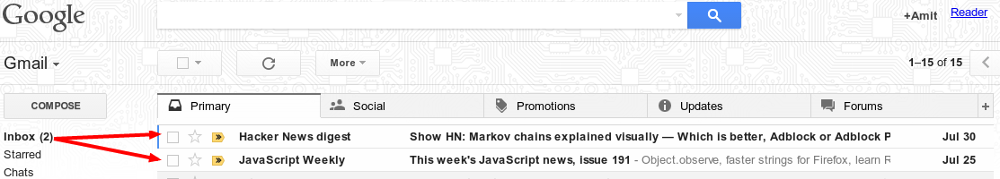
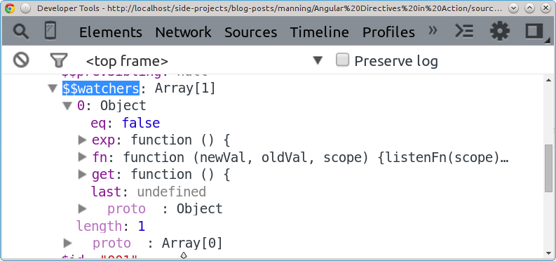
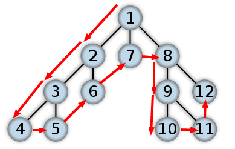
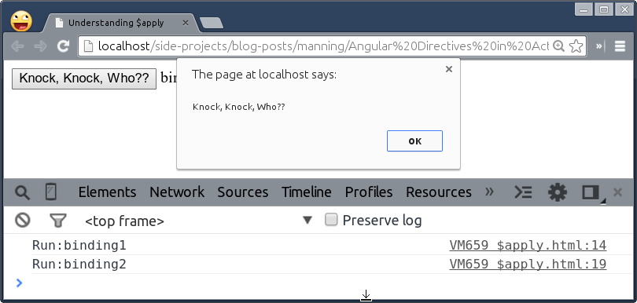
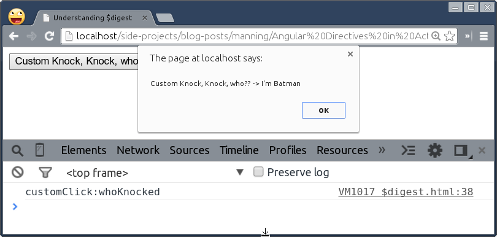

# Bringing directives to Life
This chapter covers
* How data binding works behind the scene
* $digest vs $apply
* Various ways to watch over AngularJS models and the paradox of choice
* How and why to $observe HTML attributes
* Different ways to speed up digest loop


## What is a Mutation and the necessity to keep an eye on
Over the years, developers have been writing webapps in a traditional way. What that means is that you need to take care of view that needs to be updated manually when data model changes in order to flush it to a browser. This involves a lot of efforts and complexity, especially, when multiple views are interdependent. 

Take an example of Gmail – a web based email application - that keeps track of a total number of unread mails in an In-box on the left hand side and at the same time syncs it up with a list of all the mails shown on the right hand side. The moment we open any unread mail, the unread count goes down by 1 immediately as shown in the following figure.



This is called DOM mutation and there are in-numerous places where we do active DOM manipulation using DOM APIs in JavaScript, jQuery, and other similar libraries. When an application becomes large, it is very cumbersome to manage all the pieces in a sane way.  However, there is no wrong using those libraries but definitely we can do better. By eliminating much of the boilerplate code needed, we can focus on building the actual application than scaffolding everything all over again. So AngularJS team has thought through the problem and came up with an idea to implement two-way data binding in AngularJS. This basically offloads the efforts required by developers into a framework itself, saving their time to utilize it for better use.

### Understanding $digest
We already had the bird's eye view of the $digest loop that takes care of the two-way data binding in Chapter 1, so we'll go straight into understanding what does it mean exactly? Well,   when any data binding expression such as {{}}, ng-bind, ng-class, and so on is compiled, a AngularJS watcher gets registered for the same that will be evaluated during the digest cycle and it's listener is called or re-run every time the binding's value changes. There are multiple bindings used at a time and hence their listeners are maintained in a collection of objects named ```$watchers``` which is available per scope. As we all know so far that root scope is top most scope in any AngularJS application and remaining scopes become children. They further may have child scopes as well thus creating a tree or graph like data structures. Below are the details each watcher has to effectively figure out when to call the listener to update the view as:



As you could see, each $watcher carries five properties pertaining to the watch method whenever it gets registered either manually or automatically using built-in directives. They are:

**exp:** This holds an expression or value that we passed while registering a watcher.

**get:** Evaluated expression using $parse service.

**eq:** This is an abbreviation for equality check (true/false) that decides whether to compare nested objects/arrays.

**fn:** A callback listener to trigger if the change in model detected.

last: The last evaluated expression to compare it with the updated value in order to trigger a listener a.k.a fn method during the $digest.

So, whenever a value (get) of an expression (exp) changes, the current value is compared with the previously stored one (last) and the view is updated by calling the listener (fn) if it did not match or is dirty. Please note that the $digest loop runs from $rootScope to deep down the scope tree using depth-first search algorithm (DFS). The DFS processes vertices first deep and then wide as illustrated below. Imagine each of the vertex (with children) as a scope in a tree and arrows follow the direction the way each scope object is reached to evaluate all of its watchers before moving onto a next scope. However,  watchers (leaf nodes) are evaluated recursively.



In order to maintain such a hierarchy by AngularJS, each scope has $$nextSibling, $$prevSibling, $$childHead, and $$childTail objects for easy traversing during the digest loop and locate the appropriate scope for further processing of watchers. Hence less as well as light-weight watchers are extremely useful so that the digest loop completes as quickly as possible that makes an application responsive and unobtrusive. However, updating a JavaScript variable (defined with var) in AngularJS context does not trigger a $digest loop, so what exactly triggers it, you may ask?

### $digest vs $apply
AngularJS calls $apply internally to trigger the $digest loop that ultimately updates views as seen before. The purpose of the $apply call is to evaluate the expression passed and then run the $digest loop on $rootScope and all of its descendants to be dirty checked in order to update all bindings. To understand what that means, lets take a look at ngClick directive from the AngularJS source as:

```javascript

var ngEventDirectives = {};
forEach(
  ['click'],
  function(name) {
    var directiveName = directiveNormalize('ng-' + name);
    ngEventDirectives[directiveName] = ['$parse', function($parse) {
      return {
        compile: function($element, attr) {
          var fn = $parse(attr[directiveName]);
          return function ngEventHandler(scope, element) {
            element.on(lowercase(name), function(event) {
              scope.$apply(function() {
                fn(scope, {$event:event});
              });
            });
          };
        }
      };
    }];
  }
);
```

Here  ngEventHandler method is a postLink method that will be called for each instance of the directive. The $apply call will first trigger the jqLite click handler and run a $digest loop then after. Let us use ngClick in the following example to see how many bindings get dirty checked when $apply is called. Create $apply.html in ch07/ directory as:

```html
<html ng-app="App">
<head>
  <title>Understanding $apply</title>
  <script src="../bower_components/angular/angular.js"></script>
  <script>
    var App = angular.module('App', []);

    App.run(function($rootScope) {
      $rootScope.alert = function($event) {
        alert($event.target.textContent);
      };

      $rootScope.binding1 = function() {
        console.log('Run:binding1');
        return 'binding1 ';
      };

      $rootScope.binding2 = function() {
        console.log('Run:binding2');
        return 'binding2';
      };
    });
  </script>
</head>
<body>
  <button ng-click="alert($event)">Knock, Knock, Who??</button>
  <span ng-bind="binding1()"></span>
  <span ng-bind="binding2()"></span>
</body>
</html>
```

In this simple example, I've added two dummy bindings but there could be lot of them in real-world applications. When we click the button, you'll notice following in the console:



In fact, you'll never need $apply call for models that change within the AngularJS context. But it will be useful outside the context such as jQuery plugin or JavaScript DOM events which we will see later.

Unlike $apply call that evaluates bindings from root scope to all of its descendants, scope.$digest call processes all of the $watchers of the current scope and its children only. As a $watcher's listener may change the model, the $digest loop keeps calling the $watchers until no more listeners are firing and everything is stable. That is why the digest loop runs atleast twice whenever it is triggered. 

Now that ngClick method does not modify any scope model, the digest loop is a bit overhead  for such a small operation. So we'll write a custom directive to handle the click event and  the digest flow. First, apply a custom directive on the button as follows:

```html
<button custom-click="alert($event)">Custom Knock, Knock, who??</button>
```

Then define the directive so:

```javascript
App.directive('customClick', function($parse) {
  return {
    scope: true,
    template: 'Custom Knock, Knock, who?? -> {{whoKnocked()}}',
    link: function(scope, element, attrs) {
      var fn = $parse(attrs.customClick);

      element.on('click', function($event) {
        scope.who = "I'm Batman";
        scope.$digest();
        fn(scope, {$event: $event});
      });

      scope.whoKnocked = function() {
        console.log('customClick:whoKnocked');
        return scope.who;
      };
    }
  }
});
```

Note that we've created a new child scope to separate it out from the parent scope and its bindings during digest. When the button is clicked, we update the model, who, that triggers the $digest loop to update the bindings for the current scope only using $digest instead of $apply. To our surprise, this only evaluates whoKnocked binding, leaving others untouched as shown in the following figure.



The takeaway is that $apply method triggers a digest on the root scope which is a bit scary to think of in the first place because all of the bindings used in an application will be evaluated during each digest cycle and some of them may call their listeners as well. Hence its very likely to slow down AngularJS application if we do not know these important bits of information and how to use it at your disposal we'll be covered in the next section.

Unlike scope.$apply, AngularJS restricts the digest loop to spawn the current scope and its children only using scope.$digest that gives performance benefit sometimes. However, this is not recommended and may have other implications or diverse effect on bindings. For example, a view would have not been updated when the associated data model is modified on the parent scope within the customClick directive if the digest loop had spawned the current scope. So to avoid many similar side-effects, the digest loop always runs from the root scope. 

### $scope.$apply vs $rootScope.$apply
This is confusing for lot of developers at first and you might want to know the difference between these two calls. However, to your surprise there is no difference at all. Both will run a new digest cycle on $rootScope after the passed functions are evaluated on their respective scopes.

Though this was just for us to understand how AngularJS knows when to run a digest loop and how far. Lets see how to write fast watchers to speed up the digest loop in the next section.

## $watching Data Models
Throughout this book, we have used many built-in directives to enable two way data binding.  But sometimes those are not enough and we are in need of custom watcher that will watch an expression to perform some action further. AngularJS allows us to register a custom listener callback to be executed whenever a watch expression changes and favorably it uses the same technique to register watchers internally. Here is how we can define a watch in AngularJS, ```$watch(watchExpression, listener, [objectEquality]);```

The watchExpression can be a function that returns a value being watched or a string representing a model binded on a scope. The listener callback triggers whenever there is a change in the value of the expression during the digest. Note that the listener gives access to new and old value of the expression that you can compare for further use. The reason it gives new and old value for comparison is that  when a watcher is registered with the scope, its listener is called asynchronously to initialize the watcher. In rare cases, this is undesirable because the listener is called when the result expression didn't change. To detect this scenario within the listener, you can compare the newVal and oldVal before executing the  listener logic. The objectEquality is false by default. If true, it performs a deep watch over nested objects or arrays which will have adverse effect on performance and memory footprint that will be covered in later sections. Below are couple of ways to register simple watchers and their differences:

```javascript
scope.a = scope.b = 1;

scope.$watch('a', function(newVal, oldVal) {
	console.log('a changed to ' + newVal);
});

scope.$watch('b', function(newVal, oldVal) {
	console.log('b changed to ' + newVal);
});

scope.$watch('a + b', function(newVal, oldVal) {
	console.log('a or b changed to ' + scope.a + ' ' + scope.b);
});

scope.$watchGroup(['a', 'b'], function(newVal) {
	console.log('a or b changed to ' + newVal[0] + ' ' + newVal[1]);
});
```

In this example, we have 2  models named, a and b on the current scope. The #1 and #2 watchers will be run if the values of a and b change respectively. However, the #3 watcher will be run if either of them changes with newVal as a sum of both in return which is a bit overdo. So AngularJS 1.3 came up with a better alternative in terms of $watchGroup #4 to return changed values separately as shown. The only difference is that the two separate watchers are registered by $watchGroup with a common listener callback unlike #3 where only one watcher was registered.

Now that we understand the foundation for registering watchers, let us see how to watch over objects or arrays in the following section.

### $watch for objects or arrays
The $watch method allows us to keep an eye on a property binded to a scope and perform any operation when it changes. If you remember, we had already used such a watch method for dynamic list required by ThumbnailViewer directive in ch06/ng-model-spinner.html in the previous chapter. That was:

```javascript
scope.$watch('list', function() {
  ngModelCtrl.$render();
});
```

This essentially watches scope.list model on the scope to update the spinner's state when a list grows on the fly with scope.list = newList. Notice it will not be triggered when an item is added (by JavaScript array push method), removed (by JavaScript array splice method), or moved (rearranged). Also, modifying any item or object property with scope.list[0] = 'Funday' will not affect the watch. That is because AngularJS keeps a reference of the original watched value so the referenced copy mutates automatically if the original copy changes. As both are same, the listener will not be called in such cases. 
The temporary solution to fix the above watch to be called every time when an item is added into or removed from (but not moved) the list and that is to change the watch expression so:

```javascript
scope.$watch('list.length', function() {
  ngModelCtrl.$render();
});
```

With this change, the watcher will store a length of the list (instead of actual collection as before) to compare it during a next digest cycle before calling the listener. 

### $watch for object expression with a dot
The watch method is also good at understanding an object expression with a dot in it. Imagine you want to add a little bounce effect to the spinner text in the Spinner directive, you could watch scope.opt.default and add animation on every update. 

To try that out, first, make a copy of js/ch06/ng-model-spinner.js file into js/ch07/ directory as watch-spinner.js. As we are going to use CSS3 animation library called animate.css, so let us install it quickly by running following commands in a terminal or GitBash as:

```sh
cd angular-directives-in-traction
bower install --save animate.css
```

The animate.css library provides a bunch of cool, fun, and cross-browser animations (CSS classes) purely in CSS3 that you can easily apply to any element to make it dance. Now create watch-spinner.html in ch07/ directory so:

```html
<html ng-app="nmSpinnerApp">
<head>
  <title>Understanding $watch</title>
  <script src="../bower_components/angular/angular.js"></script>
  <script src="../js/ch07/watch-spinner.js"></script>
  <link href="../bower_components/bootstrap/dist/css/bootstrap.css" rel="stylesheet">
  <link href="../bower_components/animate.css/animate.css" rel="stylesheet">
</head>
<body style="padding: 10px;">
  <adia-spinner ng-model="bounceCount"></adia-spinner>
</body>
</html>
```

This will render a range Spinner by default. Now let us watch over scope.opt.default expression by adding following into the link method of the spinner directive:

```javascript
scope.$watch('opt.default', function(newVal, oldVal) {
  if (newVal && newVal !== oldVal) {
    element.find('button').eq(1)
      .addClass('bounceIn animated')
      .on('webkitAnimationEnd mozAnimationEnd MSAnimationEnd oanimationend animationend', function() {
        angular.element(this).removeClass('bounceIn animated');
      });
  }
});
```

What we are doing here is that bouncing the spinner text with bounceIn CSS class whenever the spinner value increments or decrements. And at the end, just removing these CSS classes after animation is over to make it ready for the next round. Try at your end to see it bouncing. 

Both Object/Array from the previous section and Object expressions from the preceding example are efficient approaches as they merely keep a reference of the value around for comparison during the digest cycle.

### $watch for objects or arrays deeply
The referenced watcher on scope.list we saw in subsection 7.3.1. does not get invoked if any of its property changes so it is useful to have it deep watched in certain scenarios. The ngStyle and ngClass built-in directives use deep watchers as both allow you to apply multiple CSS styles and classes on an element, and need to figure out a change in nested objects. You can use ngStyle directive in the DOM as:

```html
<div ng-style="{left: leftPos, top: topPos}"></div>
```

In this declaration, any of the two properties (scope.leftPos and scope.topPos) may change and AngularJS has to re-render the view accordingly. In the deep watch call,  AngularJS keeps a cloned copy of the value being watched in a memory in order to compare it with the new one. So equality check ensures that both values are same including nested objects/arrays within, otherwise it fires a listener callback. Please note that it can be extremely expensive to deeply watch an objects/arrays if not used carefully and may even degrade performance of the application. 

Here is how you can convert a normal watch to become a deep watch with third parameter as true so:

```javascript
$watch(watchExpression, listener, true);
```

If you have not seen the source code of ngStyle before, that's fine. We'll write a custom directive to mimic ngStyle to get yourself an idea how it works. Imagine you are a publisher and want to enable authors (who write for you) to design a book cover for their own books. It's a simple interactive cover builder application that you want to build wherein authors can customize the color of the title and have any font size that suites them for the same. Create watch-deeply.html in ch07/ directory:

```html
<html ng-app="App">
<head>
  <title>Understanding $watch</title>
  <script src="../bower_components/angular/angular.js"></script>
  <link href="../bower_components/bootstrap/dist/css/bootstrap.css" rel="stylesheet">
  <style type="text/css">
    .title {
      text-align: center;
      color: black;
      font-size: 10px;
      height: 150px;
    }
  </style>
  <script type="text/javascript">
  	var App = angular.module('App', []);

    App.controller('DemoCtrl', function($scope) {
      $scope.color = 'black';
      $scope.fontSize = '10px';
    });

    App.directive('cover', function() {
      return {
        restrict: 'EA',
        link: function(scope, element, attrs) {
          scope.$watch(attrs.cover, function(newVal, oldVal) {
            element.css(newVal);
          }, true);
        }
      }
    });
  </script>
</head>
<body style="padding: 10px;" ng-controller="DemoCtrl">
  <div class="row">
    <div class="col-xs-3 col-md-2">
      <a class="thumbnail alert-warning">
        <div class="title" cover="{color: color, fontSize: fontSize}">AngularJS Directives in Action</div>
        
      </a>
    </div>
  </div>
  <button class='btn btn-default' ng-click="color = 'black'">&nbsp;</button>
  <button class='btn btn-primary' ng-click="color = 'blue'">&nbsp;</button>
  <button class='btn btn-info' ng-click="fontSize = '10px'"><small>10px</small></button>
  <button class='btn btn-warning' ng-click="fontSize = '20px'">20px</button>
</body>
</html>
```

In this example, we have two models namely color and fontSize (#A) which we can alter with few buttons underneath the cover layout using ngClick directives. Then we pass both properties to the directive in the DOM as an attribute values  (#C). The cover directive has a deep watch set up to watch over these properties and apply appropriate styles to the book title when any property changes.

With equality check, the watcher will be called if an entire collection is replaced by a new one, an item is added/removed/moved in the collection, and any nested object property is modified within the collection. So it is damn expensive. Make sure to keep the listener callback lightweight by not performing any heavy operation in it as it will be called multiple times than usual. However, both ngStyle and ngClass directives simply apply CSS styles/classes on an element and do not have deep nested collection so in their case it­ is not at all expensive and thus perfectly makes sense to use deep watchers in that context by AngularJS.

### $watchCollection for Shallow objects or arrays
By now, we know that ngRepeat build-in AngularJS directive takes an object or array to iterate over to generate or destroy repeatable element when model mutates. 

If we use a normal watch method (without equality check) on a collection, it will not trigger a listener callback when an item is added in or removed from the collection. Alternatively, If we use deep watch method (with equality check) on the same collection, the listener callback will be called on every updates, including nested objects. 

Performance wise this is terrible because ngRepeat should only update the DOM if an item added, removed, or moved – it should not touch the repeatable element in case of nested objects are modified that do not affect it. The $watchCollection method is to the rescue in such a case!

The $watchCollection API watches for changes in arrays or objects. It also watches items in arrays and properties in objects that distinguishes it from the deep watch we saw earlier. To achieve this, it needs to keep a copy of the original array or object, and traverses the old and new collections for each digest, checking for changes using the strict equality operator (i.e. === not ==). This has been used by ngRepeat directive since AngularJS version 1.1.4 as it serves it well. You can define it as follows:

```javascript
$scope.$watchCollection('collection', function listener() {});
```

Notice it does not require equality check as a third parameter. It can be used over deep watch for performance gain, depending on the requirement because it will only be triggered in case a collection is replaced by a new one or an item is added/removed/moved in the collection.

So it appears to be a proper solution for Spinner directive to update itself when a list changes later or progressively. Let us replace scope.$watch('list') call in ch07/watch-spinner.js with the following:


```javascript
scope.$watchCollection('list', function() {
  ngModelCtrl.$render();
});
```

To make sure that this change does not break anything, go ahead and change the references of ng-model-spinner.js in both ng-model-spinner.html and thumbnail-viewer.html with the following:


```html
<script type="text/javascript" src="../js/ch07/watch-spinner.js"></script>
```

Then run npm run test-unit and npm run test-e2e commands in the terminal to verify it. It should be working for you as well.


### $observe HTML Attributes
The watch methods are really for AngularJS models so you can not watch over HTML attributes with it, especially interpolations. HTML attribute is a string or evaluated expression (with double curly braces) such as data-interpolated="my {{name}}" but the watch methods expect non interpolated strings as we saw earlier in watch-deeply.html. Here is how you can register the $observe callback, ```attrs.$observe('interpolatedAttribute', function(newVal) { });```.

Notice that the $observe is a method binded on attributes (a.k.a attrs object) that only works inside directives. The directive's link method gives access to attrs to set up the observer. You can even register it in the compile method of the directive as it does not require scope which is only available in the linking phase.

Note that the watch expression are evaluated by $parse or scope.$eval services whereas $interpolate service is used to evaluate interpolated strings during the next digest cycle following compilation. The observer is then invoked whenever the interpolated  value changes. This is how the $interpolate service being used as, ```$interpolate("my {{name}}")(scope)```.

When an observer is registered, the expression will be evaluated by the $interpolate service to create a compiled function (similar to $parse service) which can then be used to set up a watch. However, the $observe's listener callback only returns a new value but not old one. Although it could have returned an old value as well but is not required by the built-in directives that use $observe internally such as ngBindTemplate, ngClass, ngModel, etc.

Note that all observers and watchers are dirty checked on every digest cycle so performance-wise there is no much difference between  the two.


## Speeding up the digest loop
No matter how fast a particular programming language or framework is it all boils down to how carefully we craft the application to keep it smooth. The same thing applies to AngularJS. Each and every directive is properly benchmarked and scrutinized by AngularJS team but still it's our responsibility to control the total number of bindings we use and when the digest runs, especially how often. All this and much more will be covered in this section.

### By unregistering unnecessary $watchers
Each registered watcher via $watch, $watchCollection, or $observe returns deregistration method that you can invoke later to unregister the respective watch. You can do following to unregister the registered watch:

```javascript
var killWatcher = $scope.$watch('list', function() {}
killWatcher(); // deregister the above watch
```

However, it is very rare to unregister the watch in AngularJS application but can be handy in few situations. Imagine you are a publisher and allow readers to read few pages of any book they like but also want to notify them to buy the book after every 4 pages they flip. However,  you want to limit the alert to be shown 10 times only not to annoy readers so often. Obviously, you can conditionally show the alert and stop showing it once the counter reaches 10 but the watch is still hanging around in the digest loop which is unnecessary. We can easily get rid of it as shown:

```javascript
var killBuyWatch = $scope.$watch('pageTurnCounter', function(newVal) {
  if ($scope.buyCounter > 10) {
    killBuyWatch();
  } else if (newVal / 4 === 0) {
    $scope.modalOpen = true;
    $scope.buyCounter++;
  }
})
```

Many times, we unintentionally keep watchers alive even though we do not need it. Note that you can even to unregister $observe calls the same way. 

### By using one-time binding syntax
It's very common scenario to have one time watchers that will be evaluated only once. Localization is one example I can think of where you may want to translate form labels in some other language other than English such as:

```html

<label>{{'firstName' | translate }}</label>
<lable ng-bind='firstName | translate'></label>
```

But bindings used to translate above labels should be dead after evaluation but we can not control its behavior because AngularJS automatically set up a watch for it. And writing a separate directive to incorporate the previous approach (from the preceding example) is not scaleable. Luckily, AngularJS 1.3 has one-time-binding syntax wherein expression stops recalculating once the DOM is updated which happens after the first digest. AngularJS  immediately destroys the watch once it is stable.  The expression or binding starts with :: (double colon) is considered a one-time binding. So the preceding example would change to:

```html

<label>{{::'firstName' | translate }}</label>
<lable ng-bind='::firstName | translate'></label>
```

This can even work with custom watcher that takes a string as an expression but not a function. We can easily turn pageTurnCounter watcher into a one-time binding as:

```javascript
$scope.$watch('::pageTurnCounter', function(newVal) { });
```

Look into your AngularJS application and who knows you may find such watchers that are of no use but only require once.

### By using $watchCollection over  $watch
If you remember the iscroll directive that we wrote in chapter 5, we were using a watch method to update the scroll when any movie name is removed. But there was one problem with the watch implementation, here it is:

```javascript
scope.$watch(function() {
  if (myScroll) {
    myScroll.refresh();
  } else {
    myScroll = new IScroll(element[0], {
      scrollbars: angular.isDefined(scope.scrollbars) ? scope.scrollbars : true,
      mouseWheel: angular.isDefined(scope.mousewheel) ? scope.mousewheel : true
    });
  }
});
```

You could notice that this watch does not have a listener because we have put the logic into the expression function itself to update the scrollbar in a worse-case scenario replacing setTimeout used before. The problem with this approach is that the expression will be evaluated for every digest cycle and as we are doing active DOM manipulation by calling iscroll's constructor method that interacts with the DOM which is what making it vulnerable. 

What we can do to fix this vulnerability is to watch over movies collection using watchCollection method so that the scrollbar will only be updated when a movie is removed. Lets try that out. Create a copy of ch05/iscroll-directive.html and save it in the ch07/ directory.

First we will add one more attribute named data-collection to hold the array/object that we are iterating through as:

```html
<div id="wrapper" iscroll data-collection="movies" data-scrollbars="true" data-mousewheel="true">
```


Then we'll update the directive definition to bring the collection into the local scope and replace watch with watchCollection so:

```javascript
App.directive('iscroll', function() {
  return {
    restrict: 'EAC',
    scope: {
      scrollbars: '=?',
      mousewheel: '=?',
      collection: '='
    },
    link: function(scope, element, attrs) {
      var myScroll = null;      

      scope.$watchCollection('collection', callback);

      function callback() {
        if (myScroll) {
          myScroll.refresh();
        } else {
          myScroll = new IScroll(element[0], {
            scrollbars: angular.isDefined(scope.scrollbars) ? scope.scrollbars : true,
            mouseWheel: angular.isDefined(scope.mousewheel) ? scope.mousewheel : true
          });
        }
      }
    }
  }
});
```

That is pretty straight forward. We've just wrapped the previous expression into its own JavaScript method and using collection as an expression instead. We'll get to why we have the callback() method separately in a moment. 

This should not have affected the iscroll implementation and worked properly. However, you'll notice that iscroll does not allow you to scroll through the entire list initially but it does if any item is removed. The reason for that is the iscroll directive executed before ngRepeat finished rendering all the items. So, how can we delay the execution of the iscroll directive? Unfortunately, there is no event to track when ngRepeat finishes rendering all the items for us to update the scrollbar later, although it may be available in next AngularJS releases.

For now, we will also leverage the previous watch implementation as a one-time watcher by unregistering it immediately after the iscroll directive is compiled and linked. So update the link method of the iscroll directive as:

```javascript

link: function(scope, element, attrs) {
  var myScroll = null,
      killThisWatcher = scope.$watch(callback);  

  scope.$watchCollection('collection', callback);

  function callback() {
    if (myScroll) {
      myScroll.refresh();
      if (!angular.isDefined(oldVal)) killThisWatcher();
    } else {
      myScroll = new IScroll(element[0], {
        scrollbars: angular.isDefined(scope.scrollbars) ? scope.scrollbars : true,
        mouseWheel: angular.isDefined(scope.mousewheel) ? scope.mousewheel : true
      });
    }
  }
}
```

In here, the watch statement will be registered first to instantiate the iscroll constructor and then watchCollection gets invoked to refresh the scrollbar and freezes itself (will not be called unless collection changes). But the normal watch will be triggered once again by the digest loop to make sure everything is stable, so this time we unregister it. Please note that the order of registration of watchers may affect the behavior in this case.

### By preventing DOM manipulation inside watch listener
In the section 2.2 we had updated spinner directive to have a nice bouncing effect whenever the spinner value changes. Here is the watch method used to bring up the effect from ch07/watch-spinner.html:

```javascript
scope.$watch('opt.default', function(newVal, oldVal) {
  if (newVal && newVal !== oldVal) {
    element.find('button').eq(1)
      .addClass('bounceIn animated')
      .on('webkitAnimationEnd mozAnimationEnd MSAnimationEnd oanimationend animationend', function() {
        angular.element(this).removeClass('bounceIn animated');
      });
  }
});
```

But this watch method has a major issue which is not even noticeable if not looked closely. And that is, we are searching through the descendants of an element in the DOM tree which is not only slow but also fired every time when the listener is called. Searching process causes reflow event wherein web browser recalculates the positions and geometries of elements in the DOM, for the purpose of re-rendering part or all of the document. Obviously  it's an user blocking operation that will surely delay the digest to complete the cycle. The best way is to cache such selectors for later use. So update the watch in js/ch07/watch-spinner.js with:


```javascript
var $bouncer = element.find('button').eq(1);
$bouncer.on('webkitAnimationEnd mozAnimationEnd MSAnimationEnd oanimationend animationend', function() {
  angular.element(this).removeClass('bounceIn animated');
});
scope.$watch('opt.default', function(newVal, oldVal) {
  if (newVal && newVal !== oldVal) {
    $bouncer.addClass('bounceIn animated');
  }
});
```

Also, the animationEnd event needs to be binded only once and should work as before.

### By avoiding it completely

So far we know that the digest loop is the magic happens behind the scenes and makes AngularJS more magical than any other framework. That means AngularJS has to run the digest loop after every user interaction such keypress, click, and so on to make sure bindings are up to date and the UI is in sync. Having said that the more watchers you have to loop through, the more time the digest will take to complete the cycle. Although there is no harm in it but what if user interactions happen so quick and in a continuous stream that might trigger magnitude of digest cycles to bring an application to a dead end – making it unresponsive and frozen.

If you think that's a myth and will never happen then take a look at few built in directives that will help us to reproduce the problem. These directives allow us to bind special behavior on mouse events such ngMouseUp, ngMouseDown, ngMouseOver, ngMouseMove and so on. Though the directives are made available for the benefits but they might do more harm than good, especially ngMouseMove. Imagine you want to draw pixels on a HTML5 canvas element, writing a directive for binding native mouse events on the canvas is always the best choice. This is because mousemove event fires multiple times and very frequently which can not be even debounced with AngularJS directives. Native mouse event can be delayed using requestAnimationFrame() to the point when a browser is ready which prevents a forced call and maintains 60 FPS (frames per seconds) cap to keep the application performant.

So the takeaway is that it's not always necessary to use databinding or AngularJS directives  to keep your code looks angularish. Sometimes it's better to go with imperative DOM manipulation approach which is faster than the so-called digest loop. Let us look at a simple example to show how often the digest cycle runs in this particular scenario and how to avoid it altogether. We often see images load progressively wherein an image is being rendered partially as soon as the downloading begins and most of time we are unaware of how soon it will be completely shown. The solution is to write a simple asynchronous image loader directive that will fetch the image in background and show a progress in percentage while it is being downloaded. Later the progress bar will be replaced by the fully loaded image. Sounds cool, let us begin.

First create image-lazy-loader.html in ch07/ directory and put following markup in it:

```html
<html ng-app="App">
<head>
  <title>Image Lazy Loader</title>
  <script src="../bower_components/jquery/jquery.js"></script>
  <script src="../bower_components/angular/angular.js"></script>
  <script src="../js/ch07/image-lazy-loader.js"></script>
  <link rel="stylesheet" href="../bower_components/bootstrap/dist/css/bootstrap.css">
</head>
<body style="padding:10%;">
  <div style="width: 200px; height: 200px;" image-lazy-loader="http://upload.wikimedia.org/wikipedia/commons/3/36/Hopetoun_falls.jpg"></div>
</body>
</html>
```

You might have already guessed that we are going to call it imageLazyLoad directive which takes an image URL to load. You can set the custom size to the image container. Note we are relying on jQuery library because we will use $.ajax() over $http to fetch an image via XHR call. The $.ajax supports XHR parameter to override the default implementation with our own. This allows us to track total vs downloaded image size in order to accurately depict the download progress in percentage.

Now let us write a directive for the same in js/ch07/image-lazy-loader.js as:


```javascript
var App = angular.module('App', []);

App.directive('imageLazyLoader', function() {
  return {
    restrict: 'A',
    scope: {},
    template: function(element) {						#A
      element.css({position: 'relative'});


      return '\
        <a class="thumbnail">\
          \					#B
          <div ng-hide="src" class="progress" style="position: absolute;width: 50%;left: 25%;top: 48%;">\					#C
            <div style="width:{{percentage}}%;" class="progress-bar">{{percentage}}%</div>\							#D
          </div>\
        </a>';
    },
    link: function(scope, element, attrs) {
      $.ajax({
        type: 'GET',
        url: attrs.imageLazyLoader,					#E
        xhr: function() {							#F
          var xhr = new window.XMLHttpRequest();				#F
          xhr.addEventListener("progress", function(evt) {
            scope.$apply(function() {					#F
              scope.percentage = parseInt(evt.loaded / evt.total * 100, false);									#F
            });
          }, false);							#F

          return xhr;							#F
        },
        success: function(data) {
          scope.$apply(function() {					#G
            scope.src = attrs.imageLazyLoader;				#G
          });								#G
        }
      });

      scope.$watch(function() { console.log('digesting'); });
    }
  };

});
```

The code is pretty self-explanatory but the watch method at the end may find spooky to you. Of-course it is spooky because it is there to watch over the digest loop. It takes a function as a watch expression that will be run for every digest so that we can keep track of how often digest happens during the download.

Although the code looks perfect but to your surprise, a digest cycle will run for more than 100 times if the image is not in cache, which is totally disturbing. Because if we use multiple instance of this directive in a large application with lots of bindings, the application will surely be crashed. Can we do better? 

Yes, as I said before, the purpose is not only to write code that looks angularish but also to keep it responsive and unobtrusive. So let us quickly fix it. 

First thing to note that we do not have a hardcore dependency on built-in directives such ngSrc, ngStyle, etc here because we can directly set src to img element instead of doing the same via ngSrc and the same thing is with ngStyle. So update the template as:

```javascript

template: function(element) {
  element.css({position: 'relative'});

  return '\
    <a class="thumbnail">\
      \
      <div class="progress" style="position: absolute;width: 50%;left: 25%;top: 48%;">\
        <div class="progress-bar"></div>\
      </div>\
    </a>';
},
```

Nothing has changed, we have just removed AngularJS directives and bindings. Then update the link method so:


```javascript

link: function(scope, element, attrs) {
  var $img = element.find('img'),
      $progress = element.find('.progress'),
      $progressBar = element.find('.progress-bar');			#A

  $.ajax({
    type: 'GET',
    url: attrs.imageLazyLoader,
    xhr: function() {
      var xhr = new window.XMLHttpRequest(),
          percentage;

      xhr.addEventListener("progress", function(evt) {
        percentage = parseInt(evt.loaded / evt.total * 100, false) + '%';
        $progressBar.css({width: percentage}).text(percentage);		#B
      }, false);


      return xhr;
    },
    success: function(data) {
      $img.attr('src', attrs.imageLazyLoader);
      $progress.hide();
    }
  });

  scope.$watch(function() { console.log('digesting'); });
}
```

As you can see, we have completely isolated our directive from the digest loop. The real culprit was the progress event that was triggering the digest loop to update the progress. Moreover, we have achieved the exact same result by compromising neither the functionality nor the performance.

## Summary
We have started this chapter with how digest loop plays an important role in two-way data binding in AngularJS. Then we analyzed $digest vs $apply comparison to get an insight into how AngularJS triggers the digest loop and how often. Afterwards, we learned about various ways to set up watchers and when to use $watchCollection over deep $watch to get the performance boost. We then used $observe over $watch with interpolated strings. After that, we found out the way to unregister unnecessary one-time watchers to keep the digest loop short and quick.